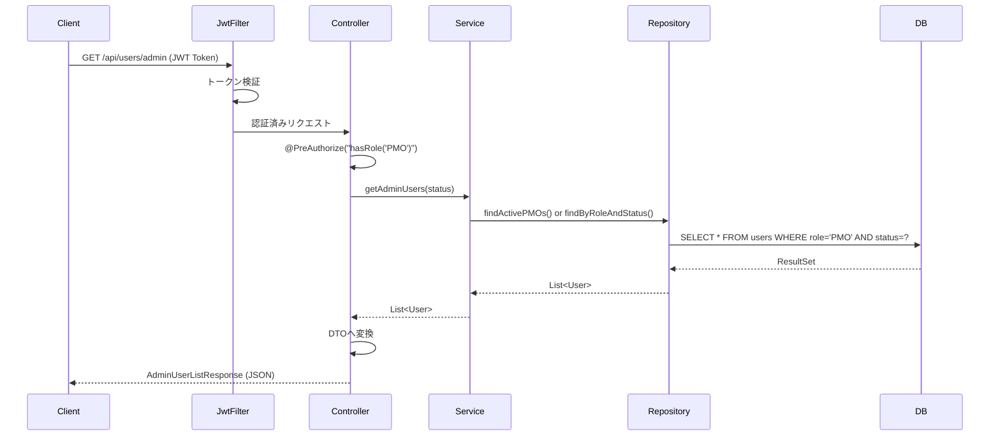
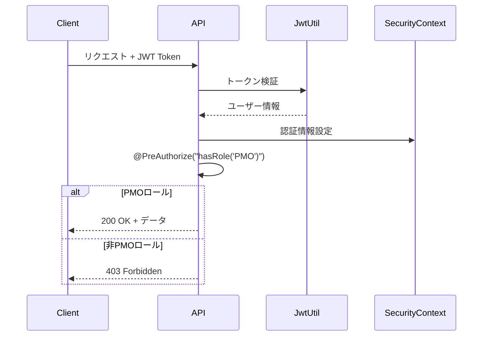
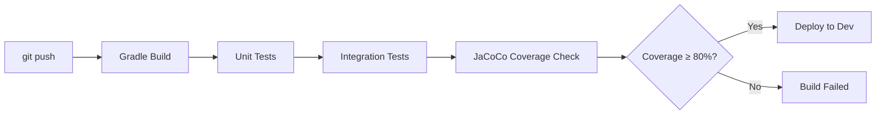

# 技術設計書

## 概要
本設計書は、管理者（PMOロール）ユーザー一覧を取得するREST APIエンドポイント `/users/admin` の実装設計を定義します。既存のDDD（Domain-Driven Design）アーキテクチャとSpring Bootフレームワークに従い、セキュリティ、パフォーマンス、拡張性を考慮した設計となっています。

## 要件マッピング

### 設計コンポーネントのトレーサビリティ
各設計コンポーネントが対応する要件：
- **UserController#getAdminUsers** → 要件1.1, 1.2: 管理者一覧取得エンドポイント
- **@PreAuthorize認証** → 要件2.1, 2.2, 2.3: アクセス制御とセキュリティ
- **AdminUserListResponse DTO** → 要件3.1, 3.3: レスポンスフォーマット
- **UserRepository#findActivePMOs** → 要件1.4, 5.1, 5.2: データ取得とフィルタリング
- **GlobalExceptionHandler** → 要件4.1, 4.2, 4.3: エラーハンドリング

### ユーザーストーリーカバレッジ
- **PMOユーザーの管理者一覧確認**: UserControllerのGETエンドポイントとUserApplicationServiceの連携で実現
- **セキュリティ保証**: Spring Securityの@PreAuthorizeアノテーションとJWT認証で実現
- **標準的なレスポンス**: DTOパターンとJacksonによるJSON変換で実現
- **エラーメッセージ**: GlobalExceptionHandlerによる統一的なエラー処理で実現
- **フィルタリング機能**: クエリパラメータ処理とリポジトリメソッドの拡張で実現

## アーキテクチャ

### システムアーキテクチャ
```mermaid
graph TB
    subgraph "Presentation Layer"
        A[UserController]
    end
    
    subgraph "Application Layer"
        B[UserApplicationService]
    end
    
    subgraph "Domain Layer"
        C[UserRepository Interface]
        D[User Entity]
    end
    
    subgraph "Infrastructure Layer"
        E[UserRepositoryImpl]
        F[UserMapper MyBatis]
        G[JwtAuthenticationFilter]
    end
    
    subgraph "Database"
        H[(MySQL users table)]
    end
    
    A -->|@PreAuthorize| G
    A --> B
    B --> C
    C --> E
    E --> F
    F --> H
    B --> D
```

### テクノロジースタック
既存のプロジェクト構成に従います：

- **バックエンド**: Java 17 + Spring Boot 3.x
- **フレームワーク**: Spring Web, Spring Security
- **データアクセス**: MyBatis (アノテーションベース)
- **データベース**: MySQL 8.0
- **認証**: JWT + Spring Security
- **バリデーション**: Jakarta Validation
- **ロギング**: SLF4J + Logback
- **テスト**: JUnit 5 + Mockito
- **ビルドツール**: Gradle (Kotlin DSL)

### アーキテクチャ決定の根拠
- **DDD採用**: ビジネスロジックをドメイン層に集約し、保守性と拡張性を確保
- **MyBatis選択**: 既存実装との一貫性を保ち、SQLの細かな制御が可能
- **JWT認証**: ステートレスな認証でスケーラビリティを確保
- **DTOパターン**: ドメインモデルの詳細を隠蔽し、APIの安定性を維持

## データフロー

### 管理者一覧取得フロー


## コンポーネントと インターフェース

### バックエンドサービス & メソッドシグネチャ

#### UserController拡張
```java
@RestController
@RequestMapping("/api/users")
public class UserController {
    
    @GetMapping("/admin")
    @PreAuthorize("hasRole('PMO')")
    public ResponseEntity<AdminUserListResponse> getAdminUsers(
        @RequestParam(required = false) String status,
        HttpServletRequest request
    ) // PMO一覧取得、オプションでステータスフィルタリング
}
```

#### UserApplicationService拡張
```java
@Service
public class UserApplicationService {
    
    public List<User> getAdminUsers(String status)  // ステータスに基づくPMOユーザー取得
    public List<User> getAllAdminUsers()            // 全PMOユーザー取得
    public List<User> getActiveAdminUsers()         // アクティブPMOユーザー取得
    public List<User> getInactiveAdminUsers()       // 非アクティブPMOユーザー取得
}
```

#### UserRepository拡張
```java
public interface UserRepository {
    
    List<User> findByRoleAndStatus(User.Role role, boolean isActive)  // ロールとステータスで検索
    List<User> findAllByRole(User.Role role)                          // ロールで全件検索
    // 既存: List<User> findActivePMOs()                              // アクティブPMO取得
}
```

### APIエンドポイント

| メソッド | ルート | 目的 | 認証 | ステータスコード |
|---------|--------|------|------|-----------------|
| GET | /api/users/admin | 管理者一覧取得 | PMOロール必須 | 200, 400, 401, 403, 500 |
| GET | /api/users/admin?status=ACTIVE | アクティブ管理者のみ | PMOロール必須 | 200, 400, 401, 403, 500 |
| GET | /api/users/admin?status=INACTIVE | 非アクティブ管理者のみ | PMOロール必須 | 200, 400, 401, 403, 500 |

## データモデル

### ドメインエンティティ
既存のUserエンティティを使用（変更なし）：
1. **User**: ユーザー情報（ID、ユーザー名、メール、ロール、ステータス等）

### レスポンスDTO

```java
// AdminUserListResponse.java
public class AdminUserListResponse {
    private List<AdminUserDto> users;
    private int totalCount;
    private LocalDateTime timestamp;
    
    // getters and setters
}

// AdminUserDto.java
public class AdminUserDto {
    private String id;
    private String username;
    private String fullName;
    private String email;
    private String status;  // "ACTIVE" or "INACTIVE"
    @JsonFormat(pattern = "yyyy-MM-dd'T'HH:mm:ss")
    private LocalDateTime createdAt;
    
    // getters and setters
}
```

### データベーススキーマ
既存のusersテーブルを使用（変更なし）：

```sql
-- 既存のusersテーブル
CREATE TABLE users (
    user_id VARCHAR(36) PRIMARY KEY,
    username VARCHAR(50) UNIQUE NOT NULL,
    email VARCHAR(100) UNIQUE NOT NULL,
    password_hash VARCHAR(255) NOT NULL,
    full_name VARCHAR(100) NOT NULL,
    role VARCHAR(20) NOT NULL,
    is_active BOOLEAN DEFAULT true,
    created_at TIMESTAMP DEFAULT CURRENT_TIMESTAMP,
    updated_at TIMESTAMP DEFAULT CURRENT_TIMESTAMP ON UPDATE CURRENT_TIMESTAMP
);

-- 既存インデックス
CREATE INDEX idx_users_role ON users(role);
CREATE INDEX idx_users_is_active ON users(is_active);
CREATE INDEX idx_users_role_active ON users(role, is_active);
```

## エラーハンドリング

### エラーレスポンス構造
```java
public class ErrorResponse {
    private int status;
    private String error;
    private String message;
    private LocalDateTime timestamp;
    private String path;
}
```

### エラーハンドリング戦略
| エラータイプ | HTTPステータス | レスポンスメッセージ |
|-------------|---------------|---------------------|
| 未認証 | 401 Unauthorized | "認証が必要です" |
| 権限不足 | 403 Forbidden | "この操作を実行する権限がありません" |
| 不正なパラメータ | 400 Bad Request | "ステータスパラメータが不正です: {value}" |
| データベースエラー | 500 Internal Server Error | "システムエラーが発生しました" |
| 予期しないエラー | 500 Internal Server Error | "予期しないエラーが発生しました" |

## セキュリティ考慮事項

### 認証・認可


### データ保護
- **入力検証**: @RequestParamでstatusパラメータを検証
- **SQLインジェクション対策**: MyBatisのパラメータバインディング使用
- **機密情報除外**: パスワードハッシュは絶対にレスポンスに含めない
- **ロギング**: 機密情報をログに出力しない

### セキュリティベストプラクティス
- **最小権限の原則**: PMOロールのみアクセス可能
- **レート制限**: 既存のSpring Securityの設定を使用
- **CORS設定**: 既存の設定を継承
- **セキュアヘッダー**: X-Content-Type-Options, X-Frame-Options等

## パフォーマンス & スケーラビリティ

### パフォーマンス目標
| メトリクス | 目標値 | 測定方法 |
|-----------|--------|----------|
| レスポンスタイム (p95) | < 200ms | APIエンドポイント |
| レスポンスタイム (p99) | < 500ms | APIエンドポイント |
| スループット | > 100 req/sec | 負荷テスト |
| データベースクエリ (p99) | < 50ms | クエリモニタリング |

### キャッシング戦略
- **アプリケーションキャッシュ**: 頻繁に変更されないPMOリストは5分間キャッシュ可能
- **データベースキャッシュ**: MySQLのクエリキャッシュを活用
- **HTTPキャッシュ**: Cache-Control: private, max-age=300

### スケーラビリティアプローチ
- **インデックス最適化**: role, is_activeの複合インデックス使用
- **ページング対応**: 将来的に大量ユーザー時はページング実装
- **読み取り専用**: 更新処理がないため、読み取りレプリカ活用可能

## テスト戦略

### テストカバレッジ要件
- **単体テスト**: ≥80% コードカバレッジ（JaCoCo）
- **統合テスト**: 全APIエンドポイント
- **E2Eテスト**: 認証フローを含む管理者一覧取得

### テストアプローチ

#### 1. 単体テスト
```java
@Test
void testGetAdminUsers_WithPMORole_ReturnsAdminList()
@Test
void testGetAdminUsers_WithDeveloperRole_Returns403()
@Test
void testGetAdminUsers_WithInvalidStatus_Returns400()
```

#### 2. 統合テスト
```java
@SpringBootTest
@AutoConfigureMockMvc
class UserControllerIntegrationTest {
    @Test
    @WithMockUser(roles = "PMO")
    void getAdminUsers_ReturnsSuccessfully()
    
    @Test
    void getAdminUsers_WithoutAuth_Returns401()
}
```

#### 3. リポジトリテスト
```java
@MybatisTest
class UserRepositoryTest {
    @Test
    void findByRoleAndStatus_ReturnCorrectUsers()
}
```

### CI/CDパイプライン


## 実装チェックリスト

### フェーズ1: 基本実装
- [ ] UserRepositoryにfindByRoleAndStatusメソッド追加
- [ ] UserRepositoryImplでMyBatisマッパー実装
- [ ] UserApplicationServiceに管理者取得メソッド追加
- [ ] AdminUserDto, AdminUserListResponse作成
- [ ] UserControllerに/adminエンドポイント追加

### フェーズ2: セキュリティとエラー処理
- [ ] @PreAuthorize設定
- [ ] エラーハンドリング実装
- [ ] ロギング追加

### フェーズ3: テスト
- [ ] 単体テスト作成
- [ ] 統合テスト作成
- [ ] カバレッジ80%確認

### フェーズ4: ドキュメント
- [ ] API仕様書更新
- [ ] Swagger/OpenAPI定義追加