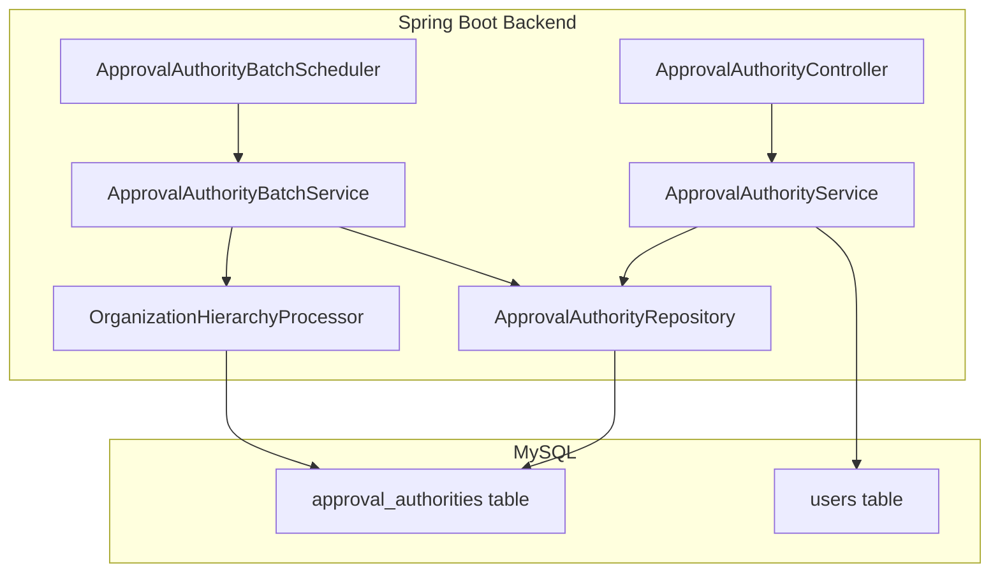
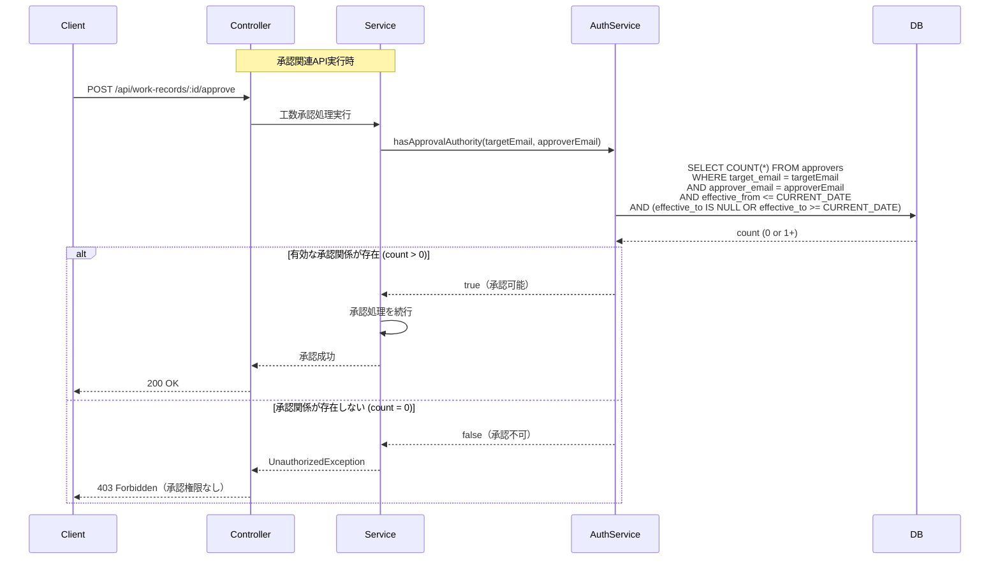
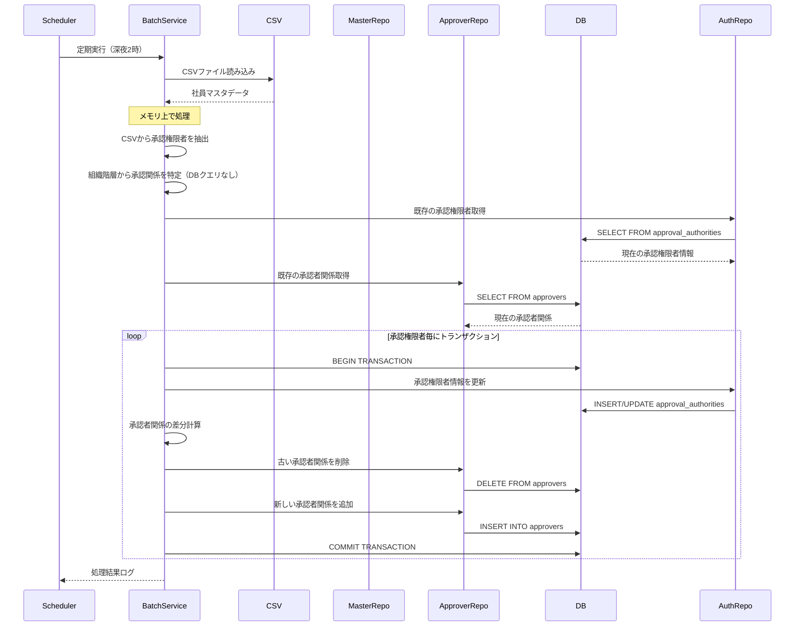
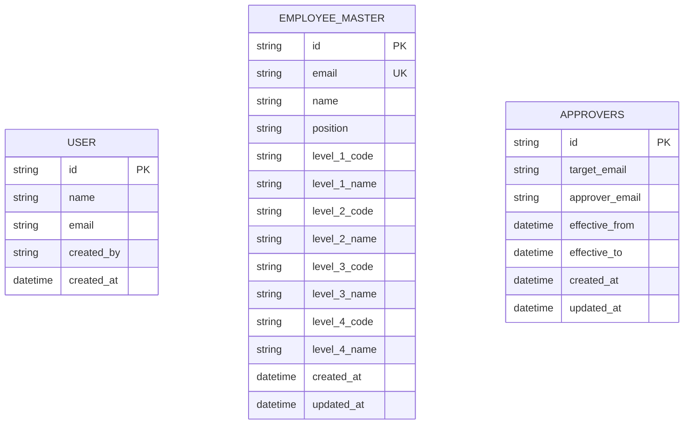
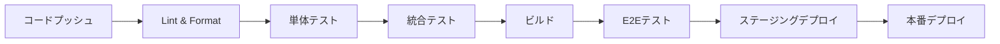

# Technical Design

## 概要
承認権限管理機能は、社員マスタCSVから承認権限を持つ社員（マネージャー以上）の情報を抽出・登録し、組織階層に基づいて承認可能なユーザーを管理するバッチ処理機能を提供します。承認権限を持つ社員の情報はapproval_authoritiesテーブルで管理し、役職（position）フィールドによって承認権限レベルを判定します。マネージャー、部長、本部長、統括本部長の役職を持つ社員のみが登録され、組織階層情報に基づいて誰が誰を承認できるかを判定します。

## 要件マッピング

### 設計コンポーネントの追跡可能性
各設計コンポーネントが対応する要件:
- **承認権限管理API** → 要件1-4: 承認権限者の確認と管理
- **認証・認可ミドルウェア** → 要件5: 権限とアクセス制御
- **ドメインバリデーション** → 要件6: データ検証と整合性
- **CSVバッチ処理** → 要件8: 社員マスタから承認権限者のバッチ登録
- **組織階層処理** → 要件9: 組織階層に基づく承認関係の判定

### ユーザーストーリーカバレッジ
- **承認権限の確認**: approval_authoritiesテーブルの存在確認とpositionフィールドで判定
- **社員マスタから承認権限者を抽出・登録**: CSVバッチ処理で実現
- **組織階層に基づく承認関係の判定**: 階層処理ロジックで実現

## アーキテクチャ

### システムアーキテクチャ


### 技術スタック
- **フロントエンド**: Vue 3.5.18 + TypeScript 5.8 + Vuetify 3.9.4
- **バックエンド**: Spring Boot 3.5.4 + Java 17 + MyBatis 3.0.5
- **データベース**: MySQL 8.0
- **認証**: Okta OAuth2/OpenID Connect
- **テスト**: JUnit 5 + Vitest + Vue Test Utils
- **デプロイメント**: Docker + Docker Compose

### アーキテクチャ決定の根拠
- **Vue 3 Composition API**: 既存のフロントエンドアーキテクチャとの一貫性
- **Spring Boot DDD**: 既存のドメイン駆動設計パターンの活用
- **MyBatisマッパー**: 既存のデータアクセス層との統合
- **Okta認証**: 既存の認証システムとのシームレスな統合
- **ShedLock**: JiraSyncと同様の分散スケジューラーロック管理
- **バッチ処理パターン**: JiraSyncApplicationServiceのパターンを踏襲

## データフロー

### 主要ユーザーフロー

#### 承認権限チェックフロー（バックエンド内部処理）


#### CSVバッチ処理フロー


## コンポーネントとインターフェース

### バックエンドサービス＆メソッドシグネチャ


#### ApprovalAuthorityService
```java
@Service
public class ApprovalAuthorityService {
    @Autowired
    private ApprovalAuthorityRepository repository;
    
    // 特定のユーザーに対する承認権限があるか確認（内部メソッド）
    public boolean hasApprovalAuthority(String targetEmail, String approverEmail) {
        // DBに対して直接、targetEmail、approverEmail、有効期間の条件でレコード存在を確認
        LocalDate today = LocalDate.now();
        return approverRepository.isValidApprover(targetEmail, approverEmail, today);
    }
    
    // 承認権限者から検索（承認者追加時の検索用）
    @Transactional(readOnly = true)
    public List<ApprovalAuthority> searchApprovalAuthorities(String query) {
        return repository.searchByNameOrEmail(query);
    }
}
```

#### ApprovalAuthorityBatchService
```java
@Service
public class ApprovalAuthorityBatchService {
    @Autowired
    private ApprovalAuthorityRepository authorityRepository;
    
    @Autowired
    private ApproverRepository approverRepository;
    
    // ファイルパスから承認権限者をインポート（スケジューラー用）
    public BatchResult importApprovalAuthoritiesFromFile(String filePath) {
        List<EmployeeRecord> records = parseCSV(filePath);
        return updateApprovalAuthoritiesWithApprovers(records);
    }
    
    // 承認権限者と承認者関係の更新
    private BatchResult updateApprovalAuthoritiesWithApprovers(List<EmployeeRecord> records) {
        BatchResult result = new BatchResult();
        
        // 1. 承認権限者（マネージャー以上）のみを抽出してメモリにロード
        Map<String, ApprovalAuthority> authorityMap = records.stream()
            .filter(r -> isApprovalPosition(r.getPosition()))
            .collect(Collectors.toMap(
                EmployeeRecord::getEmail,
                this::toApprovalAuthority
            ));
        
        // 2. 全社員情報をメモリにロードして承認関係を計算
        Map<String, EmployeeRecord> allEmployees = records.stream()
            .collect(Collectors.toMap(
                EmployeeRecord::getEmail,
                Function.identity()
            ));
        Map<String, Set<String>> approverRelations = calculateApprovers(allEmployees);
        
        // 3. 既存の承認権限者と承認者関係を取得
        List<ApprovalAuthority> existingAuthorities = authorityRepository.findAll();
        Map<String, Set<String>> existingApprovers = approverRepository.findAllGroupedByTarget();
        
        // 4. 承認権限者毎にトランザクション処理
        for (String authorityEmail : authorityMap.keySet()) {
            processAuthorityInTransaction(
                authorityEmail,
                authorityMap.get(authorityEmail),
                approverRelations.get(authorityEmail),
                existingApprovers.get(authorityEmail),
                result
            );
        }
        
        // 5. 削除された承認権限者の処理
        Set<String> deletedAuthorities = existingAuthorities.stream()
            .map(ApprovalAuthority::getEmail)
            .filter(email -> !authorityMap.containsKey(email))
            .collect(Collectors.toSet());
        
        for (String email : deletedAuthorities) {
            deleteAuthorityInTransaction(email, result);
        }
        
        return result;
    }
    
    // メモリ上で承認者を計算（DBクエリなし）
    private Map<String, Set<String>> calculateApprovers(Map<String, EmployeeRecord> allEmployees) {
        Map<String, Set<String>> approverRelations = new HashMap<>();
        
        // 組織階層マップを構築（コードベースでグルーピング）
        Map<String, List<EmployeeRecord>> byLevel1 = groupBy(allEmployees.values(), EmployeeRecord::getLevel1Code);
        Map<String, List<EmployeeRecord>> byLevel2 = groupBy(allEmployees.values(), EmployeeRecord::getLevel2Code);
        Map<String, List<EmployeeRecord>> byLevel3 = groupBy(allEmployees.values(), EmployeeRecord::getLevel3Code);
        Map<String, List<EmployeeRecord>> byLevel4 = groupBy(allEmployees.values(), EmployeeRecord::getLevel4Code);
        
        for (EmployeeRecord employee : allEmployees.values()) {
            Set<String> approvers = new HashSet<>();
            
            // Position enumを使用して判定
            Position position = null;
            try {
                position = Position.fromJapaneseName(employee.getPosition());
            } catch (IllegalArgumentException e) {
                // 未知の役職の場合はスキップ
                continue;
            }
            
            switch (position) {
                case EMPLOYEE:
                    // 一般社員の場合
                    // 同じグループのマネージャーを探す
                    if (employee.getLevel4Code() != null) {
                        findApproverByPosition(byLevel4.get(employee.getLevel4Code()), Position.MANAGER.getJapaneseName())
                            .ifPresent(approvers::add);
                    }
                    // マネージャーがいない場合は部長
                    if (approvers.isEmpty() && employee.getLevel3Code() != null) {
                        findApproverByPosition(byLevel3.get(employee.getLevel3Code()), Position.DEPARTMENT_MANAGER.getJapaneseName())
                            .ifPresent(approvers::add);
                    }
                    break;
                    
                case MANAGER:
                    // 同じ部の部長を探す
                    if (employee.getLevel3Code() != null) {
                        findApproverByPosition(byLevel3.get(employee.getLevel3Code()), Position.DEPARTMENT_MANAGER.getJapaneseName())
                            .ifPresent(approvers::add);
                    }
                    break;
                    
                case DEPARTMENT_MANAGER:
                    // 同じ本部の本部長を探す
                    if (employee.getLevel2Code() != null) {
                        findApproverByPosition(byLevel2.get(employee.getLevel2Code()), Position.DIVISION_MANAGER.getJapaneseName())
                            .ifPresent(approvers::add);
                    }
                    break;
                    
                case DIVISION_MANAGER:
                    // 同じ統括本部の統括本部長を探す
                    if (employee.getLevel1Code() != null) {
                        findApproverByPosition(byLevel1.get(employee.getLevel1Code()), Position.GENERAL_MANAGER.getJapaneseName())
                            .ifPresent(approvers::add);
                    }
                    break;
                    
                case GENERAL_MANAGER:
                    // 統括本部長には承認者なし
                    break;
            }
            
            approverRelations.put(employee.getEmail(), approvers);
        }
        
        return approverRelations;
    }
    
    // 承認権限者毎のトランザクション処理
    @Transactional(propagation = Propagation.REQUIRES_NEW)
    private void processAuthorityInTransaction(
        String authorityEmail,
        ApprovalAuthority authority,
        Set<String> newApprovers,
        Set<String> existingApprovers,
        BatchResult result
    ) {
        try {
            // 承認権限者の更新
            authorityRepository.save(authority);
            result.incrementProcessed();
            
            // 承認者関係の差分更新
            Set<String> toAdd = Sets.difference(
                newApprovers != null ? newApprovers : Collections.emptySet(),
                existingApprovers != null ? existingApprovers : Collections.emptySet()
            );
            Set<String> toDelete = Sets.difference(
                existingApprovers != null ? existingApprovers : Collections.emptySet(),
                newApprovers != null ? newApprovers : Collections.emptySet()
            );
            
            // 削除
            for (String approverEmail : toDelete) {
                approverRepository.deleteByTargetAndApprover(authorityEmail, approverEmail);
                result.incrementApproverDeleted();
            }
            
            // 追加
            for (String approverEmail : toAdd) {
                Approver relation = new Approver();
                relation.setId(UUID.randomUUID().toString());
                relation.setTargetEmail(authorityEmail);
                relation.setApproverEmail(approverEmail);
                relation.setEffectiveFrom(LocalDateTime.now());
                approverRepository.save(relation);
                result.incrementApproverAdded();
            }
            
        } catch (Exception e) {
            result.addError("Failed to process authority: " + authorityEmail + " - " + e.getMessage());
        }
    }
    
    private boolean isApprovalPosition(String positionName) {
        try {
            Position position = Position.fromJapaneseName(positionName);
            // 一般社員は承認権限なし
            return position != Position.EMPLOYEE;
        } catch (IllegalArgumentException e) {
            return false;
        }
    }
    
    private ApprovalAuthority toApprovalAuthority(EmployeeRecord record) {
        ApprovalAuthority authority = new ApprovalAuthority();
        authority.setId(UUID.randomUUID().toString());
        authority.setEmail(record.getEmail());
        authority.setName(record.getName());
        
        // Position enumを使用して設定（不正な値の場合は例外がスローされる）
        authority.setPosition(Position.fromJapaneseName(record.getPosition()));
        
        authority.setLevel1Code(record.getLevel1Code());
        authority.setLevel1Name(record.getLevel1Name());
        authority.setLevel2Code(record.getLevel2Code());
        authority.setLevel2Name(record.getLevel2Name());
        authority.setLevel3Code(record.getLevel3Code());
        authority.setLevel3Name(record.getLevel3Name());
        authority.setLevel4Code(record.getLevel4Code());
        authority.setLevel4Name(record.getLevel4Name());
        authority.setCreatedAt(LocalDateTime.now());
        authority.setUpdatedAt(LocalDateTime.now());
        
        return authority;
    }
}
```


### APIエンドポイント

#### 承認者管理API
| メソッド | ルート | 目的 | 認証 | ステータスコード |
|---------|--------|------|------|-----------------|
| GET | /api/users/:email/approvers | ユーザーの承認者一覧取得 | 必須 | 200, 404, 401, 500 |
| POST | /api/users/:email/approvers | 承認者を追加 | 必須 | 201, 400, 401, 403, 500 |
| PUT | /api/users/:email/approvers/:approverId | 承認者情報を更新 | 必須 | 200, 400, 401, 403, 404, 500 |
| DELETE | /api/users/:email/approvers/:approverId | 承認者を削除 | 必須 | 204, 401, 403, 404, 500 |
| GET | /api/approval-authorities/search | 承認権限者検索（追加時用） | 必須 | 200, 401, 500 |

#### バッチ処理API（管理者用）
| メソッド | ルート | 目的 | 認証 | ステータスコード |
|---------|--------|------|------|-----------------|
| GET | /api/admin/approval-authorities/import-status | インポート状態確認 | 管理者 | 200, 401, 403, 500 |

## データモデル

### ドメインエンティティ
1. **ApprovalAuthority**: 承認権限者エンティティ（新規）
2. **Approver**: 社員-承認者関係エンティティ（新規）
3. **User**: ユーザーエンティティ（既存）

### エンティティ関係


### データモデル定義

#### TypeScript インターフェース
```typescript
interface ApprovalAuthority {
  id: string;
  email: string;
  name: string;
  position: string;
  level1Code?: string;   // 最上位の組織コード
  level1Name?: string;   // 最上位の組織名
  level2Code?: string;   // ２階層目の組織コード
  level2Name?: string;   // ２階層目の組織名
  level3Code?: string;   // ３階層目の組織コード
  level3Name?: string;   // ３階層目の組織名
  level4Code?: string;   // ４階層目の組織コード
  level4Name?: string;   // ４階層目の組織名
  createdAt: Date;
  updatedAt: Date;
}

interface Approver {
  id: string;
  targetEmail: string;
  approverEmail: string;
  effectiveFrom: Date;
  effectiveTo?: Date;
  createdAt: Date;
  updatedAt: Date;
}

interface BatchResult {
  processed: number;
  added: number;
  updated: number;
  deleted: number;
  errors: string[];
  approverRelations: {
    added: number;
    deleted: number;
  };
}
```

#### Position Enum
```java
public enum Position {
    EMPLOYEE("一般社員", 0),
    MANAGER("マネージャー", 1),
    DEPARTMENT_MANAGER("部長", 2),
    DIVISION_MANAGER("本部長", 3),
    GENERAL_MANAGER("統括本部長", 4);
    
    private final String japaneseName;
    private final int hierarchyLevel;
    
    Position(String japaneseName, int hierarchyLevel) {
        this.japaneseName = japaneseName;
        this.hierarchyLevel = hierarchyLevel;
    }
    
    public String getJapaneseName() {
        return japaneseName;
    }
    
    public int getHierarchyLevel() {
        return hierarchyLevel;
    }
    
    // 日本語名からEnumを取得
    public static Position fromJapaneseName(String japaneseName) {
        for (Position position : values()) {
            if (position.japaneseName.equals(japaneseName)) {
                return position;
            }
        }
        throw new IllegalArgumentException("不正な役職: " + japaneseName);
    }
}
```

#### Approver エンティティ
```java
@Entity
@Data
@NoArgsConstructor
@AllArgsConstructor
public class Approver {
    private String id;
    private String targetEmail;      // 承認対象者のメールアドレス
    private String approverEmail;    // 承認者のメールアドレス
    private LocalDateTime effectiveFrom;
    private LocalDateTime effectiveTo;
    private LocalDateTime createdAt;
    private LocalDateTime updatedAt;
}
```

#### ApprovalAuthority エンティティ
```java
@Entity
@Data
@NoArgsConstructor
@AllArgsConstructor
public class ApprovalAuthority {
    private String id;
    private String email;
    private String name;
    private Position position;    // Position enum を使用
    private String level1Code;    // 最上位の組織コード
    private String level1Name;    // 最上位の組織名
    private String level2Code;    // ２階層目の組織コード
    private String level2Name;    // ２階層目の組織名
    private String level3Code;    // ３階層目の組織コード
    private String level3Name;    // ３階層目の組織名
    private String level4Code;    // ４階層目の組織コード
    private String level4Name;    // ４階層目の組織名
    private LocalDateTime createdAt;
    private LocalDateTime updatedAt;
    
    // 承認権限判定
    public boolean hasApprovalAuthority() {
        return position != null; // Position enumがセットされていれば承認権限あり
    }
    
    // 階層レベル取得
    public int getHierarchyLevel() {
        return position != null ? position.getHierarchyLevel() : 0;
    }
    
    // 組織階層パスを取得（例：「開発統括本部/開発本部/開発1部/開発1グループ」）
    public String getOrganizationPath() {
        List<String> path = new ArrayList<>();
        if (level1Name != null) path.add(level1Name);
        if (level2Name != null) path.add(level2Name);
        if (level3Name != null) path.add(level3Name);
        if (level4Name != null) path.add(level4Name);
        return String.join("/", path);
    }
    
    // 組織階層コードパスを取得（例：「1000/1100/1110/1111」）
    public String getOrganizationCodePath() {
        List<String> path = new ArrayList<>();
        if (level1Code != null) path.add(level1Code);
        if (level2Code != null) path.add(level2Code);
        if (level3Code != null) path.add(level3Code);
        if (level4Code != null) path.add(level4Code);
        return String.join("/", path);
    }
}
```

### リポジトリインターフェース

#### ApproverRepository
```java
@Repository
public interface ApproverRepository {
    // 有効な承認関係が存在するか確認（単一クエリで確認）
    @Select("SELECT COUNT(*) > 0 FROM approvers " +
            "WHERE target_email = #{targetEmail} " +
            "AND approver_email = #{approverEmail} " +
            "AND effective_from <= #{date} " +
            "AND (effective_to IS NULL OR effective_to >= #{date})")
    boolean isValidApprover(@Param("targetEmail") String targetEmail,
                                @Param("approverEmail") String approverEmail,
                                @Param("date") LocalDate date);
    
    // その他のメソッド（必要に応じて追加）
    List<Approver> findByTargetEmail(String targetEmail);
    void save(Approver approver);
    void deleteById(String id);
}
```

### データベーススキーマ

#### マイグレーション V43: 承認権限者テーブル作成
```sql
-- V43__create_approval_authorities_table.sql
CREATE TABLE approval_authorities (
    id VARCHAR(36) NOT NULL PRIMARY KEY COMMENT '承認権限者ID',
    email VARCHAR(255) NOT NULL COMMENT 'メールアドレス',
    name VARCHAR(255) NOT NULL COMMENT '氏名',
    position VARCHAR(50) NOT NULL COMMENT '役職（マネージャー/部長/本部長/統括本部長）',
    level_1_code VARCHAR(50) NULL COMMENT '最上位の組織コード',
    level_1_name VARCHAR(255) NULL COMMENT '最上位の組織名',
    level_2_code VARCHAR(50) NULL COMMENT '２階層目の組織コード',
    level_2_name VARCHAR(255) NULL COMMENT '２階層目の組織名',
    level_3_code VARCHAR(50) NULL COMMENT '３階層目の組織コード',
    level_3_name VARCHAR(255) NULL COMMENT '３階層目の組織名',
    level_4_code VARCHAR(50) NULL COMMENT '４階層目の組織コード',
    level_4_name VARCHAR(255) NULL COMMENT '４階層目の組織名',
    created_at TIMESTAMP NOT NULL DEFAULT CURRENT_TIMESTAMP COMMENT '作成日時',
    updated_at TIMESTAMP NOT NULL DEFAULT CURRENT_TIMESTAMP ON UPDATE CURRENT_TIMESTAMP COMMENT '更新日時',
    
    UNIQUE KEY uk_approval_authorities_email (email),
    CONSTRAINT chk_position CHECK (position IN ('マネージャー', '部長', '本部長', '統括本部長'))
) ENGINE=InnoDB DEFAULT CHARSET=utf8mb4 COLLATE=utf8mb4_unicode_ci 
COMMENT='承認権限者（CSVバッチ取込、マネージャー以上）';

-- インデックス作成
CREATE INDEX idx_approval_authorities_email ON approval_authorities(email);
CREATE INDEX idx_approval_authorities_position ON approval_authorities(position);
CREATE INDEX idx_approval_authorities_level_1_code ON approval_authorities(level_1_code);
CREATE INDEX idx_approval_authorities_level_2_code ON approval_authorities(level_2_code);
CREATE INDEX idx_approval_authorities_level_3_code ON approval_authorities(level_3_code);
CREATE INDEX idx_approval_authorities_level_4_code ON approval_authorities(level_4_code);
```

#### マイグレーション V44: 承認者関係テーブル作成
```sql
-- V44__create_approvers_table.sql
CREATE TABLE approvers (
    id VARCHAR(36) NOT NULL PRIMARY KEY COMMENT '関係ID',
    target_email VARCHAR(255) NOT NULL COMMENT '承認対象者メールアドレス',
    approver_email VARCHAR(255) NOT NULL COMMENT '承認者メールアドレス',
    effective_from DATETIME NOT NULL DEFAULT CURRENT_TIMESTAMP COMMENT '有効開始日時',
    effective_to DATETIME NULL COMMENT '有効終了日時',
    created_at TIMESTAMP NOT NULL DEFAULT CURRENT_TIMESTAMP COMMENT '作成日時',
    updated_at TIMESTAMP NOT NULL DEFAULT CURRENT_TIMESTAMP ON UPDATE CURRENT_TIMESTAMP COMMENT '更新日時',
    
    CONSTRAINT uk_target_approver_active UNIQUE KEY (target_email, approver_email, effective_from)
) ENGINE=InnoDB DEFAULT CHARSET=utf8mb4 COLLATE=utf8mb4_unicode_ci 
COMMENT='承認者関係テーブル（組織階層に基づく自動設定）';

-- インデックス作成
CREATE INDEX idx_approvers_target ON approvers(target_email);
CREATE INDEX idx_approvers_approver ON approvers(approver_email);
CREATE INDEX idx_approvers_effective ON approvers(target_email, effective_from, effective_to);
```


## エラーハンドリング

### エラーコード定義
- `NO_APPROVAL_AUTHORITY`: 承認権限なし
- `APPROVAL_AUTHORITY_NOT_FOUND`: 承認権限者が見つからない
- `CSV_FORMAT_ERROR`: CSVファイルフォーマット不正
- `CSV_PARSE_ERROR`: CSVファイル解析エラー
- `BATCH_PROCESSING_ERROR`: バッチ処理エラー

### エラー処理フロー
```typescript
// フロントエンドエラーハンドラー
const handleApprovalAuthorityError = (error: ApiError) => {
  switch (error.code) {
    case 'NO_APPROVAL_AUTHORITY':
      showToast('承認権限がありません', 'error');
      break;
    case 'APPROVAL_AUTHORITY_NOT_FOUND':
      showToast('承認権限者が見つかりません', 'error');
      break;
    case 'CSV_FORMAT_ERROR':
      showToast('CSVファイルのフォーマットが不正です', 'error');
      break;
    case 'BATCH_PROCESSING_ERROR':
      showToast('バッチ処理中にエラーが発生しました', 'error');
      break;
    default:
      showToast('エラーが発生しました', 'error');
  }
};
```

## セキュリティ考慮事項

### 認証・認可
- Okta OAuth2トークンによる認証
- 承認権限の確認はapproval_authoritiesテーブルで検証
- 管理者のみCSVバッチ処理実行可能

### データ保護
- 入力検証（日付範囲、ユーザーID）
- SQLインジェクション防止（MyBatisパラメータバインディング）
- XSS防止（Vue.jsの自動エスケープ）

### セキュリティベストプラクティス
- 最小権限の原則（承認権限に基づくアクセス制御）
- 監査ログ（created_at, updated_at）
- トランザクション整合性保証

## テスト戦略

### テストカバレッジ要件
- **単体テスト**: ≥80% コードカバレッジ
- **統合テスト**: 全APIエンドポイント
- **E2Eテスト**: 承認者管理の主要フロー

### テストアプローチ

#### バックエンドテスト
```java
// ApproverApplicationServiceTest
@Test
void 承認権限のないユーザーは承認者として追加できない()
@Test
void システム登録の承認者は編集できない()
@Test
void 承認済み記録がある承認者は削除できない()
@Test
void 過去日付への有効開始日変更は拒否される()

// ApproverBatchServiceTest
@Test
void CSVから承認権限者を正しく抽出できる()
@Test
void 差分計算で追加削除対象を正しく特定できる()
@Test
void 組織階層に基づいて適切な承認者が設定される()
@Test
void バッチ処理が失敗した場合ロールバックされる()

// OrganizationHierarchyProcessorTest
@Test
void 一般社員にマネージャーが承認者として設定される()
@Test
void マネージャーに部長が承認者として設定される()
@Test
void 上位役職者が存在しない場合承認者が設定されない()
```

#### フロントエンドテスト
```typescript
// ApproverManagementView.test.ts
describe('ApproverManagementView', () => {
  it('承認者一覧を表示する')
  it('承認権限持つユーザーのみ検索結果に表示')
  it('システム登録承認者の編集ボタンは無効')
  it('削除時に確認ダイアログを表示')
})
```

### CI/CDパイプライン


## バッチ処理詳細設計

### CSVファイル形式
```csv
メールアドレス,氏名,最上位の組織コード,最上位の組織名,２階層目の組織コード,２階層目の組織名,３階層目の組織コード,３階層目の組織名,４階層目の組織コード,４階層目の組織名,役職
tanaka@example.com,田中太郎,1000,開発統括本部,1100,開発本部,1110,開発1部,1111,開発1グループ,マネージャー
suzuki@example.com,鈴木一郎,1000,開発統括本部,1100,開発本部,1110,開発1部,,,部長
sato@example.com,佐藤次郎,1000,開発統括本部,1100,開発本部,,,,,本部長
yamada@example.com,山田三郎,1000,開発統括本部,,,,,,,統括本部長
takahashi@example.com,高橋四郎,1000,開発統括本部,1100,開発本部,1110,開発1部,1111,開発1グループ,一般社員
kobayashi@example.com,小林五郎,1000,開発統括本部,1100,開発本部,1110,開発1部,1112,開発2グループ,一般社員
ito@example.com,伊藤六郎,2000,営業統括本部,2100,営業本部,2110,営業1部,2111,営業1グループ,マネージャー
watanabe@example.com,渡辺七郎,2000,営業統括本部,2100,営業本部,2110,営業1部,,,部長
nakamura@example.com,中村八郎,2000,営業統括本部,2100,営業本部,2110,営業1部,2111,営業1グループ,一般社員
```

### 組織階層処理ロジック

#### 承認者決定ルール
```java
public class OrganizationHierarchyProcessor {
    
    public void processHierarchy(List<EmployeeRecord> employees) {
        // 組織階層マップを構築（コードベースでグルーピング）
        Map<String, List<EmployeeRecord>> byLevel1 = groupBy(employees, e -> e.getLevel1Code());
        Map<String, List<EmployeeRecord>> byLevel2 = groupBy(employees, e -> e.getLevel2Code());
        Map<String, List<EmployeeRecord>> byLevel3 = groupBy(employees, e -> e.getLevel3Code());
        Map<String, List<EmployeeRecord>> byLevel4 = groupBy(employees, e -> e.getLevel4Code());
        
        for (EmployeeRecord employee : employees) {
            Optional<EmployeeRecord> approver = findApprover(employee, 
                byLevel1, byLevel2, byLevel3, byLevel4);
            
            if (approver.isPresent()) {
                registerApprover(employee, approver.get());
            }
        }
    }
    
    private Optional<EmployeeRecord> findApprover(EmployeeRecord employee,
                                                  Map<String, List<EmployeeRecord>> byLevel1,
                                                  Map<String, List<EmployeeRecord>> byLevel2,
                                                  Map<String, List<EmployeeRecord>> byLevel3,
                                                  Map<String, List<EmployeeRecord>> byLevel4) {
        // Position enumを使用して判定
        Position position;
        try {
            position = Position.fromJapaneseName(employee.getPosition());
        } catch (IllegalArgumentException e) {
            // 未知の役職の場合は承認者なし
            return Optional.empty();
        }
        
        switch (position) {
            case EMPLOYEE:
                // 一般社員：同じグループのマネージャーを探す
                if (employee.getLevel4Code() != null) {
                    Optional<EmployeeRecord> manager = findByPositionInGroup(
                        byLevel4.get(employee.getLevel4Code()), Position.MANAGER.getJapaneseName());
                    if (manager.isPresent()) return manager;
                }
                // グループにマネージャーがいない場合、同じ部の部長を探す
                if (employee.getLevel3Code() != null) {
                    return findByPositionInGroup(
                        byLevel3.get(employee.getLevel3Code()), Position.DEPARTMENT_MANAGER.getJapaneseName());
                }
                break;
                
            case MANAGER:
                // マネージャー：同じ部の部長を探す
                if (employee.getLevel3Code() != null) {
                    return findByPositionInGroup(
                        byLevel3.get(employee.getLevel3Code()), Position.DEPARTMENT_MANAGER.getJapaneseName());
                }
                break;
                
            case DEPARTMENT_MANAGER:
                // 部長：同じ本部の本部長を探す
                if (employee.getLevel2Code() != null) {
                    return findByPositionInGroup(
                        byLevel2.get(employee.getLevel2Code()), Position.DIVISION_MANAGER.getJapaneseName());
                }
                break;
                
            case DIVISION_MANAGER:
                // 本部長：同じ統括本部の統括本部長を探す
                if (employee.getLevel1Code() != null) {
                    return findByPositionInGroup(
                        byLevel1.get(employee.getLevel1Code()), Position.GENERAL_MANAGER.getJapaneseName());
                }
                break;
                
            case GENERAL_MANAGER:
                // 統括本部長：承認者なし
                break;
        }
        
        return Optional.empty();
    }
}
```

### データ整合性チェック
1. **重複チェック**: 同一メールアドレスの重複を防ぐ
2. **組織整合性**: 下位組織が設定されている場合、上位組織も必須
3. **役職整合性**: 役職に応じた適切な組織レベルの設定を検証

---
**STATUS**: 設計完了
**NEXT STEP**: `/sdd:spec-tasks approver-self-management` を実行してタスクフェーズへ進む