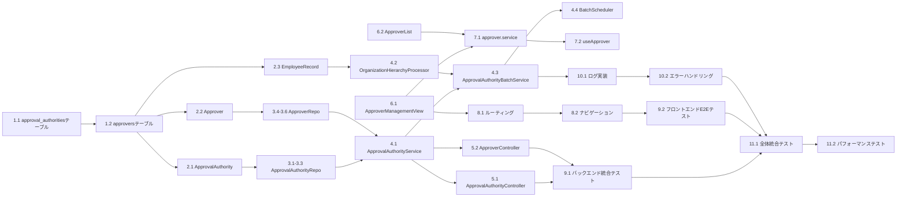

# 実装計画

## タスク一覧

### Phase 1: データベーススキーマ設計

- [ ] 1.1 approval_authoritiesテーブルのFlyway移行スクリプト作成
  - backend/src/main/resources/db/migration/V35__create_approval_authorities_table.sqlを作成
  - email (VARCHAR(255) PRIMARY KEY), position (VARCHAR(50)), created_at, updated_atカラムを定義
  - positionフィールドに適切なインデックスを作成
  - _要件: 5.1, 5.8_
  - 推奨エージェント: springboot-backend-architect

- [ ] 1.2 approversテーブルのFlyway移行スクリプト作成
  - backend/src/main/resources/db/migration/V36__create_approvers_table.sqlを作成
  - id, target_email, approver_email, effective_from, effective_to, system_generated, created_at, updated_atカラムを定義
  - 複合ユニーク制約（target_email, approver_email, effective_from）を追加
  - 外部キー制約とインデックスを適切に設定
  - _要件: 3.1, 3.5, 6.11_
  - _前提: 1.1_
  - 推奨エージェント: springboot-backend-architect

### Phase 2: ドメインモデル実装（並列実行可能）

- [ ] 2.1 ApprovalAuthorityエンティティのテスト作成と実装
  - backend/src/test/java/com/devhour/domain/model/entity/ApprovalAuthorityTest.javaでテストを作成
  - backend/src/main/java/com/devhour/domain/model/entity/ApprovalAuthority.javaを実装
  - email、position、createdAt、updatedAtフィールドを定義
  - Position列挙型（GENERAL_EMPLOYEE, MANAGER, DIRECTOR, DIVISION_HEAD, EXECUTIVE_HEAD）を作成
  - _要件: 5.3, 5.4_
  - 推奨エージェント: springboot-backend-architect

- [ ] 2.2 Approverエンティティのテスト作成と実装
  - backend/src/test/java/com/devhour/domain/model/entity/ApproverTest.javaでテストを作成
  - backend/src/main/java/com/devhour/domain/model/entity/Approver.javaを実装
  - targetEmail、approverEmail、effectiveFrom、effectiveTo、systemGeneratedフィールドを定義
  - 有効期間の検証ロジックを実装（effectiveFrom < effectiveTo）
  - _要件: 3.1, 3.5, 6.11_
  - 推奨エージェント: springboot-backend-architect

- [ ] 2.3 EmployeeRecordデータクラスのテスト作成と実装
  - backend/src/test/java/com/devhour/domain/model/valueobject/EmployeeRecordTest.javaでテストを作成
  - backend/src/main/java/com/devhour/domain/model/valueobject/EmployeeRecord.javaを実装
  - CSV形式に対応したフィールド（email、level1、level2、level3、level4、position）を定義
  - _要件: 5.2, 5.3_
  - 推奨エージェント: springboot-backend-architect

### Phase 3: リポジトリレイヤー実装

- [ ] 3.1 ApprovalAuthorityRepositoryインターフェースの定義
  - backend/src/main/java/com/devhour/domain/repository/ApprovalAuthorityRepository.javaを作成
  - findAll、findByEmail、searchByNameOrEmail、save、deleteメソッドを定義
  - _要件: 5.5, 5.9_
  - _前提: 2.1_
  - 推奨エージェント: springboot-backend-architect

- [ ] 3.2 ApprovalAuthorityMapperのテスト作成と実装
  - backend/src/test/java/com/devhour/infrastructure/mapper/ApprovalAuthorityMapperTest.javaでテストを作成
  - backend/src/main/java/com/devhour/infrastructure/mapper/ApprovalAuthorityMapper.javaを実装
  - MyBatisアノテーションベースでCRUD操作を定義
  - _要件: 5.5, 5.9_
  - _前提: 3.1_
  - 推奨エージェント: springboot-backend-architect

- [ ] 3.3 ApprovalAuthorityRepositoryImplのテスト作成と実装
  - backend/src/test/java/com/devhour/infrastructure/repository/ApprovalAuthorityRepositoryImplTest.javaでテストを作成
  - backend/src/main/java/com/devhour/infrastructure/repository/ApprovalAuthorityRepositoryImpl.javaを実装
  - MapperをラップしてDDDリポジトリパターンを実現
  - _要件: 5.5, 5.9_
  - _前提: 3.2_
  - 推奨エージェント: springboot-backend-architect

- [ ] 3.4 ApproverRepositoryインターフェースの定義
  - backend/src/main/java/com/devhour/domain/repository/ApproverRepository.javaを作成
  - findByTargetEmail、isValidApprover、findAllGroupedByTarget、save、deleteメソッドを定義
  - _要件: 1.1, 2.1_
  - _前提: 2.2_
  - 推奨エージェント: springboot-backend-architect

- [ ] 3.5 ApproverMapperのテスト作成と実装
  - backend/src/test/java/com/devhour/infrastructure/mapper/ApproverMapperTest.javaでテストを作成
  - backend/src/main/java/com/devhour/infrastructure/mapper/ApproverMapper.javaを実装
  - 有効期間を考慮したクエリを実装
  - _要件: 1.1, 2.1_
  - _前提: 3.4_
  - 推奨エージェント: springboot-backend-architect

- [ ] 3.6 ApproverRepositoryImplのテスト作成と実装
  - backend/src/test/java/com/devhour/infrastructure/repository/ApproverRepositoryImplTest.javaでテストを作成
  - backend/src/main/java/com/devhour/infrastructure/repository/ApproverRepositoryImpl.javaを実装
  - トランザクション管理を適切に実装
  - _要件: 1.1, 2.1, 3.3_
  - _前提: 3.5_
  - 推奨エージェント: springboot-backend-architect

### Phase 4: アプリケーションサービス実装

- [ ] 4.1 ApprovalAuthorityServiceのテスト作成と実装
  - backend/src/test/java/com/devhour/application/service/ApprovalAuthorityServiceTest.javaでテストを作成
  - backend/src/main/java/com/devhour/application/service/ApprovalAuthorityService.javaを実装
  - hasApprovalAuthority、searchApprovalAuthoritiesメソッドを実装
  - _要件: 1.1, 2.2_
  - _前提: 3.3, 3.6_
  - 推奨エージェント: springboot-backend-architect

- [ ] 4.2 OrganizationHierarchyProcessorのテスト作成と実装
  - backend/src/test/java/com/devhour/domain/service/OrganizationHierarchyProcessorTest.javaでテストを作成
  - backend/src/main/java/com/devhour/domain/service/OrganizationHierarchyProcessor.javaを実装
  - 組織階層に基づく承認者関係の計算ロジックを実装（要件6の各ルール）
  - _要件: 6.2, 6.3, 6.4, 6.5, 6.6, 6.7, 6.8, 6.9_
  - _前提: 2.3_
  - 推奨エージェント: springboot-backend-architect

- [ ] 4.3 ApprovalAuthorityBatchServiceのテスト作成と実装
  - backend/src/test/java/com/devhour/application/service/ApprovalAuthorityBatchServiceTest.javaでテストを作成
  - backend/src/main/java/com/devhour/application/service/ApprovalAuthorityBatchService.javaを実装
  - CSVパース、差分計算、トランザクション処理を実装
  - BatchResultクラスで処理結果を管理
  - _要件: 5.1, 5.4, 5.5, 5.6, 5.7, 5.10, 5.11, 6.1_
  - _前提: 4.1, 4.2_
  - 推奨エージェント: springboot-backend-architect

- [ ] 4.4 ApprovalAuthorityBatchSchedulerのテスト作成と実装
  - backend/src/test/java/com/devhour/infrastructure/scheduler/ApprovalAuthorityBatchSchedulerTest.javaでテストを作成
  - backend/src/main/java/com/devhour/infrastructure/scheduler/ApprovalAuthorityBatchScheduler.javaを実装
  - @Scheduled(cron = "0 0 2 * * ?")で深夜2時実行を設定
  - ShedLockによる分散ロック制御を実装
  - _要件: 5.1, 5.10_
  - _前提: 4.3_
  - 推奨エージェント: springboot-backend-architect

### Phase 5: APIレイヤー実装

- [ ] 5.1 ApprovalAuthorityControllerのテスト作成と実装
  - backend/src/test/java/com/devhour/presentation/controller/ApprovalAuthorityControllerTest.javaでテストを作成
  - backend/src/main/java/com/devhour/presentation/controller/ApprovalAuthorityController.javaを実装
  - GET /api/approval-authorities/search?query={query}エンドポイントを実装
  - Okta認証とアクセス制御を統合
  - _要件: 2.1, 2.3_
  - _前提: 4.1_
  - 推奨エージェント: springboot-backend-architect

- [ ] 5.2 ApproverControllerのテスト作成と実装
  - backend/src/test/java/com/devhour/presentation/controller/ApproverControllerTest.javaでテストを作成
  - backend/src/main/java/com/devhour/presentation/controller/ApproverController.javaを実装
  - GET /api/approvers/my-approversエンドポイントを実装（自分の承認者一覧取得）
  - _要件: 1.1, 1.2, 1.3, 1.4_
  - _前提: 4.1_
  - 推奨エージェント: springboot-backend-architect

### Phase 6: フロントエンドコンポーネント実装（並列実行可能）

- [ ] 6.1 ApproverManagementViewコンポーネントのテスト作成と実装
  - frontend/src/views/__tests__/ApproverManagementView.spec.tsでテストを作成
  - frontend/src/views/ApproverManagementView.vueを実装
  - 承認者一覧表示、検索機能を実装
  - Vuetifyのv-data-tableコンポーネントを使用
  - _要件: 1.1, 1.2, 1.3, 1.4_
  - 推奨エージェント: vue3-frontend-architect

- [ ] 6.2 ApproverListComponentのテスト作成と実装
  - frontend/src/components/approver/__tests__/ApproverList.spec.tsでテストを作成
  - frontend/src/components/approver/ApproverList.vueを実装
  - 承認者の氏名、メールアドレス、有効期間を表示
  - 承認者が存在しない場合のメッセージ表示を実装
  - _要件: 1.3, 1.4_
  - 推奨エージェント: vue3-frontend-architect

### Phase 7: フロントエンドサービス実装

- [ ] 7.1 approver.service.tsのテスト作成と実装
  - frontend/src/services/domains/__tests__/approver.service.spec.tsでテストを作成
  - frontend/src/services/domains/approver.service.tsを実装
  - getMyApprovers、searchApprovalAuthorities APIコールを実装
  - _要件: 1.1, 2.2_
  - _前提: 6.1, 6.2_
  - 推奨エージェント: vue3-frontend-architect

- [ ] 7.2 useApproverコンポーザブルのテスト作成と実装
  - frontend/src/composables/__tests__/useApprover.spec.tsでテストを作成
  - frontend/src/composables/useApprover.tsを実装
  - 承認者管理の状態管理とAPIインタラクションを提供
  - _要件: 1.1, 4.1, 4.3_
  - _前提: 7.1_
  - 推奨エージェント: vue3-frontend-architect

### Phase 8: ルーティングとナビゲーション更新

- [ ] 8.1 ルーティング設定の更新
  - frontend/src/router/index.tsに/approver-managementルートを追加
  - 認証ガードを適用して未認証アクセスを防止
  - _要件: 2.1_
  - _前提: 6.1_
  - 推奨エージェント: vue3-frontend-architect

- [ ] 8.2 ナビゲーションメニューの更新
  - AppLayoutコンポーネントに「承認者管理」メニュー項目を追加
  - アイコンとラベルを適切に設定
  - _要件: 1.1_
  - _前提: 8.1_
  - 推奨エージェント: vue3-frontend-architect

### Phase 9: 統合テスト実装

- [ ] 9.1 バックエンドAPI統合テストの作成
  - backend/src/test/java/com/devhour/integration/ApprovalAuthorityIntegrationTest.javaを作成
  - 承認権限チェック、CSVインポートの全体フローをテスト
  - TestContainersを使用してMySQLでテスト
  - _要件: 1.1, 2.1, 5.1, 6.1_
  - _前提: 5.1, 5.2_
  - 推奨エージェント: qa-test-strategist

- [ ] 9.2 フロントエンドE2Eテストの作成
  - frontend/tests/e2e/approver-management.spec.tsを作成
  - Playwrightを使用して承認者管理画面の全機能をテスト
  - 承認者一覧表示、検索機能をE2Eでテスト
  - _要件: 1.1, 1.2, 1.3, 1.4, 4.1_
  - _前提: 8.2_
  - 推奨エージェント: qa-test-strategist

### Phase 10: バッチ処理とログ実装

- [ ] 10.1 CSVバッチ処理のログ出力実装
  - ApprovalAuthorityBatchServiceにSLF4Jロギングを追加
  - 処理結果（追加件数、削除件数、維持件数、役職別集計）をログ出力
  - エラー発生時の詳細ログを実装
  - _要件: 5.10, 5.12, 6.12_
  - _前提: 4.3_
  - 推奨エージェント: springboot-backend-architect

- [ ] 10.2 CSVファイル監視とエラーハンドリング
  - CSVファイルフォーマット検証ロジックを実装
  - 不正なCSVフォーマットの場合の処理中止とエラー報告を実装
  - _要件: 5.12_
  - _前提: 10.1_
  - 推奨エージェント: springboot-backend-architect

### Phase 11: 最終統合と検証

- [ ] 11.1 全体統合テストの実行
  - バックエンドの全テストスイートを実行（./gradlew test）
  - フロントエンドの全テストを実行（npm run test:unit、npm run test:e2e）
  - テストカバレッジが80%以上であることを確認
  - _要件: 全般_
  - _前提: 9.1, 9.2_
  - 推奨エージェント: qa-test-strategist

- [ ] 11.2 パフォーマンステストの実施
  - 大量データ（10,000人規模）でのCSVインポートをテスト
  - 承認者検索APIのレスポンスタイムを測定
  - データベースインデックスの効果を確認
  - _要件: 5.10, 6.12_
  - _前提: 11.1_
  - 推奨エージェント: qa-test-strategist

## タスク依存関係

## 並列実行可能なタスクグループ

**グループA（Phase 2）**: ドメインモデル実装
- タスク 2.1, 2.2, 2.3 は相互依存がないため並列実行可能

**グループB（Phase 6）**: フロントエンドコンポーネント
- タスク 6.1, 6.2 は独立して実行可能

**グループC**: バックエンドとフロントエンドの並列開発
- Phase 3-5（バックエンド）とPhase 6-8（フロントエンド）は独立して進行可能

## 実装順序の推奨

1. **Phase 1**: データベーススキーマ（必須最初のステップ）
2. **Phase 2**: ドメインモデル（並列実行）
3. **Phase 3-5 と Phase 6-8**: バックエンドとフロントエンド並列開発
4. **Phase 9**: 統合テスト
5. **Phase 10**: バッチ処理とログ
6. **Phase 11**: 最終検証

## 完了条件

- [ ] 承認者管理画面が正常に動作する
- [ ] CSVバッチ処理が正常に動作する
- [ ] 組織階層に基づく承認者が自動設定される
- [ ] 全てのテストが通過する
- [ ] テストカバレッジ80%以上を維持
- [ ] ドキュメントが更新されている