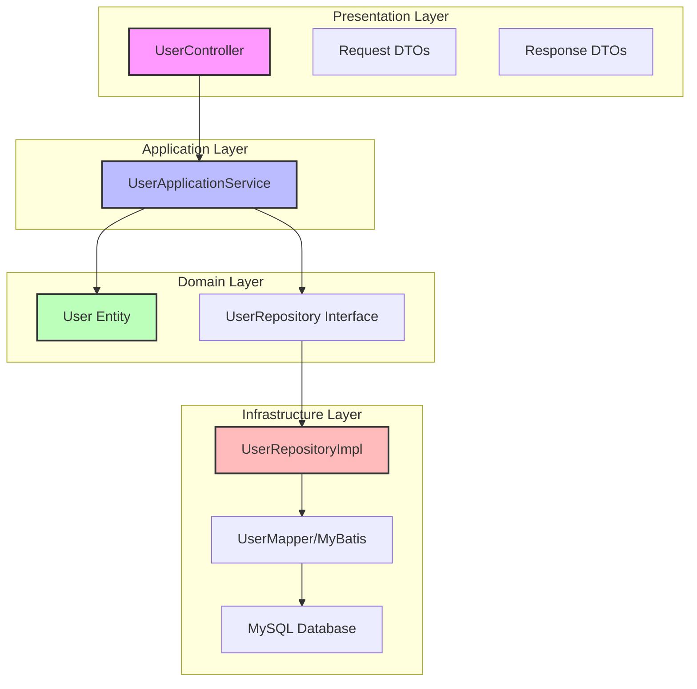
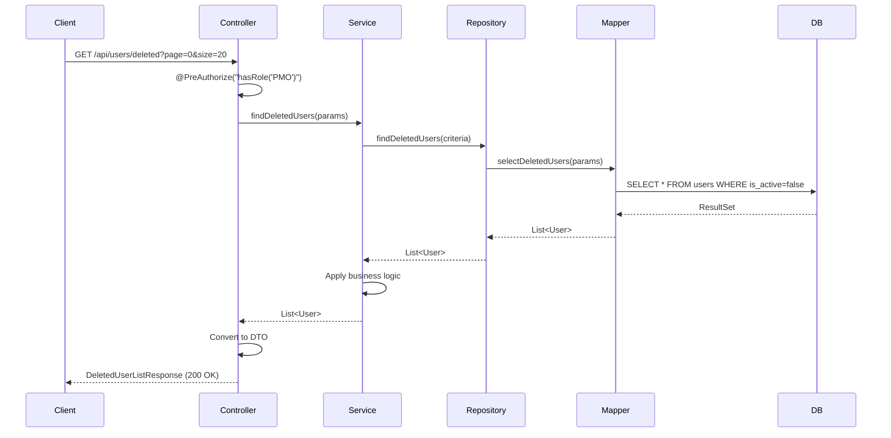
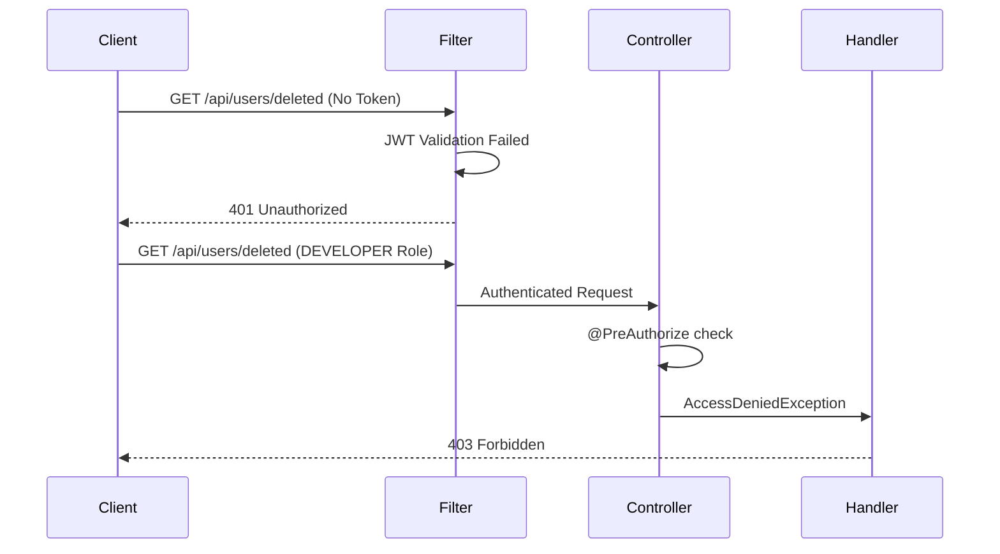
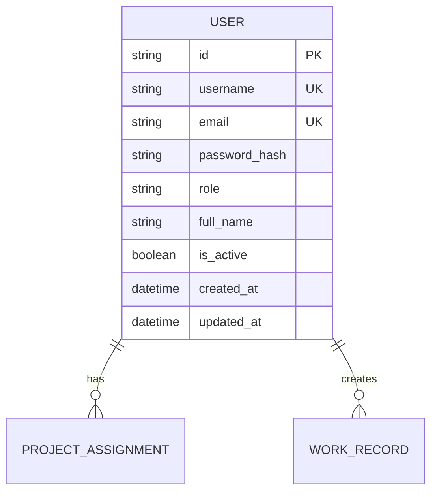
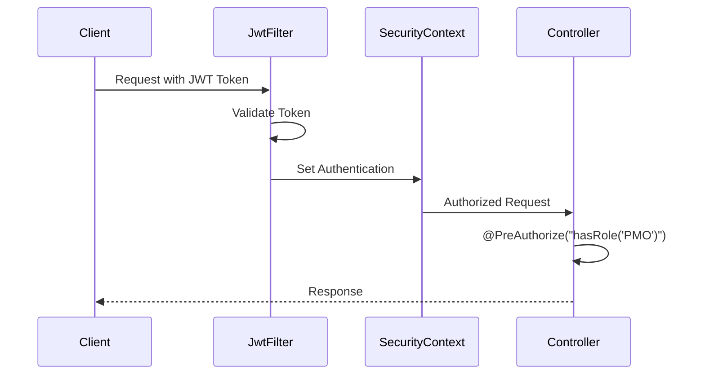

# Technical Design

## Overview
削除済みユーザー一覧取得API機能は、Spring Bootアプリケーションの既存のDDDアーキテクチャに準拠して実装されます。本機能は、論理削除（isActive=false）されたユーザー情報を管理者（PMOロール）が取得できるREST APIエンドポイントを提供し、ページネーション、フィルタリング、検索機能を含む包括的なユーザー管理機能を実現します。

## Requirements Mapping

### Design Component Traceability
各設計コンポーネントが対応する要件：

- **UserController拡張** → REQ-1.1, 1.2, 1.3, 1.4: 削除済みユーザー一覧取得APIエンドポイント
- **DeletedUserListResponse DTO** → REQ-2.1, 2.2, 2.3, 2.4: レスポンスデータ構造
- **PaginationRequest** → REQ-3.1, 3.2, 3.3, 3.4: ページネーションサポート
- **UserApplicationService拡張** → REQ-4.1, 4.2, 4.3, 4.4, 4.5: フィルタリング機能
- **UserRepository拡張** → REQ-5.1, 5.2, 5.3, 5.4: 検索機能
- **GlobalExceptionHandler** → REQ-6.1, 6.2, 6.3, 6.4: エラーハンドリング
- **LoggingAspect** → REQ-7.1, 7.2, 7.3: 監査ログ

### User Story Coverage
- **システム管理者の削除済みユーザー確認**: UserController#getDeletedUsersで実装
- **構造化された詳細情報取得**: DeletedUserListResponseによる標準化されたレスポンス
- **効率的な大量データ閲覧**: カスタムページネーション実装
- **条件による絞り込み**: QueryパラメータによるフィルタリングとUserApplicationServiceでの処理
- **名前/メール検索**: MyBatisクエリでの部分一致検索実装
- **適切なエラーメッセージ**: GlobalExceptionHandlerによる統一エラー処理
- **アクセス監査**: SLF4J + Logbackによる監査ログ記録

## Architecture

### System Architecture


### Technology Stack
既存システムとの整合性を保ちながら以下の技術スタックを使用：

- **Backend Framework**: Spring Boot 3.5.4 + Java 17
- **Data Access**: MyBatis (既存パターンに準拠)
- **Database**: MySQL 8.0
- **Authentication**: JWT (Spring Security統合済み)
- **Logging**: SLF4J + Logback
- **Testing**: JUnit 5 + Mockito (80%カバレッジ要件)
- **Build Tool**: Gradle (Kotlin DSL)

### Architecture Decision Rationale

- **MyBatis継続使用**: 既存のUserMapperとUserRepositoryImplパターンに従い、XMLマッパーではなくアノテーションベースのクエリを使用
- **カスタムページネーション**: Spring Data PageableではなくシンプルなページネーションDTOを実装（既存システムにSpring Dataが導入されていないため）
- **論理削除アプローチ**: 物理削除ではなくisActiveフラグによる論理削除を維持（既存設計に準拠）
- **DTOパターン**: 既存のAdminUserListResponseパターンに倣い、DeletedUserListResponseを実装
- **監査ログ**: データベースではなくファイルベースのログ（既存のログインフラ活用）

## Data Flow

### Primary User Flow
削除済みユーザー一覧取得の主要フロー：



### Error Flow
認証/認可エラーフロー：



## Components and Interfaces

### Backend Services & Method Signatures

#### UserApplicationService拡張
```java
@Service
@Transactional
public class UserApplicationService {
    // 既存メソッド...
    
    /**
     * 削除済みユーザー一覧を取得
     * @param criteria 検索条件（ページング、フィルタ、検索）
     * @return 削除済みユーザーのページネーション結果
     */
    public DeletedUsersResult findDeletedUsers(DeletedUserSearchCriteria criteria);
    
    /**
     * 削除済みユーザー数を取得
     * @param criteria フィルタ条件
     * @return 削除済みユーザーの総数
     */
    public long countDeletedUsers(DeletedUserSearchCriteria criteria);
}
```

#### UserRepository拡張
```java
public interface UserRepository {
    // 既存メソッド...
    
    /**
     * 削除済みユーザーを検索
     * @param criteria 検索条件
     * @return 削除済みユーザーリスト
     */
    List<User> findDeletedUsers(DeletedUserSearchCriteria criteria);
    
    /**
     * 削除済みユーザー数をカウント
     * @param criteria 検索条件
     * @return 削除済みユーザー数
     */
    long countDeletedUsers(DeletedUserSearchCriteria criteria);
}
```

### API Endpoints

| Method | Route | Purpose | Auth | Query Parameters | Status Codes |
|--------|-------|---------|------|-----------------|--------------|
| GET | /api/users/deleted | 削除済みユーザー一覧取得 | PMO Only | page, size, role, deletedFrom, deletedTo, search | 200, 400, 401, 403, 500 |

### Request/Response DTOs

#### DeletedUserSearchCriteria
```java
@Data
@Builder
public class DeletedUserSearchCriteria {
    private Integer page = 0;          // ページ番号（0始まり）
    private Integer size = 20;          // ページサイズ（デフォルト20、最大100）
    private String role;                // フィルタ: PMO/DEVELOPER
    private LocalDate deletedFrom;      // フィルタ: 削除開始日
    private LocalDate deletedTo;        // フィルタ: 削除終了日
    private String search;              // 検索キーワード（3文字以上）
    
    public int getOffset() {
        return page * size;
    }
    
    public void validate() {
        if (size > 100) {
            throw new IllegalArgumentException("Page size cannot exceed 100");
        }
        if (search != null && search.length() < 3) {
            throw new IllegalArgumentException("Search keyword must be at least 3 characters");
        }
    }
}
```

#### DeletedUserListResponse
```java
@Data
@Builder
@NoArgsConstructor
@AllArgsConstructor
public class DeletedUserListResponse {
    private List<DeletedUserDto> users;
    private PageMetadata metadata;
    
    @Data
    @Builder
    public static class DeletedUserDto {
        private String id;
        private String username;
        private String email;
        private String role;
        private String fullName;
        private boolean isActive;  // 常にfalse
        @JsonFormat(pattern = "yyyy-MM-dd'T'HH:mm:ss")
        private LocalDateTime createdAt;
        @JsonFormat(pattern = "yyyy-MM-dd'T'HH:mm:ss")
        private LocalDateTime updatedAt;  // 削除日時
    }
    
    @Data
    @Builder
    public static class PageMetadata {
        private long totalElements;
        private int totalPages;
        private int currentPage;
        private int pageSize;
        private boolean hasNext;
        private boolean hasPrevious;
    }
}
```

## Data Models

### Domain Entities
既存のUserエンティティを使用（変更なし）：

1. **User**: ユーザー情報（id, username, email, role, fullName, isActive, createdAt, updatedAt）
2. **User.Role**: ユーザーロール列挙型（PMO, DEVELOPER）

### Entity Relationships


### Database Schema
既存のusersテーブルを使用：

```sql
-- 既存テーブル（変更なし）
CREATE TABLE users (
    id VARCHAR(36) PRIMARY KEY,
    username VARCHAR(50) UNIQUE NOT NULL,
    email VARCHAR(100) UNIQUE NOT NULL,
    password_hash VARCHAR(255) NOT NULL,
    role VARCHAR(20) NOT NULL,
    full_name VARCHAR(100) NOT NULL,
    is_active BOOLEAN DEFAULT true,
    created_at TIMESTAMP NOT NULL,
    updated_at TIMESTAMP NOT NULL,
    INDEX idx_users_is_active (is_active),
    INDEX idx_users_updated_at (updated_at),
    INDEX idx_users_role (role)
);
```

### MyBatis Mapper拡張
```java
@Mapper
public interface UserMapper {
    // 既存メソッド...
    
    @Select("""
        <script>
        SELECT * FROM users
        WHERE is_active = false
        <if test="role != null">
            AND role = #{role}
        </if>
        <if test="deletedFrom != null">
            AND updated_at >= #{deletedFrom}
        </if>
        <if test="deletedTo != null">
            AND updated_at <= #{deletedTo}
        </if>
        <if test="search != null">
            AND (
                username LIKE CONCAT('%', #{search}, '%')
                OR email LIKE CONCAT('%', #{search}, '%')
                OR full_name LIKE CONCAT('%', #{search}, '%')
            )
        </if>
        ORDER BY updated_at DESC
        LIMIT #{limit} OFFSET #{offset}
        </script>
        """)
    @Results(id = "userResultMap", value = {
        @Result(property = "id", column = "id"),
        @Result(property = "username", column = "username"),
        @Result(property = "email", column = "email"),
        @Result(property = "passwordHash", column = "password_hash"),
        @Result(property = "role", column = "role", typeHandler = RoleTypeHandler.class),
        @Result(property = "fullName", column = "full_name"),
        @Result(property = "isActive", column = "is_active"),
        @Result(property = "createdAt", column = "created_at"),
        @Result(property = "updatedAt", column = "updated_at")
    })
    List<User> selectDeletedUsers(@Param("role") String role,
                                  @Param("deletedFrom") LocalDate deletedFrom,
                                  @Param("deletedTo") LocalDate deletedTo,
                                  @Param("search") String search,
                                  @Param("limit") int limit,
                                  @Param("offset") int offset);
    
    @Select("""
        <script>
        SELECT COUNT(*) FROM users
        WHERE is_active = false
        <if test="role != null">
            AND role = #{role}
        </if>
        <if test="deletedFrom != null">
            AND updated_at >= #{deletedFrom}
        </if>
        <if test="deletedTo != null">
            AND updated_at <= #{deletedTo}
        </if>
        <if test="search != null">
            AND (
                username LIKE CONCAT('%', #{search}, '%')
                OR email LIKE CONCAT('%', #{search}, '%')
                OR full_name LIKE CONCAT('%', #{search}, '%')
            )
        </if>
        </script>
        """)
    long countDeletedUsers(@Param("role") String role,
                          @Param("deletedFrom") LocalDate deletedFrom,
                          @Param("deletedTo") LocalDate deletedTo,
                          @Param("search") String search);
}
```

## Error Handling

### Exception Hierarchy
```java
// 400 Bad Request
- IllegalArgumentException: 不正なパラメータ（size > 100, search < 3文字）
- DateTimeParseException: 不正な日付形式

// 401 Unauthorized
- JwtAuthenticationException: JWT認証失敗

// 403 Forbidden  
- AccessDeniedException: PMOロール不足

// 500 Internal Server Error
- DataAccessException: データベースエラー
- Exception: 予期しないエラー

// 503 Service Unavailable
- DataSourceLookupFailureException: DB接続エラー
```

### GlobalExceptionHandler拡張
```java
@RestControllerAdvice
public class GlobalExceptionHandler {
    
    @ExceptionHandler(IllegalArgumentException.class)
    public ResponseEntity<ErrorResponse> handleBadRequest(IllegalArgumentException e) {
        return ResponseEntity.badRequest()
            .body(ErrorResponse.of(400, "Bad Request", e.getMessage()));
    }
    
    @ExceptionHandler(AccessDeniedException.class)
    public ResponseEntity<ErrorResponse> handleForbidden(AccessDeniedException e) {
        return ResponseEntity.status(403)
            .body(ErrorResponse.of(403, "Forbidden", "Access denied"));
    }
    
    @ExceptionHandler(DataSourceLookupFailureException.class)
    public ResponseEntity<ErrorResponse> handleServiceUnavailable(Exception e) {
        return ResponseEntity.status(503)
            .body(ErrorResponse.of(503, "Service Unavailable", "Database connection error"));
    }
}
```

## Security Considerations

### Authentication & Authorization


### Authorization Matrix
| Role | GET /api/users/deleted | 
|------|------------------------|
| PMO | ✅ Allowed |
| DEVELOPER | ❌ Forbidden (403) |
| Anonymous | ❌ Unauthorized (401) |

### Data Protection
- パスワードハッシュは一切レスポンスに含めない
- SQLインジェクション対策: MyBatisのパラメータバインディング使用
- XSS対策: JSONレスポンスのContent-Type適切設定
- ログにセンシティブ情報を出力しない

## Performance & Scalability

### Performance Targets
| Metric | Target | Measurement |
|--------|--------|-------------|
| Response Time (p95) | < 200ms | 1000件以下のデータ |
| Response Time (p99) | < 500ms | 全エンドポイント |
| Throughput | > 100 req/sec | 同時接続数10 |
| Database Query (p99) | < 50ms | インデックス利用 |

### Query Optimization
- `is_active`フィールドにインデックス作成済み
- `updated_at`フィールドにインデックス作成済み
- ページネーションによるメモリ使用量制限（最大100件/ページ）
- カウントクエリとデータ取得クエリの分離

### Caching Strategy
- 削除済みユーザーデータはキャッシュしない（監査要件のため）
- JWTトークンの検証結果は既存のキャッシュ機構を利用

## Testing Strategy

### Test Coverage Requirements
- **Unit Tests**: ≥80% カバレッジ（JaCoCo使用）
- **Integration Tests**: 全APIエンドポイント
- **Security Tests**: 認証・認可シナリオ

### Test Scenarios

#### UserControllerTest
```java
@Test
void getDeletedUsers_WithPMORole_ReturnsDeletedUsers()
@Test
void getDeletedUsers_WithDeveloperRole_Returns403()
@Test
void getDeletedUsers_WithoutAuth_Returns401()
@Test
void getDeletedUsers_WithInvalidPageSize_Returns400()
@Test
void getDeletedUsers_WithSearchFilter_ReturnsFilteredResults()
```

#### UserApplicationServiceTest
```java
@Test
void findDeletedUsers_ReturnsOnlyInactiveUsers()
@Test
void findDeletedUsers_WithPagination_ReturnsCorrectPage()
@Test
void findDeletedUsers_WithRoleFilter_ReturnsFilteredUsers()
@Test
void findDeletedUsers_WithDateRange_ReturnsFilteredUsers()
@Test
void findDeletedUsers_WithSearch_ReturnsMatchingUsers()
```

#### UserRepositoryImplTest
```java
@Test
void findDeletedUsers_ExecutesCorrectQuery()
@Test
void countDeletedUsers_ReturnsCorrectCount()
```

### CI/CD Pipeline Integration
既存のGradle + JUnit 5 + JaCoCoパイプラインに統合：

```bash
./gradlew clean test jacocoTestReport
./gradlew check  # 80%カバレッジ検証
```

## Logging & Monitoring

### Audit Logging Implementation
```java
@Aspect
@Component
public class AuditLoggingAspect {
    private static final Logger auditLogger = LoggerFactory.getLogger("AUDIT");
    
    @Around("@annotation(PreAuthorize) && execution(* *..UserController.getDeletedUsers(..))")
    public Object auditDeletedUsersAccess(ProceedingJoinPoint joinPoint) throws Throwable {
        String userId = SecurityContextHolder.getContext().getAuthentication().getName();
        Map<String, Object> params = extractParameters(joinPoint);
        
        try {
            Object result = joinPoint.proceed();
            int count = extractResultCount(result);
            
            auditLogger.info("DELETED_USERS_ACCESS - User: {}, Params: {}, Status: SUCCESS, Count: {}", 
                userId, params, count);
            return result;
        } catch (Exception e) {
            auditLogger.warn("DELETED_USERS_ACCESS - User: {}, Params: {}, Status: FAILED, Error: {}", 
                userId, params, e.getMessage());
            throw e;
        }
    }
}
```

### Log Format
```
2024-01-15 10:30:45.123 INFO  [AUDIT] - DELETED_USERS_ACCESS - User: pmo_user_123, Params: {page=0, size=20, role=DEVELOPER}, Status: SUCCESS, Count: 15
2024-01-15 10:31:12.456 WARN  [AUDIT] - DELETED_USERS_ACCESS - User: dev_user_456, Params: {page=0}, Status: FAILED, Error: Access denied
```