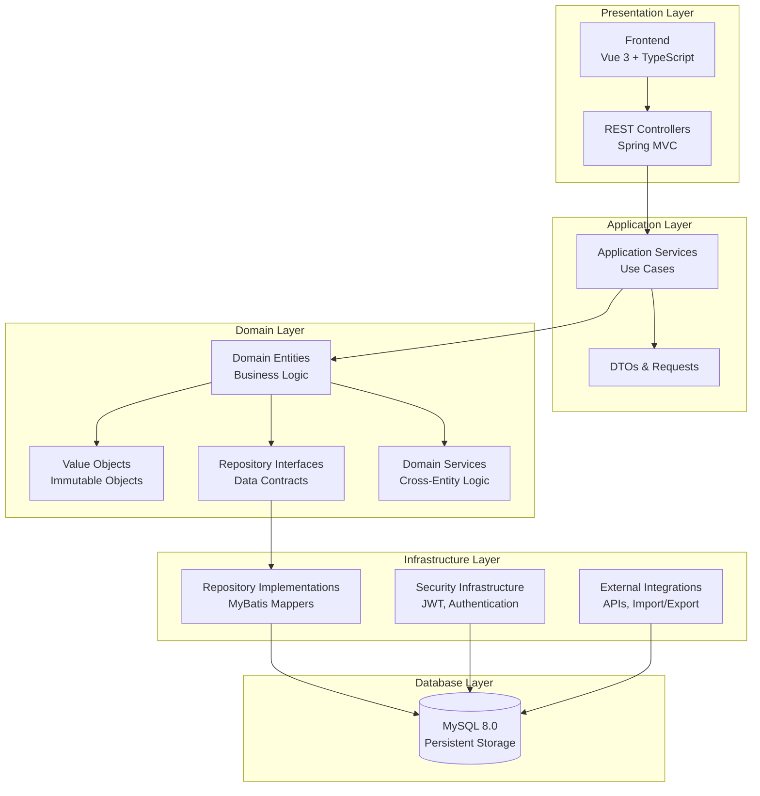
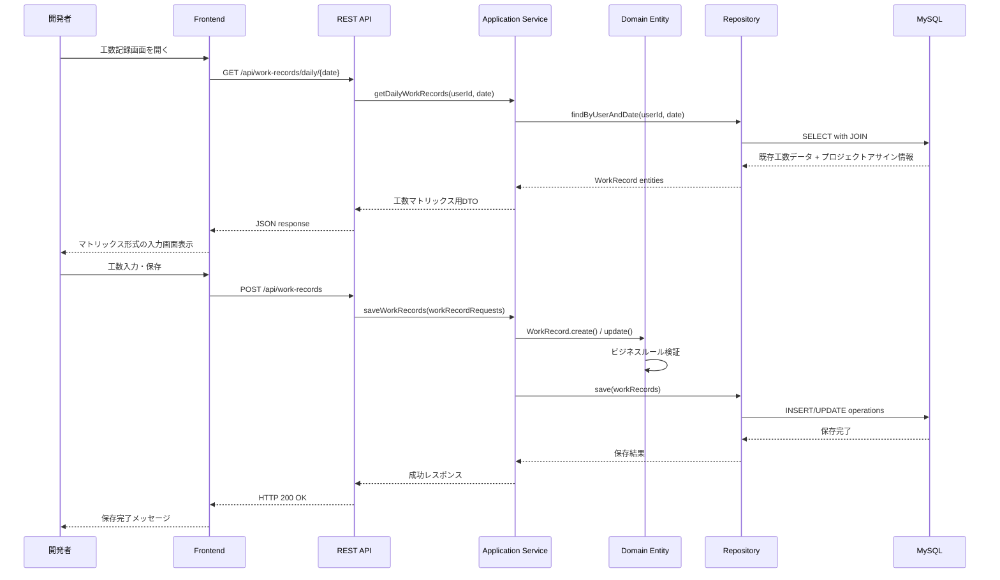
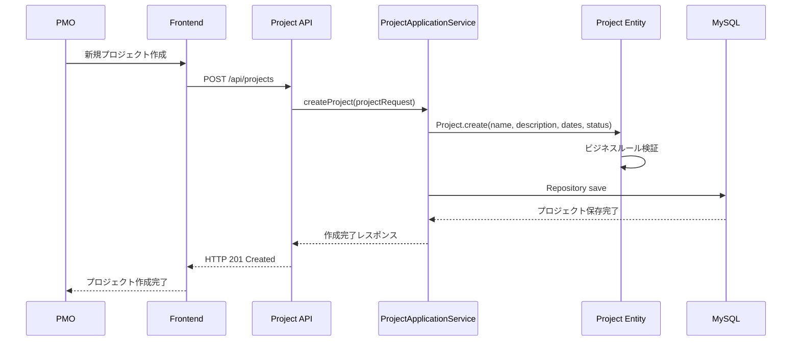
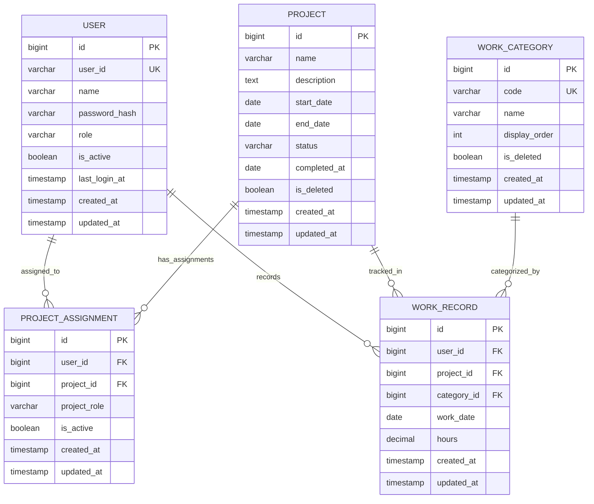
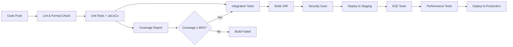

# Technical Design

## Overview
製品開発工数管理ツールは、既存のSpring Boot + Domain-Driven Design (DDD) アーキテクチャを基盤として、PMOと開発者の協働による効率的な工数管理を実現するWebアプリケーションシステムです。本設計では、要件定義で明確化された7つの機能領域を、既存の4層DDD構造（Domain、Application、Infrastructure、Presentation）に適切にマッピングし、JWTベースの認証、MyBatis + MySQL による永続化、Spring Security による認可制御を活用した堅牢なシステムを構築します。

## Requirements Mapping

### Design Component Traceability
各設計コンポーネントは以下の要件に対応します：

- **Project Management Components** → REQ-1: プロジェクト管理
  - `Project` エンティティ、`ProjectApplicationService`、`ProjectController`
- **Assignment Management Components** → REQ-2: 開発者アサイン管理  
  - `ProjectAssignment` エンティティ、`ProjectAssignmentApplicationService`
- **Work Record Components** → REQ-3: 工数記録・追跡
  - `WorkRecord` エンティティ、`WorkRecordApplicationService`、マトリックス入力UI
- **Category Management Components** → REQ-4: 作業カテゴリ管理
  - `WorkCategory` エンティティ、`CategoryCode`/`CategoryName` 値オブジェクト
- **Authentication Components** → REQ-5: ユーザー管理・認証
  - JWT認証フィルター、`User` エンティティ、`AuthService`
- **API Integration Layer** → REQ-6: システム統合・API
  - REST API エンドポイント、データインポート機能
- **System Infrastructure** → REQ-7: パフォーマンス・非機能要件
  - キャッシング、監視、エラーハンドリング

### User Story Coverage
- **PMO管理ストーリー**: プロジェクト作成・編集、開発者アサイン、カテゴリ管理機能で対応
- **開発者記録ストーリー**: 工数マトリックス入力、履歴確認、コピー機能で対応
- **管理者運用ストーリー**: ユーザー管理、認証、システム統合機能で対応
- **システム利用ストーリー**: 高性能・高可用性アーキテクチャで対応

## Architecture



### Technology Stack
既存技術スタックを基盤として以下を活用：

- **Backend Framework**: Spring Boot 3.5.4 + Java 17
- **Architecture Pattern**: Domain-Driven Design (DDD) 4層構造
- **Data Access**: MyBatis 3.0.5 (アノテーションベース)
- **Database**: MySQL 8.0 + Flyway migration
- **Security**: Spring Security + JWT (io.jsonwebtoken:jjwt 0.12.6)
- **Build Tool**: Gradle with Kotlin DSL
- **Testing**: JUnit 5 + JaCoCo (80%カバレッジ要求)
- **Development**: Docker Compose + Spring Boot DevTools
- **Frontend**: Vue 3 + TypeScript (将来実装予定)

### Architecture Decision Rationale

- **Spring Boot + DDD選択理由**: 既存システムとの整合性、ビジネスロジックの明確な分離、保守性の向上
- **MyBatis選択理由**: SQLの完全制御、型安全性、既存システムとの統一性
- **JWT認証選択理由**: ステートレス認証、スケーラビリティ、既存実装の活用
- **MySQL選択理由**: 既存インフラとの整合性、トランザクション保証、データ整合性要件

## Data Flow

### Primary User Flows

#### 工数記録フロー


#### PMOプロジェクト管理フロー


## Components and Interfaces

### Backend Services & Method Signatures

```java
// プロジェクト管理アプリケーションサービス
@Service
@RequiredArgsConstructor
public class ProjectApplicationService {
    public ProjectResponseDto createProject(ProjectCreateRequest request);     // プロジェクト新規作成
    public ProjectResponseDto updateProject(Long projectId, ProjectUpdateRequest request); // プロジェクト更新
    public void deleteProject(Long projectId);                                 // プロジェクト論理削除
    public List<ProjectSummaryDto> findAllProjects(ProjectFilterRequest filter); // プロジェクト一覧取得（フィルタ付き）
    public ProjectDetailDto findProjectById(Long projectId);                   // プロジェクト詳細取得
    public void completeProject(Long projectId);                              // プロジェクト完了処理
}

// 工数記録アプリケーションサービス  
@Service
@RequiredArgsConstructor
public class WorkRecordApplicationService {
    public WorkRecordMatrixDto getDailyMatrix(Long userId, LocalDate date);   // 日次工数マトリックス取得
    public void saveWorkRecords(List<WorkRecordCreateRequest> requests);      // 工数記録一括保存・更新（ID存在チェックで分岐）
    public WorkRecordSummaryDto getWorkRecordSummary(Long userId, LocalDate startDate, LocalDate endDate); // 期間集計
    public void copyPreviousDayRecords(Long userId, LocalDate targetDate);    // 前日工数コピー
    public List<WorkRecordHistoryDto> getWorkRecordHistory(Long userId, int days); // 工数履歴取得
}

// プロジェクトアサインアプリケーションサービス
@Service  
@RequiredArgsConstructor
public class ProjectAssignmentApplicationService {
    public void assignUserToProject(ProjectAssignmentCreateRequest request);  // 開発者アサイン
    public void unassignUserFromProject(Long assignmentId);                   // アサイン解除
    public List<ProjectAssignmentDto> getProjectAssignments(Long projectId);  // プロジェクト別アサイン取得
    public List<UserAssignmentDto> getUserAssignments(Long userId);           // ユーザー別アサイン取得
    public void validateUniqueAssignment(Long projectId, Long userId);        // 重複アサインチェック
}

// 作業カテゴリ管理アプリケーションサービス
@Service
@RequiredArgsConstructor  
public class WorkCategoryApplicationService {
    public WorkCategoryDto createCategory(WorkCategoryCreateRequest request); // カテゴリ作成
    public WorkCategoryDto updateCategory(Long categoryId, WorkCategoryUpdateRequest request); // カテゴリ更新
    public void deleteCategory(Long categoryId);                             // カテゴリ削除（使用中チェック）
    public List<WorkCategoryDto> findAllCategories();                        // カテゴリ一覧（表示順序）
    public boolean isCategoryInUse(Long categoryId);                         // カテゴリ使用状況チェック
}
```

### Frontend Components (将来実装)
| Component名 | 責務 | Props/State概要 |
|-------------|------|----------------|
| ProjectManagement | プロジェクト管理画面 | projects[], filters, selectedProject |
| WorkRecordMatrix | 工数入力マトリックス | assignments[], categories[], workRecords[] |
| AssignmentManagement | アサイン管理画面 | users[], projects[], assignments[] |
| CategoryManagement | カテゴリ管理画面 | categories[], editingCategory |
| UserManagement | ユーザー管理画面 | users[], roles[], editingUser |
| LoginForm | ログイン画面 | credentials, authentication状態 |

### API Endpoints

| Method | Route | Purpose | Auth | Status Codes |
|--------|-------|---------|------|--------------|
| **プロジェクト管理** |
| GET    | /api/projects | プロジェクト一覧取得（フィルタ対応） | JWT必須 | 200, 401, 500 |
| POST   | /api/projects | 新規プロジェクト作成 | PMO権限 | 201, 400, 401, 403, 500 |
| GET    | /api/projects/{id} | プロジェクト詳細取得 | JWT必須 | 200, 401, 404, 500 |
| PUT    | /api/projects/{id} | プロジェクト情報更新 | PMO権限 | 200, 400, 401, 403, 404, 500 |
| DELETE | /api/projects/{id} | プロジェクト論理削除 | PMO権限 | 204, 401, 403, 404, 500 |
| PUT    | /api/projects/{id}/complete | プロジェクト完了 | PMO権限 | 200, 401, 403, 404, 500 |
| **工数記録管理** |
| GET    | /api/work-records/daily/{date} | 日次工数マトリックス取得 | JWT必須 | 200, 401, 500 |
| POST   | /api/work-records | 工数記録一括保存・更新 | Developer権限 | 200, 400, 401, 403, 500 |
| GET    | /api/work-records/summary | 工数集計取得 | JWT必須 | 200, 401, 500 |
| POST   | /api/work-records/copy/{date} | 前日工数コピー | Developer権限 | 201, 400, 401, 403, 500 |
| **アサイン管理** |
| GET    | /api/assignments/project/{projectId} | プロジェクト別アサイン取得 | JWT必須 | 200, 401, 404, 500 |
| GET    | /api/assignments/user/{userId} | ユーザー別アサイン取得 | JWT必須 | 200, 401, 404, 500 |
| POST   | /api/assignments | 開発者アサイン | PMO権限 | 201, 400, 401, 403, 409, 500 |
| PUT    | /api/assignments/{id}/deactivate | アサイン解除 | PMO権限 | 200, 401, 403, 404, 500 |
| **カテゴリ管理** |
| GET    | /api/categories | カテゴリ一覧取得 | JWT必須 | 200, 401, 500 |
| POST   | /api/categories | カテゴリ作成 | PMO権限 | 201, 400, 401, 403, 500 |
| PUT    | /api/categories/{id} | カテゴリ更新 | PMO権限 | 200, 400, 401, 403, 404, 500 |
| DELETE | /api/categories/{id} | カテゴリ削除 | PMO権限 | 204, 401, 403, 404, 409, 500 |
| **認証・ユーザー管理** |
| POST   | /api/auth/login | ユーザーログイン | 不要 | 200, 401, 500 |
| GET    | /api/auth/me | 認証ユーザー情報取得 | JWT必須 | 200, 401, 500 |
| POST   | /api/users | ユーザー作成 | Admin権限 | 201, 400, 401, 403, 500 |
| GET    | /api/users | ユーザー一覧取得 | Admin権限 | 200, 401, 403, 500 |
| PUT    | /api/users/{id}/password | パスワード変更 | 本人またはAdmin | 200, 400, 401, 403, 404, 500 |

## Data Models

### Domain Entities

1. **Project**: プロジェクトの基本情報と状態管理
2. **User**: ユーザー情報と認証データ
3. **WorkRecord**: 日次工数記録データ  
4. **ProjectAssignment**: プロジェクトと開発者のアサイン関係
5. **WorkCategory**: 作業カテゴリの定義

### Entity Relationships


### Data Model Definitions

```java
// Domain Entities (Java)

@Entity
@Table(name = "projects")
@Data
@NoArgsConstructor
public class Project {
    @Id
    @GeneratedValue(strategy = GenerationType.IDENTITY)
    private Long id;
    
    @Column(nullable = false, length = 200)
    private String name;
    
    @Column(columnDefinition = "TEXT")
    private String description;
    
    @Column(name = "start_date")
    private LocalDate startDate;
    
    @Column(name = "end_date")
    private LocalDate endDate;
    
    @Enumerated(EnumType.STRING)
    @Column(nullable = false)
    private ProjectStatus status; // 計画中、進行中、完了、保留
    
    @Column(name = "completed_at")
    private LocalDateTime completedAt;
    
    @Column(name = "is_deleted", nullable = false)
    private Boolean isDeleted = false;
    
    @Column(name = "created_at", nullable = false)
    private LocalDateTime createdAt;
    
    @Column(name = "updated_at", nullable = false)
    private LocalDateTime updatedAt;
    
    // ビジネスロジック
    public void complete() {
        this.status = ProjectStatus.COMPLETED;
        this.completedAt = LocalDateTime.now();
    }
    
    public boolean canAcceptWorkRecord() {
        return status != ProjectStatus.COMPLETED && !isDeleted;
    }
}

@Entity
@Table(name = "work_records")
@Data
@NoArgsConstructor
public class WorkRecord {
    @Id
    @GeneratedValue(strategy = GenerationType.IDENTITY)
    private Long id;
    
    @Column(name = "user_id", nullable = false)
    private Long userId;
    
    @Column(name = "project_id", nullable = false) 
    private Long projectId;
    
    @Column(name = "category_id", nullable = false)
    private Long categoryId;
    
    @Column(name = "work_date", nullable = false)
    private LocalDate workDate;
    
    @Column(precision = 4, scale = 2, nullable = false)
    private BigDecimal hours; // 0.25時間単位
    
    @Column(name = "created_at", nullable = false)
    private LocalDateTime createdAt;
    
    @Column(name = "updated_at", nullable = false)
    private LocalDateTime updatedAt;
    
    // ビジネスロジック
    public static WorkRecord create(Long userId, Long projectId, Long categoryId, 
                                  LocalDate workDate, BigDecimal hours) {
        // バリデーション: 0.25時間単位チェック
        if (hours.remainder(BigDecimal.valueOf(0.25)).compareTo(BigDecimal.ZERO) != 0) {
            throw new IllegalArgumentException("工数は0.25時間単位で入力してください");
        }
        
        WorkRecord record = new WorkRecord();
        record.userId = userId;
        record.projectId = projectId;
        record.categoryId = categoryId;
        record.workDate = workDate;
        record.hours = hours;
        record.createdAt = LocalDateTime.now();
        record.updatedAt = LocalDateTime.now();
        return record;
    }
}

@Entity
@Table(name = "project_assignments")
@Data
@NoArgsConstructor
public class ProjectAssignment {
    @Id
    @GeneratedValue(strategy = GenerationType.IDENTITY)
    private Long id;
    
    @Column(name = "user_id", nullable = false)
    private Long userId;
    
    @Column(name = "project_id", nullable = false)
    private Long projectId;
    
    @Column(name = "project_role", length = 50)
    private String projectRole; // 開発者、レビュアー、テスター等
    
    @Column(name = "is_active", nullable = false)
    private Boolean isActive = true;
    
    @Column(name = "created_at", nullable = false)
    private LocalDateTime createdAt;
    
    @Column(name = "updated_at", nullable = false)
    private LocalDateTime updatedAt;
    
    // 一意制約チェック用
    public static void validateUniqueAssignment(Long projectId, Long userId, List<ProjectAssignment> existingAssignments) {
        boolean exists = existingAssignments.stream()
            .anyMatch(assignment -> assignment.getProjectId().equals(projectId) && 
                     assignment.getUserId().equals(userId) && 
                     assignment.getIsActive());
        if (exists) {
            throw new IllegalStateException("同一プロジェクトに同一開発者は重複アサインできません");
        }
    }
}
```

```typescript
// Frontend Type Definitions (TypeScript)

interface Project {
  id: number;
  name: string;
  description?: string;
  startDate: string; // ISO date format
  endDate?: string;
  status: 'PLANNING' | 'IN_PROGRESS' | 'COMPLETED' | 'ON_HOLD';
  completedAt?: string;
  createdAt: string;
  updatedAt: string;
}

interface WorkRecord {
  id?: number;
  userId: number;
  projectId: number;
  categoryId: number;
  workDate: string; // ISO date format
  hours: number; // 0.25単位
  createdAt?: string;
  updatedAt?: string;
}

interface WorkRecordMatrix {
  date: string;
  projects: ProjectAssignmentInfo[];
  categories: WorkCategory[];
  records: { [projectId: number]: { [categoryId: number]: number } };
  totalHours: number;
}

interface ProjectAssignment {
  id: number;
  userId: number;
  projectId: number;
  projectRole: string;
  isActive: boolean;
  userName?: string;
  projectName?: string;
}
```

### Database Schema

```sql
-- 既存のスキーマ構造に基づく主要テーブル定義

-- ユーザーテーブル
CREATE TABLE users (
    id BIGINT AUTO_INCREMENT PRIMARY KEY,
    user_id VARCHAR(50) UNIQUE NOT NULL,
    name VARCHAR(100) NOT NULL,
    password_hash VARCHAR(255) NOT NULL,
    role ENUM('PMO', 'DEVELOPER', 'ADMIN') NOT NULL DEFAULT 'DEVELOPER',
    is_active BOOLEAN NOT NULL DEFAULT TRUE,
    last_login_at TIMESTAMP NULL,
    created_at TIMESTAMP NOT NULL DEFAULT CURRENT_TIMESTAMP,
    updated_at TIMESTAMP NOT NULL DEFAULT CURRENT_TIMESTAMP ON UPDATE CURRENT_TIMESTAMP
);

-- プロジェクトテーブル
CREATE TABLE projects (
    id BIGINT AUTO_INCREMENT PRIMARY KEY,
    name VARCHAR(200) NOT NULL,
    description TEXT,
    start_date DATE NOT NULL,
    end_date DATE,
    status ENUM('PLANNING', 'IN_PROGRESS', 'COMPLETED', 'ON_HOLD') NOT NULL DEFAULT 'PLANNING',
    completed_at TIMESTAMP NULL,
    is_deleted BOOLEAN NOT NULL DEFAULT FALSE,
    created_at TIMESTAMP NOT NULL DEFAULT CURRENT_TIMESTAMP,
    updated_at TIMESTAMP NOT NULL DEFAULT CURRENT_TIMESTAMP ON UPDATE CURRENT_TIMESTAMP,
    INDEX idx_status (status),
    INDEX idx_dates (start_date, end_date)
);

-- 作業カテゴリテーブル  
CREATE TABLE work_categories (
    id BIGINT AUTO_INCREMENT PRIMARY KEY,
    code VARCHAR(20) UNIQUE NOT NULL,
    name VARCHAR(100) NOT NULL,
    display_order INT NOT NULL DEFAULT 0,
    is_deleted BOOLEAN NOT NULL DEFAULT FALSE,
    created_at TIMESTAMP NOT NULL DEFAULT CURRENT_TIMESTAMP,
    updated_at TIMESTAMP NOT NULL DEFAULT CURRENT_TIMESTAMP ON UPDATE CURRENT_TIMESTAMP,
    INDEX idx_display_order (display_order)
);

-- プロジェクトアサインテーブル
CREATE TABLE project_assignments (
    id BIGINT AUTO_INCREMENT PRIMARY KEY,
    user_id BIGINT NOT NULL,
    project_id BIGINT NOT NULL,
    project_role VARCHAR(50),
    is_active BOOLEAN NOT NULL DEFAULT TRUE,
    created_at TIMESTAMP NOT NULL DEFAULT CURRENT_TIMESTAMP,
    updated_at TIMESTAMP NOT NULL DEFAULT CURRENT_TIMESTAMP ON UPDATE CURRENT_TIMESTAMP,
    FOREIGN KEY (user_id) REFERENCES users(id),
    FOREIGN KEY (project_id) REFERENCES projects(id),
    UNIQUE KEY uk_user_project_active (user_id, project_id, is_active),
    INDEX idx_user_active (user_id, is_active),
    INDEX idx_project_active (project_id, is_active)
);

-- 工数記録テーブル
CREATE TABLE work_records (
    id BIGINT AUTO_INCREMENT PRIMARY KEY,
    user_id BIGINT NOT NULL,
    project_id BIGINT NOT NULL,
    category_id BIGINT NOT NULL,
    work_date DATE NOT NULL,
    hours DECIMAL(4,2) NOT NULL CHECK (hours >= 0 AND hours <= 24),
    created_at TIMESTAMP NOT NULL DEFAULT CURRENT_TIMESTAMP,
    updated_at TIMESTAMP NOT NULL DEFAULT CURRENT_TIMESTAMP ON UPDATE CURRENT_TIMESTAMP,
    FOREIGN KEY (user_id) REFERENCES users(id),
    FOREIGN KEY (project_id) REFERENCES projects(id),
    FOREIGN KEY (category_id) REFERENCES work_categories(id),
    UNIQUE KEY uk_user_project_category_date (user_id, project_id, category_id, work_date),
    INDEX idx_user_date (user_id, work_date),
    INDEX idx_project_date (project_id, work_date)
);
```

### Migration Strategy
- **Flyway Migration**: バージョン管理されたスキーマ変更
- **Backward Compatibility**: 既存データとの互換性保持  
- **Data Transformation**: 段階的なデータ移行戦略
- **Indexing Strategy**: クエリパフォーマンス最適化のためのインデックス設計

## Error Handling

### エラーハンドリング戦略

```java
// グローバル例外ハンドラー
@RestControllerAdvice
public class GlobalExceptionHandler {

    @ExceptionHandler(BusinessException.class)
    public ResponseEntity<ErrorResponse> handleBusinessException(BusinessException e) {
        return ResponseEntity.badRequest()
            .body(ErrorResponse.builder()
                .code("BUSINESS_ERROR")
                .message(e.getMessage())
                .timestamp(LocalDateTime.now())
                .build());
    }
    
    @ExceptionHandler(DuplicateAssignmentException.class)
    public ResponseEntity<ErrorResponse> handleDuplicateAssignment(DuplicateAssignmentException e) {
        return ResponseEntity.status(HttpStatus.CONFLICT)
            .body(ErrorResponse.builder()
                .code("DUPLICATE_ASSIGNMENT")
                .message("同一プロジェクトに同一開発者は重複アサインできません")
                .build());
    }
    
    @ExceptionHandler(ValidationException.class)
    public ResponseEntity<ErrorResponse> handleValidation(ValidationException e) {
        return ResponseEntity.badRequest()
            .body(ErrorResponse.builder()
                .code("VALIDATION_ERROR")
                .message(e.getMessage())
                .details(e.getFieldErrors())
                .build());
    }
}

// カスタム例外クラス
public class DuplicateAssignmentException extends RuntimeException {
    public DuplicateAssignmentException(String message) {
        super(message);
    }
}

public class ProjectCompletedException extends BusinessException {
    public ProjectCompletedException() {
        super("完了済みプロジェクトには工数を記録できません");
    }
}
```

## Security Considerations

### Authentication & Authorization

```java
// JWT認証フロー（既存実装を活用）
@Component
@RequiredArgsConstructor
public class JwtAuthenticationFilter extends OncePerRequestFilter {
    
    private final JwtUtil jwtUtil;
    private final CustomUserDetailsService userDetailsService;
    
    @Override
    protected void doFilterInternal(HttpServletRequest request, 
                                  HttpServletResponse response, 
                                  FilterChain filterChain) throws ServletException, IOException {
        
        String token = extractTokenFromRequest(request);
        
        if (token != null && jwtUtil.validateToken(token)) {
            String userId = jwtUtil.getUserIdFromToken(token);
            UserDetails userDetails = userDetailsService.loadUserByUsername(userId);
            
            UsernamePasswordAuthenticationToken authToken = 
                new UsernamePasswordAuthenticationToken(userDetails, null, userDetails.getAuthorities());
            SecurityContextHolder.getContext().setAuthentication(authToken);
        }
        
        filterChain.doFilter(request, response);
    }
}
```

#### 認証・認可マトリックス
| 機能 | PMO | Developer | Admin |
|------|-----|-----------|-------|
| プロジェクト作成・編集・削除 | ✅ | ❌ | ✅ |
| 開発者アサイン管理 | ✅ | ❌ | ✅ |
| 工数記録・編集 | ❌ | ✅(自分のみ) | ✅ |
| 作業カテゴリ管理 | ✅ | ❌ | ✅ |
| ユーザー管理 | ❌ | ❌ | ✅ |
| 工数参照 | ✅(全体) | ✅(自分のみ) | ✅ |

### Data Protection
- **入力検証**: Spring Validation + カスタムバリデーター
- **SQLインジェクション対策**: MyBatis パラメータクエリ
- **XSS対策**: Spring Security デフォルトヘッダー
- **CSRF対策**: SameSite Cookie + CSRF Token
- **パスワードハッシュ化**: BCrypt強度設定

### Security Best Practices
- **OWASP Top 10対応**: 脆弱性の体系的対策
- **APIレート制限**: Spring Security + Bucket4j
- **CORS設定**: オリジン制限付きCORS設定  
- **セキュリティヘッダー**: HSTS, Content-Security-Policy等

## Performance & Scalability

### Performance Targets
| Metric | Target | Measurement |
|--------|--------|-------------|
| API Response Time (p95) | < 200ms | 全エンドポイント |
| API Response Time (p99) | < 500ms | 全エンドポイント |
| Database Query (p99) | < 50ms | クエリ監視 |
| 工数マトリックス表示 | < 1秒 | フロントエンド計測 |
| 同時接続ユーザー | > 100人 | システム負荷テスト |
| データベース接続プール | 最大20接続 | HikariCP設定 |

### Caching Strategy
- **アプリケーションキャッシュ**: Spring Cache + Caffeine
  - 作業カテゴリリスト (1時間TTL)
  - プロジェクトステータス情報 (30分TTL)
- **データベースクエリキャッシュ**: MySQL Query Cache
- **HTTP キャッシング**: ETags + Last-Modified headers

### Scalability Approach
- **水平スケーリング**: Spring Boot アプリケーション多重化
- **データベース最適化**: インデックス戦略、クエリ最適化
- **接続プール管理**: HikariCP による効率的な接続管理
- **バックグラウンド処理**: Spring @Async による非同期処理

## Testing Strategy

### Test Coverage Requirements
- **Unit Tests**: ≥80% code coverage (JaCoCo enforced)
- **Integration Tests**: 全API endpoint + データベース連携
- **End-to-End Tests**: 主要ユーザーフロー検証

### Testing Approach

```java
// ドメインエンティティのユニットテスト例
@ExtendWith(MockitoExtension.class)
class WorkRecordTest {
    
    @Test
    @DisplayName("工数記録作成時、0.25時間単位でない場合は例外が発生する")
    void shouldThrowExceptionWhenHoursIsNotQuarterUnit() {
        // given
        BigDecimal invalidHours = BigDecimal.valueOf(1.3);
        
        // when & then
        assertThatThrownBy(() -> 
            WorkRecord.create(1L, 1L, 1L, LocalDate.now(), invalidHours))
            .isInstanceOf(IllegalArgumentException.class)
            .hasMessage("工数は0.25時間単位で入力してください");
    }
}

// アプリケーションサービスの統合テスト例
@SpringBootTest
@AutoConfigureTestDatabase(replace = AutoConfigureTestDatabase.Replace.NONE)
@TestPropertySource("classpath:application-test.properties")
class WorkRecordApplicationServiceIntegrationTest {
    
    @Autowired
    private WorkRecordApplicationService service;
    
    @Test
    @DisplayName("完了済みプロジェクトに工数記録しようとすると例外が発生する")
    void shouldThrowExceptionWhenRecordingToCompletedProject() {
        // given: 完了済みプロジェクトのセットアップ
        
        // when & then
        assertThatThrownBy(() -> 
            service.saveWorkRecords(createWorkRecordRequests()))
            .isInstanceOf(ProjectCompletedException.class);
    }
}
```

### CI/CD Pipeline


### Test Execution Policy
- **TDD Approach**: 全機能でテストファーストによる開発
- **No Test Skipping**: `@Disabled`アノテーションの原則禁止
- **Coverage Verification**: 80%カバレッジ未達時の自動ビルド失敗
- **Continuous Testing**: プルリクエスト時の自動テスト実行
- **Performance Regression**: 性能劣化検出による自動アラート

---

## 実装計画

### Phase 1: Core Infrastructure (Week 1-2)
- 認証システムの拡張（ユーザーIDログイン対応）
- 基本エンティティとリポジトリの実装
- データベースマイグレーション

### Phase 2: Project & Assignment Management (Week 3-4)  
- プロジェクト管理機能の実装
- 開発者アサイン機能の実装
- 重複アサインバリデーション

### Phase 3: Work Record System (Week 5-6)
- 工数記録マトリックス機能
- 工数集計・履歴機能  
- 前日コピー機能

### Phase 4: Category & Integration (Week 7-8)
- 作業カテゴリ管理機能
- API統合・データインポート機能
- パフォーマンス最適化

設計完了。実装フェーズに向けた包括的な技術設計となります。