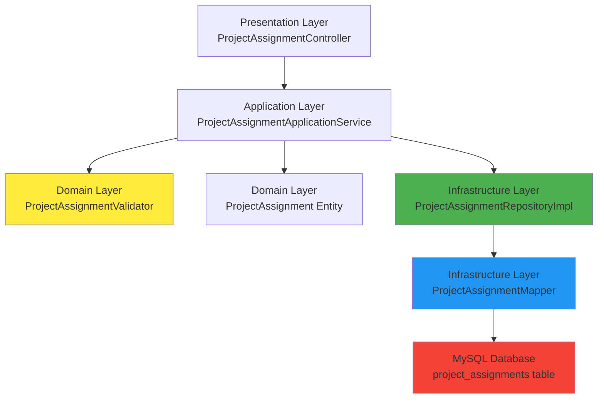
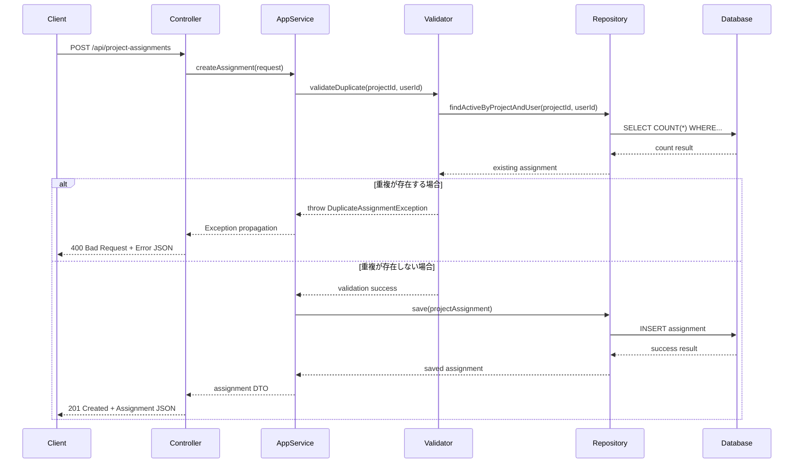
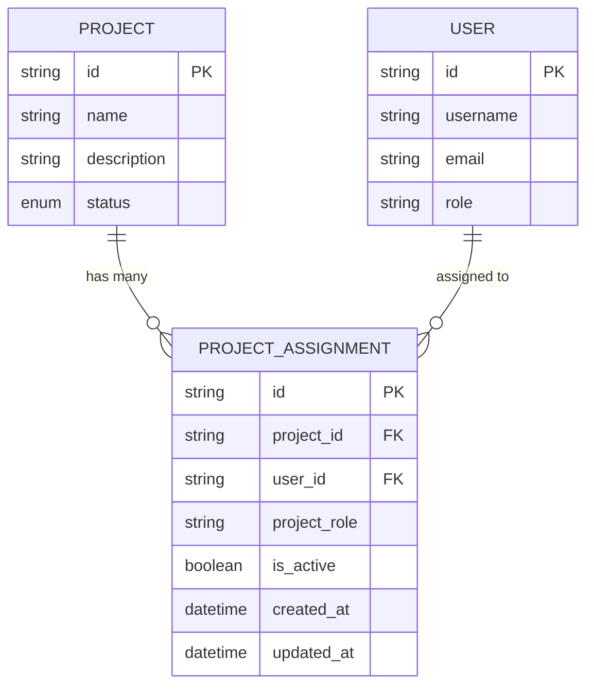
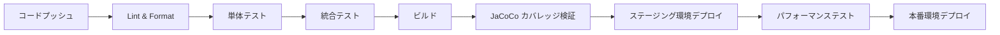

# 技術設計書

## 概要
この設計は、プロジェクト割り当てシステムにおける同一メンバーの重複割り当てを防止するバグ修正を実装します。既存の Spring Boot 3.5.4 + DDD アーキテクチャに適合し、domain層での検証ロジック、application層での業務制御、infrastructure層でのデータベース制約、presentation層でのエラーハンドリングを通じて多層防御を実現します。

## 要件マッピング

### 設計コンポーネント追跡可能性
各設計コンポーネントは特定の要件に対応しています：
- **ProjectAssignmentValidator (Domain)** → REQ-1.1-1.5: 重複割り当て検証機能
- **DuplicateAssignmentException (Domain)** → REQ-2.1-2.5: エラーハンドリングとユーザーフィードバック
- **ProjectAssignmentApplicationService (Application)** → REQ-3.1-3.5: API仕様とデータ整合性
- **ProjectAssignmentRepositoryImpl + ProjectAssignmentMapper (Infrastructure)** → REQ-4.1-4.5: パフォーマンスと整合性制約
- **@ControllerAdvice グローバル例外ハンドラ (Presentation)** → REQ-2.1, REQ-2.4: 統一エラーレスポンス
- **テストスイート** → REQ-5.1-5.5: テスタビリティと保守性

### ユーザーストーリーカバレッジ
- **PMO の重複防止要求**: Domain検証ロジック + データベース制約で実現
- **PMO の明確エラーメッセージ要求**: グローバル例外ハンドリングで日本語メッセージを提供
- **開発者の一貫API動作要求**: Application層での統一的な処理フローで保証
- **システム管理者の高パフォーマンス要求**: 効率的クエリと適切なインデックス設計で対応
- **開発者の十分テスト要求**: 各層での単体テスト + 統合テストで80%カバレッジ達成

## アーキテクチャ

### システムアーキテクチャ
既存の DDD レイヤードアーキテクチャに重複防止機能を統合：



### 技術スタック
既存アーキテクチャとの整合性を保持：

- **Backend Framework**: Spring Boot 3.5.4 + Java 17
- **アーキテクチャパターン**: Domain-Driven Design (DDD)
- **データアクセス**: MyBatis 3.0.5 (annotation-based)
- **データベース**: MySQL 8.0
- **セキュリティ**: Spring Security + JWT (既存)
- **テスティング**: JUnit 5 + Spring Boot Test + Mockito
- **ビルドツール**: Gradle + JaCoCo coverage

### アーキテクチャ決定の根拠
研究調査に基づく技術選択：

- **Why Domain層検証**: DDDパターンでビジネスルールをドメインに集約、テスタビリティ向上
- **Why MyBatis継続使用**: 既存の型ハンドラーとマッパー構成との整合性、学習コスト削減
- **Why データベース制約併用**: アプリケーション層の検証が迂回された場合の最終的な保護
- **Why @ControllerAdvice**: Spring Boot標準パターンで統一的なエラーレスポンス形式

## データフロー

### 重複チェック処理フロー
プロジェクト割り当て作成/更新時の処理シーケンス：



## コンポーネントとインターフェース

### バックエンドサービス & メソッドシグネチャ

#### Domain層
```java
// 重複検証ドメインサービス
@Service
public class ProjectAssignmentValidator {
    public void validateDuplicateAssignment(String projectId, String userId); // 重複チェック実行
    public void validateAssignmentUpdate(String assignmentId, String newProjectId, String newUserId); // 更新時重複チェック
}

// ドメイン例外
public class DuplicateAssignmentException extends DomainException {
    public DuplicateAssignmentException(String projectName, String userName); // 詳細情報付きエラー
}
```

#### Application層
```java
@Service
public class ProjectAssignmentApplicationService {
    public ProjectAssignmentResponse createAssignment(ProjectAssignmentCreateRequest request); // 作成処理
    public ProjectAssignmentResponse updateAssignment(String id, ProjectAssignmentUpdateRequest request); // 更新処理
    public void deleteAssignment(String id); // 論理削除処理
}
```

#### Infrastructure層
```java
@Repository
public class ProjectAssignmentRepositoryImpl implements ProjectAssignmentRepository {
    public Optional<ProjectAssignment> findActiveByProjectAndUser(String projectId, String userId); // 重複チェック用クエリ
    public List<ProjectAssignment> findActiveByProject(String projectId); // プロジェクト関連取得
    public ProjectAssignment save(ProjectAssignment assignment); // 作成・更新
}

@Mapper
public interface ProjectAssignmentMapper {
    @Select("SELECT COUNT(*) FROM project_assignments WHERE project_id = #{projectId} AND user_id = #{userId} AND is_active = true")
    int countActiveByProjectAndUser(@Param("projectId") String projectId, @Param("userId") String userId);
}
```

#### Presentation層
```java
@RestController
@RequestMapping("/api/project-assignments")
public class ProjectAssignmentController {
    @PostMapping
    public ResponseEntity<ProjectAssignmentResponse> createAssignment(@Valid @RequestBody ProjectAssignmentCreateRequest request);
    
    @PutMapping("/{id}")
    public ResponseEntity<ProjectAssignmentResponse> updateAssignment(@PathVariable String id, @Valid @RequestBody ProjectAssignmentUpdateRequest request);
}

// グローバル例外ハンドラ
@ControllerAdvice
public class GlobalExceptionHandler {
    @ExceptionHandler(DuplicateAssignmentException.class)
    public ResponseEntity<ErrorResponse> handleDuplicateAssignment(DuplicateAssignmentException ex);
}
```

### APIエンドポイント

| Method | Route | Purpose | Auth | Status Codes |
|--------|-------|---------|------|--------------|
| POST   | /api/project-assignments | プロジェクト割り当て作成 | Required | 201, 400, 401, 500 |
| PUT    | /api/project-assignments/:id | プロジェクト割り当て更新 | Required | 200, 400, 401, 404, 500 |
| DELETE | /api/project-assignments/:id | プロジェクト割り当て削除 | Required | 204, 401, 404, 500 |
| GET    | /api/project-assignments/user/:userId | ユーザー別割り当て取得 | Required | 200, 401, 500 |

## データモデル

### ドメインエンティティ
1. **ProjectAssignment**: プロジェクトとユーザーの割り当て関係を表現する既存エンティティ
2. **Project**: プロジェクト情報（既存）
3. **User**: ユーザー情報（既存）

### エンティティ関係


### データモデル定義

#### Java Entity (Domain層)
```java
@Entity
public class ProjectAssignment {
    private String id;
    private String projectId;
    private String userId;
    private String projectRole;
    private boolean isActive;
    private LocalDateTime createdAt;
    private LocalDateTime updatedAt;
    
    // ドメインメソッド
    public void validateUniqueness(ProjectAssignmentValidator validator) {
        validator.validateDuplicateAssignment(this.projectId, this.userId);
    }
    
    public boolean isActiveAssignment() {
        return this.isActive;
    }
}
```

#### エラーレスポンス DTO
```java
public record ErrorResponse(
    String code,
    String message,
    String details,
    LocalDateTime timestamp
) {}

public record DuplicateAssignmentErrorDetails(
    String projectId,
    String projectName,
    String userId,
    String userName
) {}
```

### データベーススキーマ

#### 制約追加
```sql
-- 既存テーブルへの制約追加
ALTER TABLE project_assignments 
ADD CONSTRAINT uk_project_user_active 
UNIQUE (project_id, user_id, is_active);

-- インデックス追加（パフォーマンス向上）
CREATE INDEX idx_project_assignments_active 
ON project_assignments (project_id, user_id) 
WHERE is_active = true;
```

### マイグレーション戦略
- **Flyway V7**: UNIQUE制約とインデックスを追加
- **後方互換性**: 既存データへの影響なし（制約追加前にデータクリーンアップ実行）
- **データ変換**: 既存の重複データは `is_active = false` に更新
- **インデックス戦略**: アクティブな割り当てのみの部分インデックス

## エラーハンドリング

### エラー処理戦略
Spring Boot標準パターンでの統一的エラーハンドリング：

#### エラーレスポンス形式
```json
{
  "code": "DUPLICATE_ASSIGNMENT",
  "message": "同じメンバーが既にこのプロジェクトに割り当てられています",
  "details": {
    "projectId": "proj-123",
    "projectName": "Sample Development Project", 
    "userId": "user-456",
    "userName": "田中太郎"
  },
  "timestamp": "2025-08-11T17:30:00Z"
}
```

#### 例外階層
```java
public abstract class DomainException extends RuntimeException {
    protected DomainException(String message) { super(message); }
}

public class DuplicateAssignmentException extends DomainException {
    private final String projectId;
    private final String userId;
    private final String projectName;
    private final String userName;
}
```

## セキュリティ考慮事項

### 認証・認可
- **既存JWT認証**: 変更なし、既存のSpring Securityフィルター継続使用
- **認可マトリックス**: PMOロール - 全割り当て操作可能、Developerロール - 参照のみ
- **セッション管理**: ステートレスJWT継続使用

### データ保護
- **入力検証**: Spring Boot Validation による @Valid アノテーション活用
- **SQLインジェクション防止**: MyBatis パラメータ化クエリ継続使用
- **機密データハンドリング**: 個人情報のログ出力防止

### セキュリティベストプラクティス
- **OWASP Top 10対策**: 既存実装継承、入力検証強化
- **APIレート制限**: 既存Spring Security設定継承
- **CORS設定**: 既存SecurityConfig継承
- **セキュリティヘッダー**: Spring Securityデフォルト継承

## パフォーマンス＆スケーラビリティ

### パフォーマンス目標
| メトリック | 目標値 | 測定方法 |
|-----------|--------|----------|
| 重複チェック応答時間 (p95) | < 50ms | 単体クエリ測定 |
| API応答時間 (p95) | < 200ms | エンドポイント測定 |
| API応答時間 (p99) | < 500ms | 負荷テスト |
| データベースクエリ (p99) | < 30ms | クエリモニタリング |
| 同時リクエスト処理 | > 100 req/sec | 負荷テスト |

### キャッシュ戦略
- **アプリケーションキャッシュ**: Spring Cache でプロジェクト・ユーザー情報キャッシュ
- **データベースキャッシュ**: MySQL InnoDB バッファプール最適化
- **クエリキャッシュ**: 頻繁アクセスされる重複チェッククエリの結果キャッシュ

### スケーラビリティアプローチ
- **水平スケーリング**: Spring Boot アプリケーションサーバー複数台対応
- **データベース最適化**: インデックスとパーティション戦略
- **非同期処理**: 必要に応じて @Async アノテーションでの非同期化
- **自動スケーリング**: 負荷に基づくコンテナスケーリング（Docker環境）

## テスト戦略

### テストカバレッジ要件
- **単体テスト**: ≥80% コードカバレッジ（JaCoCo強制）
- **統合テスト**: 全APIエンドポイントと重複チェック機能
- **E2Eテスト**: 重要な割り当て作成・更新フロー
- **パフォーマンステスト**: 想定ピークの2倍負荷での検証

### テストアプローチ

#### 1. 単体テスト
```java
@ExtendWith(MockitoExtension.class)
class ProjectAssignmentValidatorTest {
    @Test
    void validateDuplicateAssignment_既存割り当てありの場合_例外が発生() {
        // Given: 既存アクティブ割り当てが存在
        // When: 同じプロジェクト・ユーザーでの検証実行
        // Then: DuplicateAssignmentException が発生
    }
}
```

#### 2. 統合テスト
```java
@SpringBootTest(webEnvironment = SpringBootTest.WebEnvironment.RANDOM_PORT)
@TestMethodOrder(OrderAnnotation.class)
class ProjectAssignmentIntegrationTest {
    @Test
    void createAssignment_重複データの場合_400エラーが返却される() {
        // Given: 既存割り当てをセットアップ
        // When: 同じ組み合わせで作成API呼び出し
        // Then: 400 Bad Request + 適切なエラーレスポンス
    }
}
```

#### 3. エンドツーエンドテスト
- **ユーザー認証フロー**: JWT取得→API呼び出し
- **重複防止フロー**: 割り当て作成→重複作成試行→エラー確認
- **データ整合性検証**: 同時リクエストでの競合状態テスト

### CI/CDパイプライン


### テスト実行コマンド
```bash
# 単体テスト実行（カバレッジレポート自動生成）
./gradlew test

# カバレッジ検証込みテスト実行（80%未満で失敗）
./gradlew check

# 統合テスト実行
./gradlew integrationTest

# すべてのテスト実行
./gradlew clean test integrationTest check
```