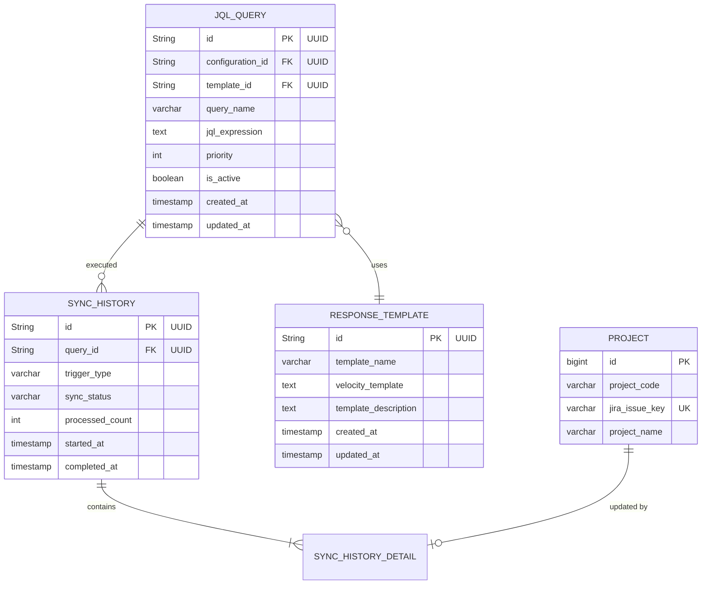

# Technical Design

## Overview

JIRAプロジェクト同期機能は、外部JIRAシステムから定期的にプロジェクト情報を取得し、開発工数管理ツールのプロジェクトデータと同期する機能です。複数のJQLクエリをシステムに登録し、1時間ごとの自動同期とオンデマンドの手動同期をサポートします。各JQLクエリは専用のVelocityテンプレートを指定でき、JIRAのレスポンスは選択されたテンプレートで共通フォーマットに変換されます。変換処理はJsonTransformServiceが担当し、変換されたデータのマッピングとProjectエンティティの保存はJiraSyncApplicationServiceが統括します。JIRA接続設定はSpring Bootのapplication.ymlで管理し、認証情報は環境変数で安全に管理します。

## Requirements Mapping

### Design Component Traceability
各設計コンポーネントが対応する要件：
- **JIRA接続管理モジュール** → REQ-1: JIRA API接続設定
- **JQLクエリ管理モジュール** → REQ-2: JQLクエリ管理
- **同期スケジューラー** → REQ-3: 自動同期スケジューリング
- **手動同期実行モジュール** → REQ-4: 手動同期実行
- **JSON変換エンジン** → REQ-5: プロジェクトフィールドマッピング
- **同期履歴管理モジュール** → REQ-6: 同期履歴とモニタリング
- **競合解決エンジン** → REQ-7: データ競合解決
- **エラーハンドリング/リトライ機構** → REQ-8: エラー処理とリトライ
- **セキュリティ層** → REQ-9: セキュリティとアクセス制御

### User Story Coverage
- 管理者のJIRA接続設定: JIRA接続管理モジュールとセキュリティ層で実現
- JQLクエリ登録・管理: JQLクエリ管理モジュールで実装
- 自動同期: Spring Schedulerによる定期実行
- 手動同期: REST APIエンドポイントとして提供
- JSON変換: Velocityテンプレートによる一括変換と共通フォーマット化
- 同期履歴確認: 履歴データの永続化と検索API
- データ競合解決: issue_keyベースの識別と自動解決
- エラー処理: リトライキューとサーキットブレーカーパターン
- セキュリティ: AWS Secrets Manager統合とIAMロール認証

## Architecture


### Technology Stack

- **Frontend**: Vue 3 + TypeScript (既存システム活用)
- **Backend**: Spring Boot 3.5.4 + Java 17
- **データベース**: MySQL 8.0
- **設定管理**: Spring Boot application.yml + 環境変数
- **JIRA統合**: Atlassian JIRA REST API Client
- **テンプレート処理**: Apache Velocity 2.3
- **スケジューリング**: Spring Scheduler
- **テスト**: JUnit 5 + Mockito + WireMock
- **デプロイメント**: Docker + Kubernetes

### Architecture Decision Rationale

- **Spring Scheduler選択理由**: 既存のSpring Boot環境との統合が容易で、クラスター環境でのジョブ重複実行を防ぐShedLock統合が可能
- **application.yml + 環境変数の組み合わせ**: JIRA URLは設定ファイルで管理し、認証情報のみ環境変数で保護
- **Apache Velocity選択理由**: 柔軟なテンプレート機能、豊富な変換ユーティリティ、Spring Bootとの統合が容易
- **JQLごとのテンプレート選択**: 異なるJIRAプロジェクトやイシュータイプに応じて適切な変換ロジックを適用可能
- **issue_keyベースの識別**: JIRAのユニークキーを使用することで、プロジェクトコードに依存しない確実な同期が可能

## Data Flow

### Primary User Flows

#### 1. JIRA接続設定フロー


#### 2. 自動同期実行フロー


#### 3. JSON変換処理フロー


## Components and Interfaces

### Application Layer Services

```java
// JIRA同期アプリケーションサービス
// 責務: JIRAデータの取得、変換の呼び出し、Projectエンティティの保存を統括
@Service
public class JiraSyncApplicationService {
    public void executeSync();                                    // 全JQLクエリ実行
    public SyncResult syncByQuery(String queryId);                // 特定クエリ実行
    public ConnectionTestResult testConnection();                 // 接続テスト
    public SyncStatus getSyncStatus();                           // 同期ステータス取得
}

// JQLクエリ管理アプリケーションサービス
@Service
public class JqlQueryApplicationService {
    public JqlQuery createQuery(JqlQueryRequest request);         // クエリ登録
    public JqlQuery updateQuery(String id, JqlQueryRequest req);  // クエリ更新
    public void deleteQuery(String id);                          // クエリ削除
    public Page<JqlQuery> listQueries(Pageable pageable);        // クエリ一覧
    public ValidationResult validateJql(String jql);              // JQL検証
}

// JSON変換アプリケーションサービス
// 責務: VelocityテンプレートによるJSON変換のみ（Projectの保存は行わない）
@Service
public class JsonTransformService {
    public String transformResponse(String jiraResponseJson, String templateId); // JIRAレスポンス→共通フォーマットJSON
    public ResponseTemplate createTemplate(TemplateRequest request);             // テンプレート作成
    public ResponseTemplate updateTemplate(String id, TemplateRequest request);  // テンプレート更新
    public List<ResponseTemplate> listTemplates();                              // テンプレート一覧
    public boolean validateTemplate(String template);                           // テンプレート検証
}

// 同期履歴アプリケーションサービス
@Service
public class SyncHistoryApplicationService {
    public Page<SyncHistory> getHistory(LocalDate from, LocalDate to, Pageable pageable);
    public SyncHistoryDetail getHistoryDetail(String historyId);
    public void recordSync(SyncResult result);
}

// レスポンスDTO
@Data
public class JiraConnectionResponse {
    private String jiraUrl;           // JIRA Base URL
    private String tokenEnvKey;       // APIトークン環境変数キー名
    private String usernameEnvKey;    // Username環境変数キー名
    private boolean isConfigured;     // 環境変数が設定されているか
    private String lastTestResult;    // 最後の接続テスト結果
}

// JIRA設定サービス (Infrastructure Layer)
@Component
@ConfigurationProperties(prefix = "jira")
public class JiraConfiguration {
    private String url;                                          // application.ymlから取得
    private String apiToken;                                     // 環境変数から取得
    private String username;                                     // 環境変数から取得
    
    public JiraCredentials getCredentials();                     // 認証情報取得
    public ConnectionConfig getConnectionConfig();               // 接続設定取得
}
```

### Backend Controllers

```java
// JIRA同期コントローラー
@RestController
@RequestMapping("/api/jira")
public class JiraSyncController {
    // 接続設定エンドポイント
    @GetMapping("/connection")
    public JiraConnectionResponse getConnection();
    // Returns: {jiraUrl, tokenEnvKey, usernameEnvKey, isConfigured}
    
    @PostMapping("/connection/test")
    public ConnectionTestResponse testConnection();
    
    // 手動同期エンドポイント
    @PostMapping("/sync/manual")
    public SyncResponse executeManualSync();
    
    @GetMapping("/sync/status")
    public SyncStatusResponse getSyncStatus();
    
    @GetMapping("/sync/history")
    public Page<SyncHistory> getSyncHistory(@RequestParam LocalDate from, 
                                           @RequestParam LocalDate to,
                                           Pageable pageable);
    
    @GetMapping("/sync/history/{id}")
    public SyncHistoryDetail getSyncHistoryDetail(@PathVariable String id);
}

// JQLクエリ管理コントローラー
@RestController
@RequestMapping("/api/jira/queries")
public class JqlQueryController {
    @GetMapping
    public Page<JqlQuery> listQueries(Pageable pageable);
    
    @PostMapping
    public JqlQuery createQuery(@RequestBody JqlQueryRequest request);
    
    @PutMapping("/{id}")
    public JqlQuery updateQuery(@PathVariable String id, @RequestBody JqlQueryRequest request);
    
    @DeleteMapping("/{id}")
    public void deleteQuery(@PathVariable String id);
    
    @PostMapping("/{id}/validate")
    public ValidationResult validateQuery(@PathVariable String id);
}

// JIRAフィールドマッピングコントローラー
@RestController
@RequestMapping("/api/jira/templates")
public class ResponseTemplateController {
    @GetMapping
    public List<ResponseTemplate> listTemplates();
    
    @GetMapping("/{id}")
    public ResponseTemplate getTemplate(@PathVariable String id);
    
    @PostMapping
    public ResponseTemplate createTemplate(@RequestBody ResponseTemplateRequest request);
    
    @PutMapping("/{id}")
    public ResponseTemplate updateTemplate(@PathVariable String id, @RequestBody ResponseTemplateRequest request);
    
    @DeleteMapping("/{id}")
    public void deleteTemplate(@PathVariable String id);
    
    @PostMapping("/{id}/test")
    public TemplateTestResult testTemplate(@PathVariable String id, @RequestBody String sampleJson);
}
```

### Frontend Components

| Component Name | Responsibility | Props/State Summary |
|----------------|---------------|---------------------|
| JiraConnectionSettings | JIRA接続設定管理 | url, secretArn, testStatus |
| JqlQueryManager | JQLクエリ一覧・編集 | queries[], selectedQuery, selectedTemplate, validationResult |
| ResponseTemplateManager | テンプレート一覧・管理 | templates[], selectedTemplate |
| ResponseTemplateEditor | Velocityテンプレート編集 | template, testResult |
| SyncHistoryViewer | 同期履歴表示 | history[], filters, selectedEntry |
| SyncStatusMonitor | 同期ステータス表示 | status, lastSync, nextSync |
| ManualSyncTrigger | 手動同期実行 | syncInProgress, selectedQueries |

### API Endpoints

| Method | Route | Purpose | Auth | Status Codes |
|--------|-------|---------|------|--------------|
| GET | /api/jira/connection | 接続設定取得 | Admin | 200, 401, 403 |
| POST | /api/jira/connection/test | 接続テスト | Admin | 200, 400, 401, 403, 503 |
| GET | /api/jira/queries | JQLクエリ一覧 | PMO | 200, 401, 403 |
| POST | /api/jira/queries | JQLクエリ登録 | PMO | 201, 400, 401, 403 |
| PUT | /api/jira/queries/:id | JQLクエリ更新 | PMO | 200, 400, 401, 403, 404 |
| DELETE | /api/jira/queries/:id | JQLクエリ削除 | PMO | 204, 401, 403, 404 |
| POST | /api/jira/queries/:id/validate | JQL検証 | PMO | 200, 400, 401, 403 |
| GET | /api/jira/templates | テンプレート一覧 | PMO | 200, 401, 403 |
| GET | /api/jira/templates/:id | テンプレート詳細 | PMO | 200, 401, 403, 404 |
| POST | /api/jira/templates | テンプレート作成 | PMO | 201, 400, 401, 403 |
| PUT | /api/jira/templates/:id | テンプレート更新 | PMO | 200, 400, 401, 403, 404 |
| DELETE | /api/jira/templates/:id | テンプレート削除 | PMO | 204, 401, 403, 404 |
| POST | /api/jira/templates/:id/test | テンプレートテスト | PMO | 200, 400, 401, 403 |
| POST | /api/jira/sync/manual | 手動同期実行 | PMO | 202, 401, 403, 409 |
| GET | /api/jira/sync/status | 同期ステータス | PMO | 200, 401, 403 |
| GET | /api/jira/sync/history | 同期履歴取得 | PMO | 200, 401, 403 |
| GET | /api/jira/sync/history/:id | 同期履歴詳細 | PMO | 200, 401, 403, 404 |

## Data Models

### Domain Services

```java
// データマッピングドメインサービス
// 責務: 共通フォーマットJSONとProjectエンティティ間の変換
@Service
public class DataMappingDomainService {
    // 既存Projectエンティティに共通フォーマットの値を反映
    public Project updateProjectFromCommonFormat(Project existingProject, JsonNode commonFormat);
    
    // 共通フォーマットから新規Projectエンティティを作成
    public Project createProjectFromCommonFormat(JsonNode commonFormat);
    
    // 共通フォーマットからissue_keyを抽出
    public String extractIssueKey(JsonNode commonFormat);
}

// JIRA同期ドメインサービス
// 責務: issue_keyベースの競合解決
@Service
public class JiraSyncDomainService {
    // 競合解決ロジック
    public Project resolveConflict(Project existing, Project incoming);
    
    // 同期可能性チェック
    public boolean canSync(Project project);
}
```

### Domain Entities
1. **JqlQuery**: JQLクエリ定義
2. **ResponseTemplate**: レスポンス変換テンプレート
3. **SyncHistory**: 同期実行履歴
4. **SyncHistoryDetail**: 同期詳細情報
5. **Project** (拡張): issue_keyフィールド追加

### Entity Relationships


### Data Model Definitions

```typescript
// TypeScript interfaces
interface JiraConnectionInfo {
  jiraUrl: string;           // JIRA Base URL (application.yml)
  tokenEnvKey: string;       // APIトークン環境変数キー名 (application.yml)
  usernameEnvKey: string;    // Username環境変数キー名 (application.yml)
  isConfigured: boolean;     // 設定完了フラグ
  lastTestResult?: string;   // 最後のテスト結果
}

interface JqlQuery {
  id: string; // UUID
  configurationId: string; // UUID
  templateId: string; // UUID - 使用するVelocityテンプレート
  queryName: string;
  jqlExpression: string;
  priority: number;
  isActive: boolean;
  createdAt: Date;
  updatedAt: Date;
}

interface ResponseTemplate {
  id: string; // UUID
  templateName: string;
  velocityTemplate: string;
  templateDescription?: string;
  createdAt: Date;
  updatedAt: Date;
}

interface SyncHistory {
  id: string; // UUID
  queryId: string; // UUID
  triggerType: 'SCHEDULED' | 'MANUAL';
  syncStatus: 'IN_PROGRESS' | 'COMPLETED' | 'FAILED';
  processedCount: number;
  startedAt: Date;
  completedAt?: Date;
  errorMessage?: string;
}
```

```java
// Java Entities
@Table(name = "jql_query")
public class JqlQuery {
    @Id
    @GeneratedValue(generator = "uuid2")
    @GenericGenerator(name = "uuid2", strategy = "uuid2")
    @Column(columnDefinition = "CHAR(36)")
    private String id;
    
    @Column(name = "query_name", nullable = false)
    private String queryName;
    
    @Column(name = "jql_expression", columnDefinition = "TEXT")
    private String jqlExpression;
    
    @Column(name = "priority")
    private Integer priority;
    
    @Column(name = "is_active")
    private Boolean isActive;
    
    @Column(name = "created_at")
    private LocalDateTime createdAt;
    
    @Column(name = "updated_at")
    private LocalDateTime updatedAt;
}
```

### Database Schema

```sql
-- V22__create_jira_sync_tables.sql
CREATE TABLE jql_query (
    id CHAR(36) PRIMARY KEY,
    template_id CHAR(36),
    query_name VARCHAR(255) NOT NULL,
    jql_expression TEXT NOT NULL,
    priority INT DEFAULT 0,
    is_active BOOLEAN DEFAULT TRUE,
    created_at TIMESTAMP DEFAULT CURRENT_TIMESTAMP,
    updated_at TIMESTAMP DEFAULT CURRENT_TIMESTAMP ON UPDATE CURRENT_TIMESTAMP,
    FOREIGN KEY (template_id) REFERENCES response_template(id),
    INDEX idx_jql_active (is_active, priority),
    INDEX idx_jql_template (template_id)
);

CREATE TABLE response_template (
    id CHAR(36) PRIMARY KEY,
    template_name VARCHAR(255) NOT NULL UNIQUE,
    velocity_template TEXT NOT NULL,
    template_description TEXT,
    created_at TIMESTAMP DEFAULT CURRENT_TIMESTAMP,
    updated_at TIMESTAMP DEFAULT CURRENT_TIMESTAMP ON UPDATE CURRENT_TIMESTAMP,
    INDEX idx_template_name (template_name)
);

CREATE TABLE sync_history (
    id CHAR(36) PRIMARY KEY,
    query_id CHAR(36) NOT NULL,
    trigger_type ENUM('SCHEDULED', 'MANUAL') NOT NULL,
    sync_status ENUM('IN_PROGRESS', 'COMPLETED', 'FAILED') NOT NULL,
    processed_count INT DEFAULT 0,
    error_message TEXT,
    started_at TIMESTAMP NOT NULL,
    completed_at TIMESTAMP NULL,
    FOREIGN KEY (query_id) REFERENCES jql_query(id),
    INDEX idx_sync_history_date (started_at, sync_status),
    INDEX idx_sync_history_status (sync_status, query_id)
);

CREATE TABLE sync_history_detail (
    id CHAR(36) PRIMARY KEY,
    history_id CHAR(36) NOT NULL,
    project_id BIGINT NOT NULL,
    jira_issue_key VARCHAR(50) NOT NULL,
    action ENUM('CREATED', 'UPDATED', 'SKIPPED', 'ERROR') NOT NULL,
    error_detail TEXT,
    FOREIGN KEY (history_id) REFERENCES sync_history(id),
    FOREIGN KEY (project_id) REFERENCES projects(id),
    INDEX idx_sync_detail (history_id, action)
);

-- Projectテーブル拡張
ALTER TABLE projects ADD COLUMN jira_issue_key VARCHAR(50) UNIQUE;
CREATE INDEX idx_project_jira_key ON projects(jira_issue_key);

-- V23__insert_initial_response_templates.sql
-- 初期Velocityテンプレートデータの投入
INSERT INTO response_template (id, template_name, velocity_template, template_description, created_at, updated_at) VALUES
-- 標準プロジェクトテンプレート
(UUID(), 'Standard Project Template', 
'{
  "issueKey": "$!{key}",
  "projectCode": "$!{fields.customfield_10001}",
  "projectName": "$!{fields.summary}",
  "description": "$!{fields.description}",
  "status": "#if($fields.status.name == ''In Progress'')ACTIVE#{elseif}($fields.status.name == ''Done'')COMPLETED#{else}PLANNING#end",
  "startDate": "$!{fields.customfield_10020}",
  "endDate": "$!{fields.customfield_10021}",
  "projectManager": "$!{fields.assignee.displayName}",
  "budget": #if($fields.customfield_10030)$numberUtils.toDouble($fields.customfield_10030)#{else}0#end
}',
'標準的なJIRAプロジェクト用テンプレート', NOW(), NOW()),

-- アジャイルプロジェクトテンプレート
(UUID(), 'Agile Project Template',
'{
  "issueKey": "$!{key}",
  "projectCode": "$stringUtils.uppercase($!{fields.project.key})",
  "projectName": "$!{fields.summary}",
  "status": "#if($fields.status.statusCategory.key == ''done'')COMPLETED#{elseif}($fields.status.statusCategory.key == ''indeterminate'')ACTIVE#{else}PLANNING#end",
  "sprint": {
    "currentSprint": "$!{fields.customfield_10070}",
    "storyPoints": #if($fields.customfield_10071)$numberUtils.toInteger($fields.customfield_10071)#{else}0#end
  },
  "team": {
    "scrumMaster": "$!{fields.customfield_10073}",
    "productOwner": "$!{fields.customfield_10074}"
  }
}',
'Scrum/Kanbanプロジェクト用テンプレート', NOW(), NOW()),

-- シンプルタスクテンプレート
(UUID(), 'Simple Task Template',
'{
  "issueKey": "$!{key}",
  "projectCode": "$stringUtils.removeSpaces($stringUtils.uppercase($!{fields.project.key}))",
  "projectName": "$stringUtils.normalizeSpaces($!{fields.summary})",
  "description": "#if($fields.description)$!{fields.description}#{else}No description#end",
  "status": "#if($fields.resolution)COMPLETED#{else}ACTIVE#end",
  "startDate": "$!{fields.created.substring(0,10)}",
  "endDate": "#if($fields.duedate)$!{fields.duedate}#{else}null#end"
}',
'簡易プロジェクト/タスク用軽量テンプレート', NOW(), NOW());
```

### Migration Strategy
- Flyway V22マイグレーションでJIRA同期関連テーブル作成
- 既存projectsテーブルにjira_issue_keyカラム追加
- Flyway V23マイグレーションで初期Velocityテンプレートデータ投入
- 初期データ投入は不要（管理画面から設定）
- ロールバック用のdownマイグレーション準備

### Application Configuration

```yaml
# application.yml
jira:
  url: https://your-company.atlassian.net
  api:
    version: v2
    timeout: 30000
  auth:
    token-env-key: JIRA_API_TOKEN  # デフォルト値: JIRA_API_TOKEN
    username-env-key: JIRA_USER     # デフォルト値: JIRA_USER
  sync:
    schedule:
      cron: "0 0 * * * *"  # 毎時間0分に実行
    batch-size: 100
    max-retries: 3
    retry-delay: 30000

# 環境変数で設定（キー名はapplication.ymlで指定可能）
# JIRA_API_TOKEN=your-api-token
# JIRA_USER=your-email@example.com
```

```java
// JIRA設定クラス
@Component
@ConfigurationProperties(prefix = "jira")
@Data
public class JiraConfiguration {
    private String url;
    private ApiConfig api;
    private AuthConfig auth;
    private SyncConfig sync;
    
    // 実際の認証情報（環境変数から取得）
    private String apiToken;
    private String username;
    
    @Data
    public static class ApiConfig {
        private String version;
        private int timeout;
    }
    
    @Data
    public static class AuthConfig {
        private String tokenEnvKey = "JIRA_API_TOKEN";     // デフォルト値
        private String usernameEnvKey = "JIRA_USER";       // デフォルト値
    }
    
    @Data
    public static class SyncConfig {
        private ScheduleConfig schedule;
        private int batchSize;
        private int maxRetries;
        private int retryDelay;
    }
    
    @Data
    public static class ScheduleConfig {
        private String cron;
    }
    
    @PostConstruct
    public void init() {
        // application.ymlで指定された環境変数キー名から認証情報を取得
        this.apiToken = System.getenv(auth.getTokenEnvKey());
        this.username = System.getenv(auth.getUsernameEnvKey());
        
        if (this.apiToken == null || this.apiToken.isEmpty()) {
            throw new IllegalStateException(
                "JIRA API token not found in environment variable: " + auth.getTokenEnvKey()
            );
        }
    }
    
    public JiraCredentials getCredentials() {
        return new JiraCredentials(username, apiToken);
    }
}
```

## Error Handling

### エラー処理戦略
1. **接続エラー**: リトライメカニズムとサーキットブレーカー
2. **認証エラー**: 即座に管理者通知、リトライなし
3. **レート制限**: APIレスポンスヘッダーに基づく待機
4. **データ競合**: issue_keyベースの自動解決
5. **マッピングエラー**: 詳細ログと部分的同期継続

### リトライポリシー
```java
@Retryable(
    value = {JiraConnectionException.class},
    maxAttempts = 3,
    backoff = @Backoff(delay = 30000, multiplier = 2)
)
public void syncWithJira() {
    // 同期処理
}
```

## Security Considerations

### Authentication & Authorization


### Authorization Matrix
| Role | JIRA設定 | JQL管理 | 手動同期 | 履歴閲覧 |
|------|---------|---------|---------|----------|
| Admin | ✓ | ✓ | ✓ | ✓ |
| PMO | × | ✓ | ✓ | ✓ |
| Developer | × | × | × | × |

### Data Protection
- JIRA認証情報: AWS Secrets Managerで暗号化保存
- 転送中の暗号化: HTTPS/TLS 1.2以上
- ログ出力: 認証情報のマスキング
- 監査ログ: 全設定変更を記録

### Security Best Practices
- application.ymlはGit管理、認証情報は環境変数で分離
- 環境変数キー名を設定可能にすることで、環境ごとに異なるキー名を使用可能
- JIRAトークンの定期ローテーション
- API呼び出しのレート制限実装
- 入力検証（JQL, JsonPath）
- XSS/SQLインジェクション対策

## Performance & Scalability

### Performance Targets
| Metric | Target | Measurement |
|--------|--------|-------------|
| 同期処理時間 (1000件) | < 60秒 | エンドツーエンド |
| JQL実行時間 | < 5秒 | JIRA API応答 |
| Velocityテンプレート評価 (1000件) | < 1秒 | 処理時間 |
| 同期履歴検索 | < 200ms | API応答時間 |
| 同時同期ジョブ | 1 | ShedLock制御 |

### Caching Strategy
- **JIRA接続設定**: アプリケーション起動時に読み込み
- **JIRAスキーマキャッシュ**: 1時間TTL
- **マッピング設定キャッシュ**: アプリケーション起動時ロード
- **同期ステータスキャッシュ**: Redisで30秒TTL

### Scalability Approach
- ShedLockによる分散環境でのジョブ重複防止
- バッチ処理による大量データ同期
- 非同期処理による応答性向上
- データベースインデックス最適化

## Testing Strategy

### Test Coverage Requirements
- **単体テスト**: ≥80% コードカバレッジ
- **統合テスト**: JIRA API統合、AWS統合
- **E2Eテスト**: 同期フロー全体
- **性能テスト**: 1000プロジェクト同期

### Testing Approach

1. **単体テスト**
   - Velocityテンプレート評価ロジック
   - マッピング変換処理
   - リトライメカニズム
   - エラーハンドリング

2. **統合テスト**
   - JIRA APIモック（WireMock）
   - AWS Secrets Managerモック
   - データベース統合

3. **エンドツーエンドテスト**
   - 接続設定フロー
   - JQLクエリ登録・実行
   - 自動同期処理
   - 履歴確認

4. **性能テスト**
   - 大量データ同期（JMeter）
   - 同時実行制御
   - メモリリーク検証

### CI/CD Pipeline


---
**STATUS**: Design generated
**NEXT PHASE**: After review, run `/sdd:spec-tasks jira-project-sync` to generate implementation tasks