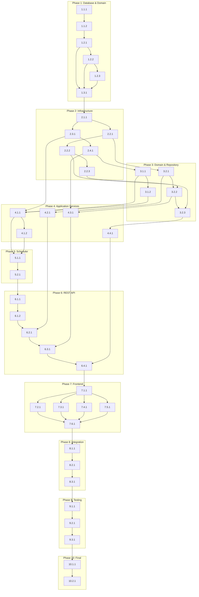

# Implementation Plan

## Phase 1: データベース基盤とドメインモデル

### 1.1 Flyway マイグレーションファイルの作成
- [ ] 1.1.1 V22マイグレーションファイルの作成
  - backend/src/main/resources/db/migration/V22__create_jira_sync_tables.sql を作成
  - jql_query テーブルを定義（template_id外部キー含む）
  - response_template テーブルを定義（template_name, velocity_template カラム含む）
  - sync_history, sync_history_detail テーブルを定義
  - projects テーブルに jira_issue_key カラムを追加
  - _Requirements: REQ-5.8, REQ-5.9_
  - _After: 1.1.2_
  - Suggested Coding Agent: springboot-backend-architect

- [ ] 1.1.2 V23初期データマイグレーションファイルの作成
  - backend/src/main/resources/db/migration/V23__insert_initial_response_templates.sql を作成
  - Standard Project Template を挿入（標準JIRAプロジェクト用）
  - Agile Project Template を挿入（Scrum/Kanban用）
  - Simple Task Template を挿入（簡易タスク用）
  - _Requirements: REQ-5.3, REQ-5.6_
  - _Previous: 1.1.1_
  - _After: 1.2.1_
  - Suggested Coding Agent: springboot-backend-architect

### 1.2 ドメインエンティティの実装
- [ ] 1.2.1 JqlQueryエンティティの実装
  - com.devhour.domain.model.entity.JqlQuery クラスを作成
  - templateId フィールドを含めた実装
  - ファクトリーメソッド、バリデーション、ビジネスロジックを実装
  - JqlQueryTest でユニットテストを作成
  - _Requirements: REQ-2.1, REQ-2.2_
  - _Previous: 1.1.2_
  - _After: 1.2.2, 1.3.1_
  - Suggested Coding Agent: springboot-backend-architect

- [ ] 1.2.2 ResponseTemplateエンティティの実装
  - com.devhour.domain.model.entity.ResponseTemplate クラスを作成
  - templateName, velocityTemplate, templateDescription フィールドを実装
  - Velocityテンプレート構文の基本検証メソッドを実装
  - ResponseTemplateTest でユニットテストを作成
  - _Requirements: REQ-5.1, REQ-5.3_
  - _Previous: 1.2.1_
  - _After: 1.2.3, 1.3.1_
  - Suggested Coding Agent: springboot-backend-architect

- [ ] 1.2.3 SyncHistory/SyncHistoryDetailエンティティの実装
  - com.devhour.domain.model.entity.SyncHistory クラスを作成
  - com.devhour.domain.model.entity.SyncHistoryDetail クラスを作成
  - 同期履歴の記録とステータス管理ロジックを実装
  - 各エンティティのユニットテストを作成
  - _Requirements: REQ-6.1, REQ-6.2_
  - _Previous: 1.2.2_
  - _After: 1.3.1_
  - Suggested Coding Agent: springboot-backend-architect

### 1.3 Project エンティティの拡張
- [ ] 1.3.1 Project エンティティへのjiraIssueKey追加
  - com.devhour.domain.model.entity.Project にjiraIssueKeyフィールドを追加
  - issue_keyベースの等価性判定ロジックを実装
  - ProjectBuilder にjiraIssueKeyサポートを追加
  - ProjectTest を更新してjiraIssueKeyの動作を検証
  - _Requirements: REQ-5.9, REQ-7.1_
  - _Previous: 1.2.1, 1.2.2, 1.2.3_
  - _After: 2.1.1_
  - Suggested Coding Agent: springboot-backend-architect

## Phase 2: インフラストラクチャ層の実装

### 2.1 Spring Boot設定クラスの実装
- [ ] 2.1.1 JiraConfiguration設定クラスの作成
  - com.devhour.config.JiraConfiguration を@ConfigurationPropertiesで実装
  - AuthConfig内部クラスで環境変数キー名を管理
  - @PostConstructで環境変数から認証情報を動的取得
  - application.ymlにJIRA設定セクションを追加
  - JiraConfigurationTest でテストを作成
  - _Requirements: REQ-1.3, REQ-9.2, REQ-9.4_
  - _Previous: 1.3.1_
  - _After: 2.2.1, 2.3.1_
  - Suggested Coding Agent: springboot-backend-architect

### 2.2 MyBatis Mapper インターフェースの実装
- [ ] 2.2.1 JqlQueryMapperの実装
  - com.devhour.infrastructure.mapper.JqlQueryMapper インターフェースを作成
  - template_idを含むCRUD操作メソッドを定義
  - アノテーションベースのSQL定義（@Select, @Insert, @Update）
  - JqlQueryMapperTest で@MybatisTestを使用したテストを作成
  - _Requirements: REQ-2.5_
  - _Previous: 2.1.1_
  - _After: 2.2.2, 3.2.1_
  - Suggested Coding Agent: springboot-backend-architect

- [ ] 2.2.2 ResponseTemplateMapperの実装
  - com.devhour.infrastructure.mapper.ResponseTemplateMapper インターフェースを作成
  - template_nameでの検索メソッドを含むCRUD操作を定義
  - アノテーションベースのSQL定義
  - ResponseTemplateMapperTest でテストを作成
  - _Requirements: REQ-5.2_
  - _Previous: 2.2.1_
  - _After: 2.2.3, 3.2.2_
  - Suggested Coding Agent: springboot-backend-architect

- [ ] 2.2.3 SyncHistory関連Mapperの実装
  - com.devhour.infrastructure.mapper.SyncHistoryMapper を作成
  - com.devhour.infrastructure.mapper.SyncHistoryDetailMapper を作成
  - ProjectMapperにselectByJiraIssueKeyメソッドを追加
  - 各Mapperのテストを作成
  - _Requirements: REQ-6.3, REQ-6.4_
  - _Previous: 2.2.2_
  - _After: 3.2.3_
  - Suggested Coding Agent: springboot-backend-architect

### 2.3 外部連携クライアントの実装
- [ ] 2.3.1 JiraClientの実装
  - com.devhour.infrastructure.jira.JiraClient クラスを作成
  - RestTemplateを使用したREST API v2/v3通信を実装
  - Basic認証ヘッダーの生成（Base64エンコード）
  - JQL検索、イシュー詳細取得、接続テストメソッドを実装
  - WireMockを使用した統合テストを作成
  - _Requirements: REQ-1.4, REQ-8.1, REQ-8.2_
  - _Previous: 2.1.1_
  - _After: 2.4.1, 4.1.1_
  - Suggested Coding Agent: springboot-backend-architect

### 2.4 Velocityテンプレート処理の実装
- [ ] 2.4.1 VelocityTemplateProcessorの実装
  - com.devhour.infrastructure.velocity.VelocityTemplateProcessor クラスを作成
  - Apache Velocity 2.3を使用したテンプレート処理を実装
  - StringUtils, DateUtils, NumberUtilsユーティリティクラスを作成
  - テンプレート検証メソッドを実装
  - VelocityTemplateProcessorTest でユニットテストを作成
  - _Requirements: REQ-5.3, REQ-5.4, REQ-5.6_
  - _Previous: 2.3.1_
  - _After: 3.1.2, 4.3.1_
  - Suggested Coding Agent: springboot-backend-architect

## Phase 3: ドメイン層とリポジトリ実装

### 3.1 Domain Servicesの実装
- [ ] 3.1.1 DataMappingDomainServiceの実装
  - com.devhour.domain.service.DataMappingDomainService クラスを作成
  - updateProjectFromCommonFormatメソッドを実装（既存エンティティ更新）
  - createProjectFromCommonFormatメソッドを実装（新規エンティティ作成）
  - extractIssueKeyメソッドを実装（共通フォーマットからissue_key抽出）
  - DataMappingDomainServiceTest でユニットテストを作成
  - _Requirements: REQ-7.1, REQ-7.2, REQ-7.5_
  - _Previous: 2.4.1_
  - _After: 3.1.2, 4.1.1_
  - Suggested Coding Agent: springboot-backend-architect

- [ ] 3.1.2 JiraSyncDomainServiceの実装
  - com.devhour.domain.service.JiraSyncDomainService クラスを作成
  - issue_keyベースの競合解決ロジックを実装
  - マスターデータ優先ポリシーの実装
  - 同期可能性チェックメソッドを実装
  - JiraSyncDomainServiceTest でユニットテストを作成
  - _Requirements: REQ-7.3, REQ-7.4_
  - _Previous: 3.1.1_
  - _After: 4.1.1_
  - Suggested Coding Agent: springboot-backend-architect

### 3.2 Repository実装
- [ ] 3.2.1 JqlQueryRepositoryの実装
  - com.devhour.domain.repository.JqlQueryRepository インターフェースを定義
  - com.devhour.infrastructure.repository.JqlQueryRepositoryImpl を実装
  - 優先順位によるクエリ取得メソッドを実装
  - トランザクション管理（@Transactional）を設定
  - JqlQueryRepositoryTest でMockitoを使用したテストを作成
  - _Requirements: REQ-2.1, REQ-2.4_
  - _Previous: 2.2.1_
  - _After: 3.2.2, 4.2.1_
  - Suggested Coding Agent: springboot-backend-architect

- [ ] 3.2.2 ResponseTemplateRepositoryの実装
  - com.devhour.domain.repository.ResponseTemplateRepository インターフェースを定義
  - com.devhour.infrastructure.repository.ResponseTemplateRepositoryImpl を実装
  - テンプレート名による検索メソッドを実装
  - ResponseTemplateRepositoryTest でテストを作成
  - _Requirements: REQ-5.1, REQ-5.7_
  - _Previous: 3.2.1, 2.2.2_
  - _After: 3.2.3, 4.3.1_
  - Suggested Coding Agent: springboot-backend-architect

- [ ] 3.2.3 SyncHistoryRepositoryの実装
  - com.devhour.domain.repository.SyncHistoryRepository インターフェースを定義
  - com.devhour.infrastructure.repository.SyncHistoryRepositoryImpl を実装
  - 履歴の保存と検索メソッドを実装
  - ProjectRepositoryにfindByJiraIssueKeyメソッドを追加
  - 各Repositoryのテストを作成
  - _Requirements: REQ-6.1, REQ-6.2_
  - _Previous: 3.2.2, 2.2.3_
  - _After: 4.4.1_
  - Suggested Coding Agent: springboot-backend-architect

## Phase 4: アプリケーション層の実装

### 4.1 JiraSyncApplicationServiceの実装
- [ ] 4.1.1 JiraSyncApplicationServiceの基本実装
  - com.devhour.application.JiraSyncApplicationService クラスを作成
  - executeSyncメソッドを実装（全JQLクエリ実行）
  - syncByQueryメソッドを実装（個別クエリ実行）
  - JsonTransformServiceの呼び出しとProjectエンティティの保存を統括
  - testConnectionメソッドを実装
  - JiraSyncApplicationServiceTest でモックを使用したテストを作成
  - _Requirements: REQ-3.1, REQ-3.2, REQ-4.2_
  - _Previous: 3.1.1, 3.1.2, 2.3.1_
  - _After: 4.1.2, 5.1.1_
  - Suggested Coding Agent: springboot-backend-architect

- [ ] 4.1.2 リトライメカニズムの実装
  - JiraSyncApplicationServiceに@Retryableアノテーションを設定
  - エクスポネンシャルバックオフの設定
  - レート制限対応の実装
  - エラーハンドリングとログ記録の実装
  - リトライ動作のテストを作成
  - _Requirements: REQ-8.1, REQ-8.3, REQ-8.6_
  - _Previous: 4.1.1_
  - _After: 5.1.1_
  - Suggested Coding Agent: springboot-backend-architect

### 4.2 JqlQueryApplicationServiceの実装
- [ ] 4.2.1 JqlQueryApplicationServiceの実装
  - com.devhour.application.JqlQueryApplicationService クラスを作成
  - JQLクエリのCRUD操作メソッドを実装
  - validateJqlメソッドでJQL構文検証を実装
  - 優先順位による実行順序管理を実装
  - JqlQueryApplicationServiceTest でテストを作成
  - _Requirements: REQ-2.2, REQ-2.3, REQ-2.4, REQ-2.8_
  - _Previous: 3.2.1_
  - _After: 6.2.1_
  - Suggested Coding Agent: springboot-backend-architect

### 4.3 JsonTransformServiceの実装
- [ ] 4.3.1 JsonTransformServiceの実装
  - com.devhour.application.JsonTransformService クラスを作成
  - transformResponseメソッドを実装（JIRAレスポンス→共通フォーマット変換）
  - テンプレート管理メソッド（create, update, list）を実装
  - validateTemplateメソッドを実装
  - JsonTransformServiceTest でテストを作成
  - _Requirements: REQ-5.2, REQ-5.3, REQ-5.4_
  - _Previous: 2.4.1, 3.2.2_
  - _After: 6.3.1_
  - Suggested Coding Agent: springboot-backend-architect

### 4.4 SyncHistoryApplicationServiceの実装
- [ ] 4.4.1 SyncHistoryApplicationServiceの実装
  - com.devhour.application.SyncHistoryApplicationService クラスを作成
  - 同期履歴の記録メソッドを実装
  - ページネーション対応の履歴検索を実装
  - 詳細情報の取得メソッドを実装
  - SyncHistoryApplicationServiceTest でテストを作成
  - _Requirements: REQ-6.1, REQ-6.2, REQ-6.3, REQ-6.4_
  - _Previous: 3.2.3_
  - _After: 6.4.1_
  - Suggested Coding Agent: springboot-backend-architect

## Phase 5: スケジューラーとバッチ処理

### 5.1 Spring Schedulerの設定
- [ ] 5.1.1 JiraSyncSchedulerの実装
  - com.devhour.scheduler.JiraSyncScheduler クラスを作成
  - @Scheduledで1時間ごとの実行を設定（cron式）
  - ShedLockによる分散環境での重複実行防止を実装
  - スケジューラーの有効/無効を制御する設定を追加
  - JiraSyncSchedulerTest でテストを作成
  - _Requirements: REQ-3.1, REQ-3.3, REQ-3.4_
  - _Previous: 4.1.1, 4.1.2_
  - _After: 5.2.1_
  - Suggested Coding Agent: springboot-backend-architect

### 5.2 バッチ処理の最適化
- [ ] 5.2.1 バッチ処理最適化の実装
  - 大量データ処理のためのバッチサイズ設定を実装
  - メモリ効率を考慮したストリーミング処理を実装
  - 進捗状況のログ出力を実装
  - パフォーマンステストを作成（1000件処理）
  - _Requirements: REQ-3.5, REQ-6.7_
  - _Previous: 5.1.1_
  - _After: 6.1.1_
  - Suggested Coding Agent: springboot-backend-architect

## Phase 6: REST APIコントローラー実装

### 6.1 JiraSyncControllerの実装
- [ ] 6.1.1 JiraSyncControllerの基本実装
  - com.devhour.presentation.controller.JiraSyncController クラスを作成
  - GET /api/jira/connection エンドポイントを実装
  - POST /api/jira/connection/test エンドポイントを実装
  - POST /api/jira/sync/manual エンドポイントを実装
  - MockMvcを使用したコントローラーテストを作成
  - _Requirements: REQ-1.1, REQ-1.4, REQ-4.1, REQ-4.2_
  - _Previous: 5.2.1_
  - _After: 6.1.2_
  - Suggested Coding Agent: springboot-backend-architect

- [ ] 6.1.2 同期履歴エンドポイントの実装
  - GET /api/jira/sync/status エンドポイントを実装
  - GET /api/jira/sync/history エンドポイントを実装（ページネーション対応）
  - GET /api/jira/sync/history/:id エンドポイントを実装
  - エラーハンドリングとバリデーションを実装
  - コントローラーテストを作成
  - _Requirements: REQ-6.5, REQ-6.6_
  - _Previous: 6.1.1_
  - _After: 6.2.1_
  - Suggested Coding Agent: springboot-backend-architect

### 6.2 JqlQueryControllerの実装
- [ ] 6.2.1 JqlQueryControllerの実装
  - com.devhour.presentation.controller.JqlQueryController クラスを作成
  - JQLクエリ管理用CRUDエンドポイントを実装
  - POST /api/jira/queries/:id/validate エンドポイントを実装
  - ページネーション対応を実装
  - コントローラーテストを作成
  - _Requirements: REQ-2.2, REQ-2.3, REQ-2.6, REQ-2.7_
  - _Previous: 6.1.2, 4.2.1_
  - _After: 6.3.1_
  - Suggested Coding Agent: springboot-backend-architect

### 6.3 ResponseTemplateControllerの実装
- [ ] 6.3.1 ResponseTemplateControllerの実装
  - com.devhour.presentation.controller.ResponseTemplateController クラスを作成
  - GET /api/jira/templates エンドポイントを実装（テンプレート一覧）
  - POST /api/jira/templates エンドポイントを実装（テンプレート作成）
  - PUT /api/jira/templates/:id エンドポイントを実装
  - POST /api/jira/templates/:id/test エンドポイントを実装
  - コントローラーテストを作成
  - _Requirements: REQ-5.1, REQ-5.2, REQ-5.7_
  - _Previous: 6.2.1, 4.3.1_
  - _After: 6.4.1_
  - Suggested Coding Agent: springboot-backend-architect

### 6.4 認可設定の実装
- [ ] 6.4.1 Spring Security認可設定の実装
  - SecurityConfigにJIRA API用の認可設定を追加
  - PMOロールによるアクセス制御を実装
  - JWT トークン検証の統合
  - 各エンドポイントの認可設定を実装
  - セキュリティテストを作成
  - _Requirements: REQ-9.1, REQ-9.9_
  - _Previous: 6.3.1, 4.4.1_
  - _After: 7.1.1_
  - Suggested Coding Agent: springboot-backend-architect

## Phase 7: フロントエンド実装（Vue 3 + TypeScript）

### 7.1 TypeScriptインターフェースとサービス
- [x] 7.1.1 型定義とAPIクライアントの実装
  - frontend/src/types/jira.ts で型定義を作成（JqlQuery, ResponseTemplate等）
  - frontend/src/services/jira.service.ts でAPIクライアントを実装
  - frontend/src/services/jira-sync.service.ts で同期関連APIを実装
  - エラーハンドリングの統合
  - Jestを使用したサービステストを作成
  - _Requirements: REQ-1.1, REQ-2.1, REQ-4.1_
  - _Previous: 6.4.1_
  - _After: 7.2.1, 7.3.1, 7.4.1, 7.5.1_
  - Suggested Coding Agent: vue3-frontend-architect

### 7.2 JIRA設定管理画面コンポーネント
- [x] 7.2.1 JiraSettingsViewの実装
  - frontend/src/views/JiraSettingsView.vue を作成
  - frontend/src/components/JiraConnectionSettings.vue で接続設定表示を実装
  - 接続テスト機能の実装
  - Toast通知の統合
  - Vue Test Utilsを使用したコンポーネントテストを作成
  - _Requirements: REQ-1.1, REQ-1.2, REQ-1.4, REQ-1.5_
  - _Previous: 7.1.1_
  - _After: 7.6.1_
  - Suggested Coding Agent: vue3-frontend-architect

### 7.3 JQLクエリ管理画面コンポーネント
- [x] 7.3.1 JqlQueryViewの実装
  - frontend/src/views/JqlQueryView.vue を作成
  - frontend/src/components/JqlQueryManager.vue でクエリ一覧と編集を実装
  - テンプレート選択機能を実装（各クエリごと）
  - クエリ検証機能の統合
  - 優先順位の設定UI
  - コンポーネントテストを作成
  - _Requirements: REQ-2.2, REQ-2.3, REQ-2.4, REQ-2.6_
  - _Previous: 7.1.1_
  - _After: 7.6.1_
  - Suggested Coding Agent: vue3-frontend-architect

### 7.4 テンプレート管理画面コンポーネント
- [x] 7.4.1 ResponseTemplateManagerの実装
  - frontend/src/views/ResponseTemplateView.vue を作成
  - frontend/src/components/ResponseTemplateManager.vue でテンプレート一覧を実装
  - frontend/src/components/ResponseTemplateEditor.vue でテンプレート編集を実装
  - Velocityテンプレートの入力と検証機能
  - テンプレートテスト機能の実装
  - コンポーネントテストを作成
  - _Requirements: REQ-5.1, REQ-5.2, REQ-5.3, REQ-5.6_
  - _Previous: 7.1.1_
  - _After: 7.6.1_
  - Suggested Coding Agent: vue3-frontend-architect

### 7.5 同期管理画面コンポーネント
- [x] 7.5.1 SyncHistoryViewの実装
  - frontend/src/views/SyncHistoryView.vue を作成
  - frontend/src/components/SyncHistoryViewer.vue で履歴表示を実装
  - frontend/src/components/ManualSyncTrigger.vue で手動同期実行を実装
  - frontend/src/components/SyncStatusMonitor.vue でステータス表示を実装
  - コンポーネントテストを作成
  - _Requirements: REQ-4.1, REQ-4.3, REQ-4.5, REQ-6.1_
  - _Previous: 7.1.1_
  - _After: 7.6.1_
  - Suggested Coding Agent: vue3-frontend-architect

### 7.6 Composablesの実装
- [x] 7.6.1 useJiraSync Composableの実装
  - frontend/src/composables/useJiraSync.ts で同期ロジックを実装
  - frontend/src/composables/useJqlQuery.ts でクエリ管理ロジックを実装
  - frontend/src/composables/useResponseTemplate.ts でテンプレート管理ロジックを実装
  - エラーハンドリングとローディング状態管理
  - Composablesのテストを作成
  - _Requirements: REQ-4.4, REQ-6.2_
  - _Previous: 7.2.1, 7.3.1, 7.4.1, 7.5.1_
  - _After: 8.1.1_
  - Suggested Coding Agent: vue3-frontend-architect

## Phase 8: 統合とエラーハンドリング

### 8.1 エラーハンドリング機構の実装
- [ ] 8.1.1 グローバルエラーハンドラーの実装
  - com.devhour.presentation.exception.GlobalExceptionHandler を拡張
  - JIRA API特有のエラー処理を追加
  - リトライメカニズムの統合
  - レート制限エラーの処理
  - 詳細なエラーログ記録の実装
  - エラー処理のテストを作成
  - _Requirements: REQ-8.1, REQ-8.2, REQ-8.3, REQ-8.6_
  - _Previous: 7.6.1_
  - _After: 8.2.1_
  - Suggested Coding Agent: springboot-backend-architect

### 8.2 データ競合解決メカニズム
- [ ] 8.2.1 競合解決ロジックの実装
  - JiraSyncDomainServiceで競合検出ロジックを強化
  - マスターデータ優先ポリシーの詳細実装
  - 競合ログの記録機能を実装
  - 競合解決のテストケースを作成
  - _Requirements: REQ-7.1, REQ-7.2, REQ-7.4, REQ-7.5_
  - _Previous: 8.1.1_
  - _After: 8.3.1_
  - Suggested Coding Agent: springboot-backend-architect

### 8.3 監査ログとモニタリング
- [ ] 8.3.1 監査ログ機能の実装
  - 設定変更の監査ログ記録を実装
  - 同期処理のメトリクス収集を実装
  - パフォーマンスモニタリング機能を追加
  - ログ出力のテストを作成
  - _Requirements: REQ-1.7, REQ-6.7, REQ-9.6_
  - _Previous: 8.2.1_
  - _After: 9.1.1_
  - Suggested Coding Agent: springboot-backend-architect

## Phase 9: 統合テストとE2Eテスト

### 9.1 バックエンド統合テストの実装
- [ ] 9.1.1 完全な統合テストの作成
  - @SpringBootTestによる統合テストクラスを作成
  - TestContainersを使用したデータベーステストを実装
  - WireMockによるJIRA APIモックを設定
  - 同期フロー全体のテストを作成
  - _Requirements: REQ-3.1, REQ-4.2, REQ-7.1_
  - _Previous: 8.3.1_
  - _After: 9.2.1_
  - Suggested Coding Agent: qa-test-strategist

### 9.2 フロントエンドE2Eテストの実装
- [ ] 9.2.1 E2Eテストスイートの作成
  - CypressまたはPlaywrightでE2Eテスト環境を設定
  - 接続設定フローのE2Eテストを作成
  - JQLクエリ管理フローのテストを作成
  - テンプレート管理フローのテストを作成
  - 手動同期実行フローのテストを作成
  - _Requirements: REQ-1.1, REQ-2.2, REQ-4.1, REQ-5.1_
  - _Previous: 9.1.1_
  - _After: 9.3.1_
  - Suggested Coding Agent: qa-test-strategist

### 9.3 パフォーマンステストの実装
- [ ] 9.3.1 負荷テストとパフォーマンス検証
  - JMeterで大量データ同期テストを作成（1000件）
  - 同時実行制御のテストを実装
  - メモリリーク検証テストを作成
  - レスポンスタイム測定とベンチマークを実装
  - _Requirements: REQ-3.5, REQ-6.7_
  - _Previous: 9.2.1_
  - _After: 10.1.1_
  - Suggested Coding Agent: qa-test-strategist

## Phase 10: 最終統合と検証

### 10.1 全コンポーネントの統合
- [ ] 10.1.1 最終統合と動作確認
  - フロントエンドとバックエンドの接続確認
  - 認証・認可フローの動作確認
  - 全機能の統合テスト実行
  - カバレッジ80%以上の確認
  - _Requirements: REQ-9.1, REQ-9.9_
  - _Previous: 9.3.1_
  - _After: 10.2.1_
  - Suggested Coding Agent: qa-test-strategist

### 10.2 本番相当環境での動作確認
- [ ] 10.2.1 本番環境シミュレーション
  - Docker環境での動作テスト
  - 環境変数設定の確認
  - 1時間ごとの自動同期動作確認
  - エラー復旧動作の確認
  - _Requirements: REQ-3.1, REQ-8.1, REQ-9.2_
  - _Previous: 10.1.1_
  - Suggested Coding Agent: qa-test-strategist

## Task Dependencies

---
**STATUS**: Tasks generated based on approved design
**COVERAGE**: All requirements mapped to implementation tasks
**NEXT PHASE**: Ready for implementation