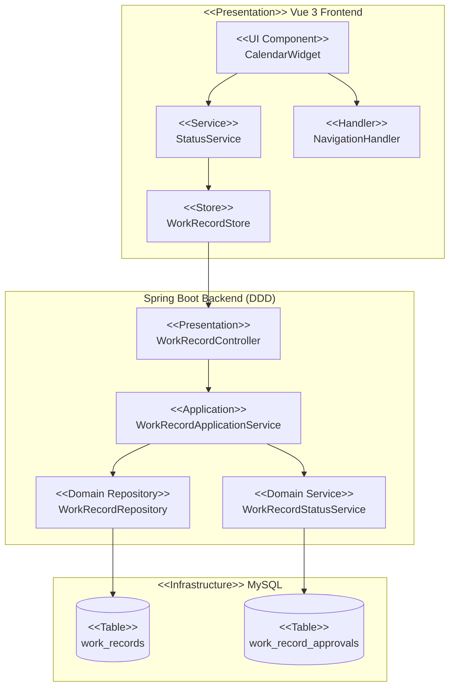
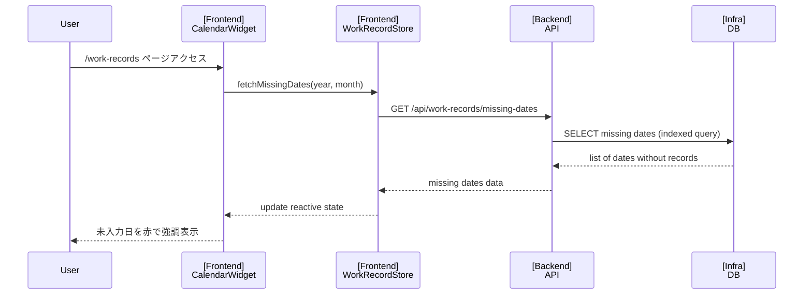
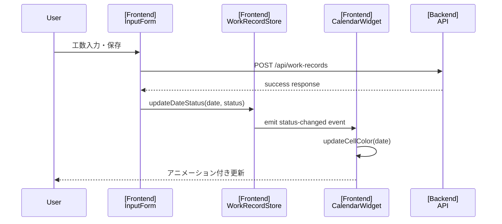
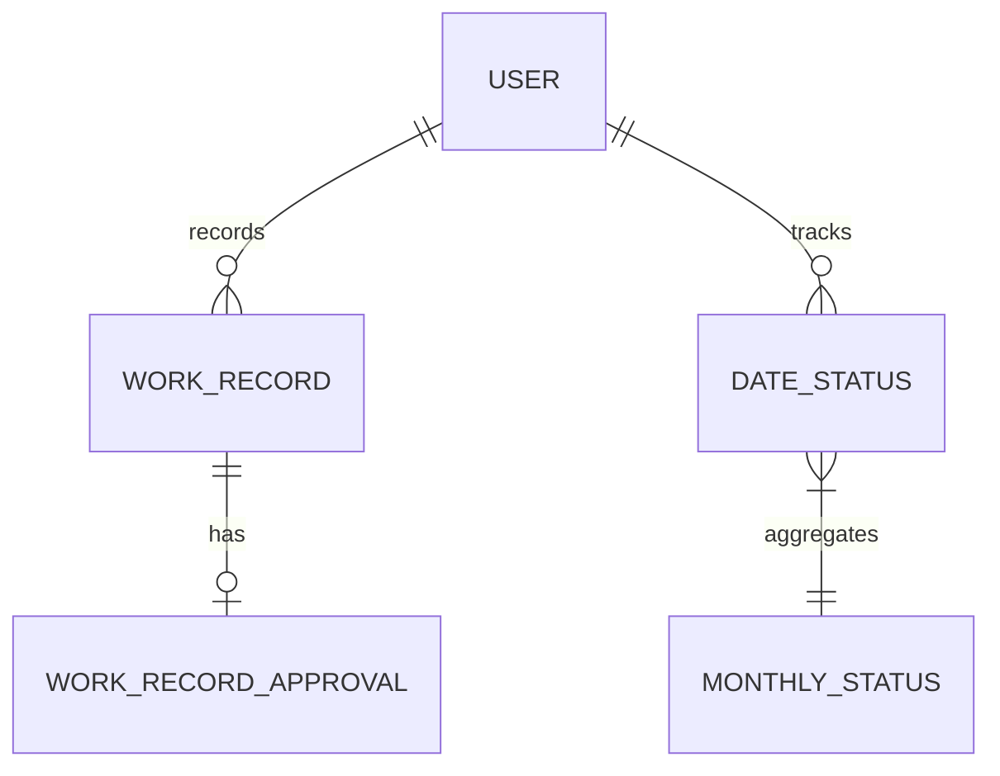
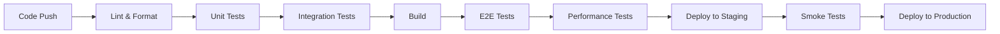

# Technical Design

## Overview

月初から現在日までの工数未入力日を視覚的に表示する欠落工数インジケーター機能の実装設計。Vue 3のパフォーマンス最適化技術、WCAG 2.1準拠のアクセシビリティ、Spring Boot/MyBatisの効率的なデータアクセスを統合し、開発者の工数入力漏れを防ぐリアルタイムカレンダーウィジェットを構築する。

## Requirements Mapping

### Design Component Traceability
各設計コンポーネントは特定の要件に対応：
- **CalendarWidget Component** → REQ-1: カレンダー表示要件
- **StatusIndicator Service** → REQ-2: 未入力日の識別要件
- **ColorCoding System** → REQ-3: ステータス別の色分け要件
- **DateNavigation Handler** → REQ-4: 日付ナビゲーション要件
- **ReactiveStatusUpdate** → REQ-5: リアルタイム更新要件
- **SummaryCalculator** → REQ-6: 月間サマリー表示要件

### User Story Coverage
- **開発者向け機能**: カレンダーウィジェットによる直感的な未入力日確認と効率的なデータ入力
- **PMO向け機能**: チーム全体の入力状況把握とリマインド管理支援

## Architecture

### 高レベルシステムアーキテクチャ



### Technology Stack

- **Frontend**: Vue 3.5.18 + TypeScript 5.8 + Composition API
- **UI Framework**: Vuetify 3.9.4 (Material Design)
- **State Management**: Pinia (既存のworkRecordストア拡張)
- **Backend**: Spring Boot 3.5.4 + Java 17
- **Data Access**: MyBatis 3.0.5 (annotation-based)
- **Database**: MySQL 8.0
- **Testing**: Vitest (Frontend) + JUnit 5 (Backend)

### Architecture Decision Rationale

- **Vue 3 Composition API**: リアクティブな日付状態管理とパフォーマンス最適化のため
- **Vuetify Calendar Component拡張**: 既存UIフレームワークとの統合性を維持
- **MyBatis Date Range Queries**: 複雑な日付範囲クエリの最適化制御
- **Composite Index Strategy**: user_id + work_date複合インデックスによる高速検索

## Data Flow

### カレンダー初期表示フロー



### 工数入力後のリアルタイム更新フロー



## Components and Interfaces

### Backend Services & Method Signatures

```java
// WorkRecordApplicationService拡張
public class WorkRecordApplicationService {
    // 未入力日リスト取得（主要機能）
    public MissingDatesResponse getMissingDatesForMonth(Long userId, int year, int month);
}

// 新規ドメインサービス
public class WorkRecordStatusService {
    public WorkRecordStatus calculateStatus(WorkRecord record, WorkRecordApproval approval);
    public List<LocalDate> findMissingDates(Long userId, LocalDate start, LocalDate end);
}
```

### Frontend Components

| Component | Responsibility | Props/State Summary |
|-----------|---------------|-------------------|
| CalendarWidget.vue | カレンダー全体の表示制御 | year, month, missingDates, onDateClick |
| CalendarCell.vue | 個別日付セルの表示 | date, isMissing, isWeekend, isHoliday |
| MissingDatesIndicator.vue | 未入力日数の表示 | count |
| DateNavigator.vue | 月切り替えナビゲーション | currentMonth, onMonthChange |

### API Endpoints

| Method | Route | Purpose | Auth | Status Codes |
|--------|-------|---------|------|--------------|
| GET | /api/work-records/missing-dates | 未入力日リスト取得（メインAPI） | Required | 200, 401, 500 |

## Data Models

### Domain Entities

1. **WorkRecordStatus** (新規Value Object): 工数記録の状態を表現
2. **DateStatus** (新規Entity): 日付ごとの入力状態管理
3. **MonthlyStatusAggregate** (新規Aggregate): 月次状態の集約

### Entity Relationships



### Data Model Definitions

```typescript
// Frontend Types
interface MissingDatesResponse {
  year: number;
  month: number;
  missingDates: string[]; // ['2025-01-05', '2025-01-08', ...]
  workingDaysCount: number;
}

interface MonthSummary {
  notEntered: number;
  pending: number;
  approved: number;
  rejected: number;
  totalWorkingDays: number;
}

interface StatusSummary {
  notEntered: number;
  pending: number;
  approved: number;
  rejected: number;
  completionRate: number; // percentage
}
```

```java
// Backend DTOs
@Data
public class MonthlyStatusResponse {
    private int year;
    private int month;
    private List<DateStatusDto> dates;
    private StatusSummaryDto summary;
}

@Data
public class DateStatusDto {
    private LocalDate date;
    private WorkRecordStatus status;
    private boolean isWeekend;
    private boolean isHoliday;
    private boolean hasData;
}

public enum WorkRecordStatus {
    NOT_ENTERED,
    PENDING,
    APPROVED,
    REJECTED
}
```

### Database Schema

```sql
-- 新規インデックス（パフォーマンス最適化）
CREATE INDEX idx_work_records_user_date_range 
ON work_records(user_id, work_date) 
WHERE deleted_at IS NULL;

-- 日本の祝日マスタ（オプション）
CREATE TABLE japanese_holidays (
    holiday_date DATE PRIMARY KEY,
    holiday_name VARCHAR(100),
    created_at TIMESTAMP DEFAULT CURRENT_TIMESTAMP
);
```

### Migration Strategy
- Flyway Migration V21: インデックス追加とパフォーマンス最適化
- 既存データへの影響なし（読み取り専用の新機能）
- キャッシュ戦略により既存APIへの負荷影響を最小化

## Error Handling

### エラー処理戦略
- **Network Errors**: 自動リトライ（3回まで）とフォールバック表示
- **Cache Errors**: キャッシュミス時は直接DB参照へフォールバック
- **Date Calculation Errors**: デフォルト値使用とエラーログ記録
- **Permission Errors**: 401/403時は再認証フロー起動

## Security Considerations

### Authentication & Authorization
- JWT認証による既存セキュリティフレームワーク活用
- ユーザーは自身の工数記録のみ参照可能
- PMO/Admin役割は配下メンバーの状態も参照可能

### Data Protection
- 日付範囲バリデーション（最大3ヶ月制限）
- SQLインジェクション対策（MyBatisパラメータバインディング）
- XSS対策（Vue.jsの自動エスケープ）

## Performance & Scalability

### Performance Targets
| Metric | Target | Measurement |
|--------|--------|-------------|
| Calendar Initial Load | < 2秒 | ページロードから表示完了 |
| Status Update | < 500ms | 保存から画面更新 |
| Month Navigation | < 1秒 | 月切り替え完了 |
| API Response (p95) | < 200ms | エンドポイント応答 |
| Database Query Time | < 50ms | インデックス活用クエリ |

### Performance Strategy
- **Database Indexes**: 複合インデックスによる高速クエリ実行
- **Frontend Optimization**: Vue 3 computed()による自動メモ化
- **Lazy Loading**: 大量データの仮想スクロール実装
- **Minimal Data Transfer**: 必要最小限のデータのみ取得

### Scalability Approach
- 仮想スクロール実装（大量日付表示時）
- 遅延ローディング（defineAsyncComponent使用）
- DB複合インデックスによるクエリ最適化
- 水平スケーリング対応（ステートレス設計）

### Performance Optimization Techniques
```javascript
// Vue 3最適化例
const CalendarWidget = defineAsyncComponent({
  loader: () => import('@/components/calendar/CalendarWidget.vue'),
  loadingComponent: CalendarSkeleton,
  delay: 200
});

// shallowRefによるリアクティビティ最適化
const monthlyStatus = shallowRef<MonthlyStatus>();

// computedによる自動メモ化
const missingDatesCount = computed(() => 
  monthlyStatus.value?.dates.filter(d => d.status === 'NOT_ENTERED').length ?? 0
);
```

## Testing Strategy

### Test Coverage Requirements
- **Unit Tests**: ≥80% コードカバレッジ
- **Integration Tests**: 全APIエンドポイントとDBクエリ
- **E2E Tests**: カレンダー操作の主要ユーザーフロー

### Testing Approach

1. **Unit Testing**
   - DateStatusService: 状態計算ロジック
   - CalendarWidget: 表示ロジックとイベント処理
   - WorkRecordStatusService: ビジネスロジック

2. **Integration Testing**
   ```java
   @Test
   void testMonthlyStatusWithDateRange() {
       // Given: 月次データ
       // When: APIコール
       // Then: 正しい状態が返される
   }
   ```

3. **End-to-End Testing**
   ```javascript
   test('カレンダーナビゲーションと状態更新', async () => {
     await page.goto('/work-records');
     await page.click('[data-test="calendar-date-15"]');
     await page.fill('[data-test="hours-input"]', '8');
     await page.click('[data-test="save-button"]');
     
     // カレンダーセルの色が更新されることを確認
     await expect(page.locator('[data-test="calendar-date-15"]'))
       .toHaveClass(/status-pending/);
   });
   ```

### CI/CD Pipeline



## Implementation Phases

### Phase 1: Backend API実装（3日）
- WorkRecordApplicationService拡張
- 新規エンドポイント実装
- データベースインデックス追加

### Phase 2: Frontend基本実装（5日）
- CalendarWidgetコンポーネント作成
- Piniaストア拡張
- 基本的な表示とナビゲーション

### Phase 3: リアルタイム更新実装（2日）
- イベントハンドリング
- 状態管理統合
- アニメーション追加

### Phase 4: テストとパフォーマンス最適化（3日）
- 単体テスト作成
- E2Eテスト実装
- パフォーマンスチューニング

総実装期間: 約13日