# Technical Design

## 概要

このドキュメントは、Development Hour Management Tool における Okta OpenID Connect (OIDC) 認証統合の技術設計を定義します。既存の JWT ベース認証とロールベースアクセス制御を、Okta OIDC と OAuth2 スコープベース権限管理に完全に置き換えることで、より柔軟で安全な認証・認可システムを実現します。

## 要件マッピング

### 設計コンポーネントのトレーサビリティ

各設計コンポーネントが対応する要件：
- **Okta OIDC認証モジュール** → Requirement 1: Okta OIDC認証フロー
- **ユーザー同期サービス** → Requirement 2: ユーザープロビジョニングと同期
- **スコープ認可エンジン** → Requirement 3: OAuth2スコープベースの権限管理（3階層構造）
- **セッション管理** → Requirement 4: セッション管理とログアウト
- **セキュリティ層** → Requirement 5: セキュリティ要件
- **監視・メトリクス** → Requirement 6: モニタリングと運用
- **Vue 3統合層** → Requirement 7: フロントエンド統合

### ユーザーストーリーカバレッジ

- **開発者のSSO**: OIDC Authorization Code Flow with PKCEによる実装
- **管理者のユーザー管理**: SCIM 2.0とWebhookによる自動同期
- **細粒度権限制御**: 3階層スコープによる柔軟な権限管理
- **グローバルログアウト**: Okta SLOエンドポイントとの統合

## アーキテクチャ

### システム全体構成

```mermaid
graph TB
    subgraph "Frontend (Vue 3)"
        A[Vue Router] --> B[Okta Vue SDK]
        B --> C[Pinia Store]
        C --> D[Axios Interceptor]
    end
    
    subgraph "Okta"
        E[Authorization Server]
        F[JWKS Endpoint]
        G[UserInfo Endpoint]
    end
    
    subgraph "Backend (Spring Boot)"
        H[Spring Security OAuth2]
        I[Resource Server]
        J[Scope Evaluator]
        K[User Sync Service]
    end
    
    subgraph "Database"
        L[(MySQL)]
    end
    
    B --> E
    D --> I
    I --> F
    I --> J
    K --> G
    K --> L
```



### 技術スタック

#### Backend
- **Spring Boot 3.5.4**: 既存フレームワーク
- **Spring Security 6.x OAuth2 Resource Server**: JWT検証とスコープベース認可
- **spring-boot-starter-oauth2-resource-server**: OAuth2リソースサーバー機能
- **Okta Spring Boot Starter 3.0.x**: Okta統合の簡素化
- **SCIM 2.0 SDK**: ユーザープロビジョニング

#### Frontend
- **Vue 3.5.18**: 既存フレームワーク
- **@okta/okta-vue 5.x**: Vue 3用Okta SDK
- **@okta/okta-auth-js 7.x**: OIDC/OAuth2クライアント
- **Pinia 3.0.3**: 状態管理（トークン、スコープ、ユーザー情報）
- **Axios 1.11.0**: HTTPクライアント（トークン自動付与）

#### Pinia Store で保持する State

##### AuthStore (認証ストア)
```typescript
interface AuthState {
  // Oktaトークン情報
  accessToken: string | null;        // Oktaアクセストークン（メモリ保持推奨）
  idToken: string | null;            // OktaIDトークン（メモリ保持推奨）
  refreshToken: string | null;       // リフレッシュトークン（セキュアストレージ）
  
  // ユーザー情報
  user: {
    oktaUserId: string;              // Okta User ID (sub claim)
    username: string;                // ユーザー名
    email: string;                   // メールアドレス
    fullName: string;                // フルネーム
    profilePicture?: string;         // プロフィール画像URL
  } | null;
  
  // 権限情報
  scopes: string[];                  // 付与されたスコープリスト
  roles: string[];                   // ロール（Okta Groups）
  
  // 認証状態
  isAuthenticated: boolean;          // 認証済みフラグ
  isLoading: boolean;                // 認証処理中フラグ
  authError: string | null;          // 認証エラーメッセージ
  
  // トークン有効期限
  accessTokenExpiresAt: Date | null; // アクセストークン有効期限
  refreshTokenExpiresAt: Date | null;// リフレッシュトークン有効期限
}
```

##### UserPreferencesStore (ユーザー設定ストア)
```typescript
interface UserPreferencesState {
  // UI設定
  locale: 'ja' | 'en' | 'zh';       // 言語設定
  theme: 'light' | 'dark' | 'auto'; // テーマ設定
  dateFormat: string;                // 日付表示形式
  
  // 表示設定
  itemsPerPage: number;              // ページあたりの表示件数
  defaultView: string;               // デフォルトビュー
  sidebarCollapsed: boolean;         // サイドバー折りたたみ状態
  
  // 通知設定
  notificationsEnabled: boolean;     // 通知有効化フラグ
  emailNotifications: boolean;       // メール通知フラグ
  soundEnabled: boolean;             // サウンド通知フラグ
}
```

##### ApplicationStore (アプリケーション状態ストア)
```typescript
interface ApplicationState {
  // システム情報
  systemStatus: 'online' | 'offline' | 'maintenance';
  apiVersion: string;
  buildVersion: string;
  
  // 機能フラグ
  features: {
    jiraIntegration: boolean;        // JIRA統合機能
    approvalWorkflow: boolean;       // 承認ワークフロー
    analytics: boolean;              // 分析機能
    bulkOperations: boolean;         // 一括操作機能
  };
  
  // グローバルローディング状態
  globalLoading: boolean;
  loadingMessage: string | null;
  
  // エラー管理
  errors: Array<{
    id: string;
    type: 'error' | 'warning' | 'info';
    message: string;
    timestamp: Date;
    dismissed: boolean;
  }>;
  
  // キャッシュ管理
  cacheTimestamps: {
    projects: Date | null;
    users: Date | null;
    workCategories: Date | null;
    supervisors: Date | null;
  };
}
```

##### WorkHoursStore (工数管理ストア - 既存拡張)
```typescript
interface WorkHoursState {
  // 既存のState
  workRecords: WorkRecord[];
  
  // Okta統合による追加State
  approvalPermissions: {
    canApproveTeam: boolean;         // チーム承認権限
    canApproveAll: boolean;          // 全体承認権限
    pendingApprovals: number;        // 未承認件数
  };
  
  // フィルター状態
  filters: {
    dateRange: { start: Date; end: Date };
    projectIds: number[];
    userIds: number[];
    approvalStatus: string[];
  };
  
  // ページネーション
  pagination: {
    currentPage: number;
    totalPages: number;
    totalItems: number;
    hasNext: boolean;
    hasPrevious: boolean;
  };
}
```

##### ProjectStore (プロジェクト管理ストア - 既存拡張)
```typescript
interface ProjectState {
  // 既存のState
  projects: Project[];
  
  // Okta統合による追加State
  projectPermissions: {
    canCreate: boolean;               // プロジェクト作成権限
    canEditAll: boolean;             // 全プロジェクト編集権限
    managedProjectIds: number[];     // 管理可能プロジェクトID
    assignedProjectIds: number[];    // アサイン済みプロジェクトID
  };
  
  // JIRA同期状態
  jiraSync: {
    lastSyncTime: Date | null;
    syncInProgress: boolean;
    syncErrors: string[];
    syncedProjectCount: number;
  };
  
  // プロジェクト検索
  searchQuery: string;
  searchResults: Project[];
}
```

### アーキテクチャ決定の根拠

- **なぜOIDCか**: SAMLより実装がシンプルで、SPAとの親和性が高く、JSONベースでRESTful APIに最適
- **なぜSpring OAuth2 Resource Serverか**: Spring Security統合済み、JWKSによる自動鍵ローテーション対応
- **なぜ3階層スコープか**: 権限の細粒度制御、将来の拡張性、組織構造への柔軟な対応
- **なぜPKCEか**: 2024年現在のOAuth2ベストプラクティス、パブリッククライアントのセキュリティ強化

## データフロー

### 主要ユーザーフロー

#### 1. 認証フロー（OIDC Authorization Code Flow with PKCE）


#### 2. スコープベース認可フロー

**注記**: このフロー図における「APIGateway」は概念的な表現であり、実際にはSpring Securityのフィルターチェーンとして実装されます。物理的なAPI Gatewayコンポーネントは現時点では導入せず、Spring Security OAuth2 Resource Serverの機能を活用します。


**実装コンポーネント構成**:
- **Spring Security Filter Chain**: JWTトークンの検証と認証処理
- **OAuth2ResourceServerConfigurer**: Okta JWTの自動検証設定
- **@PreAuthorize アノテーション**: コントローラーメソッドレベルでのスコープベース認可（Okta JWTから直接評価）

## コンポーネントと インターフェース

### Backend サービス & メソッドシグネチャ

#### OktaAuthenticationService
```java
@Service
public class OktaAuthenticationService {
    public OktaUserDetails validateAndExtractUser(String accessToken); // JWT検証とユーザー情報抽出
    public Set<String> extractScopes(String accessToken);              // JWTからスコープ抽出
    public void globalLogout(String idToken);                         // グローバルログアウト
}
```

#### UserSynchronizationService
```java
@Service
public class UserSynchronizationService {
    public void syncUserFromOkta(OktaUserDetails oktaUser);            // Oktaからユーザー同期
    public void handleUserDeactivation(String oktaUserId);             // ユーザー無効化処理
    public void processSCIMEvent(SCIMEvent event);                     // SCIM イベント処理
    public void linkExistingUser(String email, String oktaId);         // 既存ユーザーリンク
}
```

### Frontend コンポーネント

| コンポーネント名 | 責任 | Props/State 概要 |
|----------------|------|-----------------|
| OktaCallback.vue | 認証コールバック処理 | Props: なし, State: リダイレクト処理 |
| OktaLoginButton.vue | ログインボタン | Props: buttonText, State: loading状態 |
| ScopeGuard.vue | スコープベースアクセス制御 | Props: requiredScope, State: 権限状態 |
| UserProfile.vue | ユーザー情報表示 | Props: なし, State: Oktaユーザー情報 |
| GlobalLogout.vue | グローバルログアウト | Props: なし, State: ログアウト処理状態 |

### スコープ定義

**注記**: すべてのスコープはOkta側で定義・管理され、JWTトークンに含まれて配信されます。アプリケーション側ではスコープの定義や管理は行わず、JWTから取得したスコープを直接評価します。

#### 完全なスコープ定義一覧

##### 工数管理スコープ
| スコープ | 説明 | 使用箇所 |
|---------|------|----------|
| **工数データ (work-hours)** | | |
| `work-hours:read:own` | 自分の工数データを参照 | GET /api/work-records/missing-dates<br>GET /api/work-records/date-statuses |
| `work-hours:read:team` | チームメンバーの工数を参照 | GET /api/work-records/user/{userId}/* (部下のデータ) |
| `work-hours:read:all` | 全ユーザーの工数を参照 | GET /api/work-records/user/{userId}/* (全ユーザー) |
| `work-hours:write:own` | 自分の工数を登録・更新 | PUT /api/work-records/{date} |
| `work-hours:delete:own` | 自分の工数を削除 | DELETE /api/work-records/{date} |
| **工数承認 (work-hours-approval)** | | |
| `work-hours-approval:read:team` | チームの承認待ち一覧を参照 | GET /api/approvals/pending |
| `work-hours-approval:write:team` | チームの工数を承認・却下 | POST /api/approvals/approve<br>POST /api/approvals/reject<br>POST /api/approvals/approve-batch |
| `work-hours-approval:write:all` | 全体の工数を承認（PMO用） | POST /api/approvals/* (全体承認) |
| **工数分析 (work-hours-analytics)** | | |
| `work-hours-analytics:read:team` | チームの工数統計を参照 | GET /api/approvals/statistics |
| `work-hours-analytics:read:all` | 全体の工数統計を参照 | （将来の統計API用） |

##### プロジェクトスコープ
| スコープ | 説明 | 使用箇所 |
|---------|------|----------|
| **プロジェクトデータ (projects)** | | |
| `projects:read:assigned` | アサインされたプロジェクトを参照 | GET /api/projects/workrecordable<br>GET /api/projects/{projectId} (アサイン済み) |
| `projects:read:managed` | 管理中のプロジェクトを参照 | GET /api/projects/{projectId} (管理中) |
| `projects:read:all` | 全プロジェクトを参照（マネジャー以上） | GET /api/projects<br>GET /api/projects/active<br>GET /api/projects/{projectId} (全プロジェクト) |
| `projects:write:own` | プロジェクトを新規作成 | POST /api/projects |
| `projects:write:managed` | 管理プロジェクトを更新 | PUT /api/projects/{projectId} |
| `projects:delete:managed` | 管理プロジェクトを削除 | DELETE /api/projects/{projectId} |
| **プロジェクトアサイン (project-assignments)** | | |
| `project-assignments:read:own` | 自分のアサインを参照 | GET /api/project-assignments/users/{userId} (自分) |
| `project-assignments:read:team` | チームのアサインを参照 | GET /api/project-assignments/subordinates |
| `project-assignments:read:managed` | 管理プロジェクトのアサインを参照 | GET /api/project-assignments/projects/{projectId} |
| `project-assignments:write:managed` | アサインを作成・更新 | POST /api/project-assignments<br>POST /api/project-assignments/batch<br>POST /api/project-assignments/{id}/activate<br>POST /api/project-assignments/{id}/deactivate |
| `project-assignments:delete:managed` | アサインを削除 | DELETE /api/project-assignments/{id} |

##### ユーザー管理スコープ
| スコープ | 説明 | 使用箇所 |
|---------|------|----------|
| **ユーザーデータ (users)** | | |
| `users:read:own` | 自分の情報を参照 | GET /api/users/{userId} (自分) |
| `users:read:team` | チームメンバーを参照 | GET /api/users/active/developers |
| `users:read:all` | 全ユーザーを参照 | GET /api/users<br>GET /api/users/admin<br>GET /api/users/deleted<br>GET /api/users/{userId} (全員) |
| `users:write:own` | 自分の情報を更新 | PATCH /api/users/{userId}/password (自分) |
| `users:write:all` | 全ユーザー情報を更新 | POST /api/users<br>PUT /api/users/{userId}<br>PATCH /api/users/{userId}/activate<br>PATCH /api/users/{userId}/deactivate |
| **上長関係 (supervisors)** | | |
| `supervisors:read:own` | 自分の上長情報を参照 | GET /api/supervisors/{supervisorId} (自分の上長) |
| `supervisors:read:team` | チームの上下関係を参照 | GET /api/supervisors/subordinates |
| `supervisors:write:all` | 上長関係を設定・解除 | POST /api/supervisors/assign<br>DELETE /api/supervisors/users/{userId} |

##### JIRA統合スコープ ※システム管理者・PMO限定
| スコープ | 説明 | 使用箇所 |
|---------|------|----------|
| **JIRA接続 (jira-connection)** ※システム管理者のみ | | |
| `jira-connection:read:all` | JIRA接続設定を参照 | GET /api/jira/connection |
| `jira-connection:write:all` | JIRA接続設定をテスト・更新 | POST /api/jira/connection/test |
| **JIRA同期 (jira-sync)** ※管理者・PMO | | |
| `jira-sync:read:all` | 同期ステータスと履歴を参照 | GET /api/jira/sync/status<br>GET /api/jira/sync/history<br>GET /api/jira/sync/history/{id} |
| `jira-sync:write:all` | 手動同期を実行 | POST /api/jira/sync/manual |
| **JQLクエリ (jira-queries)** ※管理者・PMO | | |
| `jira-queries:read:all` | JQLクエリを参照 | GET /api/jira/queries |
| `jira-queries:write:all` | JQLクエリを作成・更新・検証 | POST /api/jira/queries<br>PUT /api/jira/queries/{id}<br>POST /api/jira/queries/{id}/validate |
| `jira-queries:delete:all` | JQLクエリを削除 | DELETE /api/jira/queries/{id} |
| **JIRAテンプレート (jira-templates)** ※管理者・PMO | | |
| `jira-templates:read:all` | テンプレートを参照 | GET /api/jira/templates<br>GET /api/jira/templates/{id} |
| `jira-templates:write:all` | テンプレートを作成・更新・テスト | POST /api/jira/templates<br>PUT /api/jira/templates/{id}<br>POST /api/jira/templates/{id}/test |
| `jira-templates:delete:all` | テンプレートを削除 | DELETE /api/jira/templates/{id} |

##### システム管理スコープ
| スコープ | 説明 | 使用箇所 |
|---------|------|----------|
| **作業カテゴリ (work-categories)** | | |
| `work-categories:read:all` | 作業カテゴリを参照 | GET /api/work-categories<br>GET /api/work-categories/{id}<br>GET /api/work-categories/active |
| `work-categories:write:all` | 作業カテゴリを作成・更新 | POST /api/work-categories<br>PUT /api/work-categories/{id}<br>PATCH /api/work-categories/{id}/activate<br>PATCH /api/work-categories/{id}/deactivate |

##### レポートスコープ (reports:*)
| スコープ | 説明 | 使用箇所 |
|---------|------|----------|
| `reports:read:all` | 全体のレポートを参照 | （将来の全社レポート機能用に予約） |

##### 特殊なスコープ処理
| パターン | 説明 | 例 |
|---------|------|-----|
| `*:*:*` | 全権限（管理者用） | システム管理者に付与 |
| `{resource}:*:*` | 特定リソースの全権限 | `jira:*:*` でJIRA機能の全権限 |
| `{resource}:{action}:*` | 特定アクションの全スコープ | `work-hours:read:*` で全範囲の工数参照 |

#### スコープなしで利用可能なエンドポイント
| エンドポイント | 説明 |
|--------------|------|
| GET /api/users/exists/username/{username} | ユーザー名の存在確認（ログイン前） |
| GET /api/users/exists/email/{email} | メールアドレスの存在確認（ログイン前） |
| GET /api/work-categories | 作業カテゴリ一覧（全ユーザー参照可） |
| GET /api/work-categories/{id} | 作業カテゴリ詳細（全ユーザー参照可） |
| GET /api/work-categories/active | アクティブカテゴリ（全ユーザー参照可） |


### API エンドポイント（全網羅）

#### 認証関連 (/api/auth)
| Method | Route | Purpose | Auth | Required Scope | Status Codes |
|--------|-------|---------|------|---------------|--------------|
| POST | /api/auth/login | ログイン（廃止予定） | None | - | 200, 401 |
| POST | /api/auth/logout | ログアウト | Required | - | 200, 401 |
| GET | /api/auth/me | 現在のユーザー情報 | Required | - | 200, 401 |
| GET | /api/auth/validate | トークン検証 | Required | - | 200, 401 |

#### 工数管理 (/api/work-records)
| Method | Route | Purpose | Auth | Required Scope | Status Codes |
|--------|-------|---------|------|---------------|--------------|
| PUT | /api/work-records/{date} | 工数更新 | Required | work-hours:write:own | 200, 400, 401, 403 |
| DELETE | /api/work-records/{date} | 工数削除 | Required | work-hours:delete:own | 204, 401, 403, 404 |
| GET | /api/work-records/user/{userId}/{date} | 特定日の工数取得 | Required | work-hours:read:* | 200, 401, 403, 404 |
| GET | /api/work-records/user/{userId}/period | 期間工数取得 | Required | work-hours:read:* | 200, 401, 403 |
| GET | /api/work-records/user/{userId}/summary | 工数サマリ取得 | Required | work-hours:read:* | 200, 401, 403 |
| GET | /api/work-records/missing-dates | 未入力日取得 | Required | work-hours:read:own | 200, 401 |
| GET | /api/work-records/date-statuses | 日付ステータス取得 | Required | work-hours:read:own | 200, 401 |

#### 承認管理 (/api/approvals)
| Method | Route | Purpose | Auth | Required Scope | Status Codes |
|--------|-------|---------|------|---------------|--------------|
| GET | /api/approvals/pending | 承認待ち一覧 | Required | work-hours-approval:read:team | 200, 401, 403 |
| POST | /api/approvals/approve | 承認実行 | Required | work-hours-approval:write:team | 200, 400, 401, 403 |
| POST | /api/approvals/reject | 却下実行 | Required | work-hours-approval:write:team | 200, 400, 401, 403 |
| POST | /api/approvals/approve-batch | 一括承認 | Required | work-hours-approval:write:team | 200, 400, 401, 403 |
| GET | /api/approvals/statistics | 承認統計 | Required | work-hours-analytics:read:team | 200, 401, 403 |

#### プロジェクト管理 (/api/projects)
| Method | Route | Purpose | Auth | Required Scope | Status Codes |
|--------|-------|---------|------|---------------|--------------|
| GET | /api/projects | プロジェクト一覧 | Required | projects:read:all | 200, 401, 403 |
| POST | /api/projects | プロジェクト作成 | Required | projects:write:own | 201, 400, 401, 403 |
| GET | /api/projects/{projectId} | プロジェクト詳細 | Required | projects:read:* | 200, 401, 403, 404 |
| PUT | /api/projects/{projectId} | プロジェクト更新 | Required | projects:write:managed | 200, 400, 401, 403, 404 |
| DELETE | /api/projects/{projectId} | プロジェクト削除 | Required | projects:delete:managed | 204, 401, 403, 404 |
| GET | /api/projects/workrecordable | 工数入力可能プロジェクト | Required | projects:read:assigned | 200, 401 |
| GET | /api/projects/active | アクティブプロジェクト | Required | projects:read:all | 200, 401, 403 |

#### プロジェクトアサイン (/api/project-assignments)
| Method | Route | Purpose | Auth | Required Scope | Status Codes |
|--------|-------|---------|------|---------------|--------------|
| GET | /api/project-assignments/subordinates | 部下のアサイン一覧 | Required | project-assignments:read:team | 200, 401, 403 |
| POST | /api/project-assignments/batch | 一括アサイン | Required | project-assignments:write:managed | 200, 400, 401, 403 |
| GET | /api/project-assignments/projects/{projectId} | プロジェクト別アサイン | Required | project-assignments:read:managed | 200, 401, 403, 404 |
| GET | /api/project-assignments/users/{userId} | ユーザー別アサイン | Required | project-assignments:read:* | 200, 401, 403, 404 |
| POST | /api/project-assignments | アサイン作成 | Required | project-assignments:write:managed | 201, 400, 401, 403 |
| DELETE | /api/project-assignments/{assignmentId} | アサイン削除 | Required | project-assignments:delete:managed | 204, 401, 403, 404 |
| POST | /api/project-assignments/{assignmentId}/activate | アサイン有効化 | Required | project-assignments:write:managed | 200, 401, 403, 404 |
| POST | /api/project-assignments/{assignmentId}/deactivate | アサイン無効化 | Required | project-assignments:write:managed | 200, 401, 403, 404 |

#### ユーザー管理 (/api/users)
| Method | Route | Purpose | Auth | Required Scope | Status Codes |
|--------|-------|---------|------|---------------|--------------|
| GET | /api/users | ユーザー一覧（ページング） | Required | users:read:all | 200, 401, 403 |
| POST | /api/users | ユーザー作成 | Required | users:write:all | 201, 400, 401, 403 |
| GET | /api/users/{userId} | ユーザー詳細 | Required | users:read:* | 200, 401, 403, 404 |
| PUT | /api/users/{userId} | ユーザー更新 | Required | users:write:all | 200, 400, 401, 403, 404 |
| PATCH | /api/users/{userId}/password | パスワード変更 | Required | users:write:own | 200, 400, 401, 403 |
| PATCH | /api/users/{userId}/activate | ユーザー有効化 | Required | users:write:all | 200, 401, 403, 404 |
| PATCH | /api/users/{userId}/deactivate | ユーザー無効化 | Required | users:write:all | 200, 401, 403, 404 |
| GET | /api/users/active/developers | アクティブ開発者一覧 | Required | users:read:team | 200, 401, 403 |
| GET | /api/users/admin | 管理者一覧 | Required | users:read:all | 200, 401, 403 |
| GET | /api/users/deleted | 削除済みユーザー | Required | users:read:all | 200, 401, 403 |
| GET | /api/users/exists/username/{username} | ユーザー名存在確認 | Required | - | 200, 401 |
| GET | /api/users/exists/email/{email} | メール存在確認 | Required | - | 200, 401 |

#### 上長管理 (/api/supervisors)
| Method | Route | Purpose | Auth | Required Scope | Status Codes |
|--------|-------|---------|------|---------------|--------------|
| POST | /api/supervisors/assign | 上長設定 | Required | supervisors:write:all | 200, 400, 401, 403 |
| DELETE | /api/supervisors/users/{userId} | 上長関係解除 | Required | supervisors:write:all | 204, 401, 403, 404 |
| GET | /api/supervisors/subordinates | 部下一覧取得 | Required | supervisors:read:team | 200, 401, 403 |
| GET | /api/supervisors/{supervisorId} | 上長情報取得 | Required | supervisors:read:* | 200, 401, 403, 404 |

#### 作業カテゴリ (/api/work-categories)
| Method | Route | Purpose | Auth | Required Scope | Status Codes |
|--------|-------|---------|------|---------------|--------------|
| GET | /api/work-categories | カテゴリ一覧 | Required | - | 200, 401 |
| POST | /api/work-categories | カテゴリ作成 | Required | work-categories:write:all | 201, 400, 401, 403 |
| GET | /api/work-categories/{categoryId} | カテゴリ詳細 | Required | - | 200, 401, 404 |
| PUT | /api/work-categories/{categoryId} | カテゴリ更新 | Required | work-categories:write:all | 200, 400, 401, 403, 404 |
| GET | /api/work-categories/active | アクティブカテゴリ | Required | - | 200, 401 |
| PATCH | /api/work-categories/{categoryId}/activate | カテゴリ有効化 | Required | work-categories:write:all | 200, 401, 403, 404 |
| PATCH | /api/work-categories/{categoryId}/deactivate | カテゴリ無効化 | Required | work-categories:write:all | 200, 401, 403, 404 |

#### JIRA統合 (/api/jira)
| Method | Route | Purpose | Auth | Required Scope | Status Codes |
|--------|-------|---------|------|---------------|--------------|
| GET | /api/jira/connection | 接続状態確認 | Required | jira-connection:read:all | 200, 401, 403 |
| POST | /api/jira/connection/test | 接続テスト | Required | jira-connection:write:all | 200, 400, 401, 403 |
| POST | /api/jira/sync/manual | 手動同期実行 | Required | jira-sync:write:all | 200, 401, 403 |
| GET | /api/jira/sync/status | 同期ステータス | Required | jira-sync:read:all | 200, 401, 403 |
| GET | /api/jira/sync/history | 同期履歴一覧 | Required | jira-sync:read:all | 200, 401, 403 |
| GET | /api/jira/sync/history/{id} | 同期履歴詳細 | Required | jira-sync:read:all | 200, 401, 403, 404 |

#### JQLクエリ管理 (/api/jira/queries)
| Method | Route | Purpose | Auth | Required Scope | Status Codes |
|--------|-------|---------|------|---------------|--------------|
| GET | /api/jira/queries | クエリ一覧 | Required | jira-queries:read:all | 200, 401, 403 |
| POST | /api/jira/queries | クエリ作成 | Required | jira-queries:write:all | 201, 400, 401, 403 |
| PUT | /api/jira/queries/{id} | クエリ更新 | Required | jira-queries:write:all | 200, 400, 401, 403, 404 |
| DELETE | /api/jira/queries/{id} | クエリ削除 | Required | jira-queries:delete:all | 204, 401, 403, 404 |
| POST | /api/jira/queries/{id}/validate | クエリ検証 | Required | jira-queries:write:all | 200, 400, 401, 403, 404 |

#### レスポンステンプレート (/api/jira/templates)
| Method | Route | Purpose | Auth | Required Scope | Status Codes |
|--------|-------|---------|------|---------------|--------------|
| GET | /api/jira/templates | テンプレート一覧 | Required | jira-templates:read:all | 200, 401, 403 |
| GET | /api/jira/templates/{id} | テンプレート詳細 | Required | jira-templates:read:all | 200, 401, 403, 404 |
| POST | /api/jira/templates | テンプレート作成 | Required | jira-templates:write:all | 201, 400, 401, 403 |
| PUT | /api/jira/templates/{id} | テンプレート更新 | Required | jira-templates:write:all | 200, 400, 401, 403, 404 |
| DELETE | /api/jira/templates/{id} | テンプレート削除 | Required | jira-templates:delete:all | 204, 401, 403, 404 |
| POST | /api/jira/templates/{id}/test | テンプレートテスト | Required | jira-templates:write:all | 200, 400, 401, 403, 404 |

## データモデル

### ドメインエンティティ

1. **User**: Okta同期ユーザー情報（スコープはJWTから直接取得）

### エンティティ関係図


### データモデル定義

#### TypeScript (Frontend)
```typescript
interface OktaUser {
  id: string;
  email: string;
  name: string;
  preferredUsername: string;
  scopes: string[];  // JWT から直接取得
  idToken: string;
  accessToken: string;
  refreshToken?: string;
  expiresAt: number;
}

interface AuthState {
  user: OktaUser | null;
  isAuthenticated: boolean;
  loading: boolean;
}
```

#### Java (Backend)
```java
@Entity
@Table(name = "users")
public class User {
    @Id
    @GeneratedValue(strategy = GenerationType.IDENTITY)
    private Long id;
    
    @Column(unique = true, nullable = false)
    private String oktaId;
    
    @Column(unique = true, nullable = false)
    private String email;
    
    private String username;
    private String displayName;
    private LocalDateTime lastSync;
    private boolean isActive;
    
    // スコープはJWTから動的に取得するため、DBには保存しない
    @Transient
    private Set<String> scopes;
}
```

### データベーススキーマ

```sql
-- 既存のusersテーブルを改修
ALTER TABLE users 
  DROP COLUMN password_hash,
  DROP COLUMN role,
  ADD COLUMN okta_id VARCHAR(255) UNIQUE NOT NULL,
  ADD COLUMN last_sync TIMESTAMP,
  ADD INDEX idx_okta_id (okta_id);
```

### マイグレーション戦略

1. **V26__introduce_okta_authentication.sql**: Okta認証用のカラム追加
2. **V27__cleanup_legacy_auth.sql**: レガシー認証関連カラムの削除（最終段階）

## エラーハンドリング

### 認証エラー
- **401 Unauthorized**: トークン無効、期限切れ、未提供
- **403 Forbidden**: スコープ不足
- **410 Gone**: ユーザー無効化

### エラーレスポンス形式
```json
{
  "error": {
    "code": "INSUFFICIENT_SCOPE",
    "message": "必要なスコープが不足しています",
    "details": {
      "required": "work-hours:approve:team",
      "provided": ["work-hours:read:own", "work-hours:write:own"]
    }
  }
}
```

## セキュリティ考慮事項

### 認証と認可

#### 認証フロー


#### 典型的なロール別スコープ割り当て（Oktaで設定）

##### 開発者（Developer）
```
# 工数管理
work-hours:read:own
work-hours:write:own
work-hours:delete:own

# プロジェクト
projects:read:assigned
project-assignments:read:own

# ユーザー
users:read:own
users:write:own
```

##### マネジャー（Manager）
```
# 開発者の権限を継承
[Developer のすべてのスコープ]

# 工数管理（追加）
work-hours:read:team
work-hours-approval:read:team
work-hours-approval:write:team
work-hours-analytics:read:team

# プロジェクト（追加）
projects:read:all              # 全プロジェクトを参照可能
project-assignments:read:team
project-assignments:read:managed
project-assignments:write:managed
project-assignments:delete:managed

# ユーザー（追加）
users:read:team
supervisors:read:team
```

##### PMO
```
# 工数管理（全体参照と分析）
work-hours:read:all
work-hours-approval:read:all
work-hours-approval:write:all
work-hours-analytics:read:all

# プロジェクト（全体管理）
projects:read:all
projects:write:own               # 新規プロジェクト作成
projects:write:all               # 全プロジェクトの更新
projects:delete:all              # 全プロジェクトの削除
project-assignments:read:all
project-assignments:write:all    # プロジェクトへのメンバーアサイン
project-assignments:delete:all   # プロジェクトメンバーの削除

# ユーザー（全体参照）
users:read:all
supervisors:read:all

# レポート
reports:read:all

# JIRA（管理権限、接続設定を除く）
jira-sync:read:all
jira-sync:write:all              # 同期実行権限
jira-queries:read:all
jira-queries:write:all           # JQLクエリ管理
jira-queries:delete:all          # JQLクエリ削除
jira-templates:read:all
jira-templates:write:all         # テンプレート管理
jira-templates:delete:all        # テンプレート削除
```

##### システム管理者（Admin）
```
# すべての権限
*:*:*

# 特に以下は管理者専用：
# - jira-connection:*:* （JIRA接続設定の管理）
# - work-categories:write:all （作業カテゴリの管理）
# - supervisors:write:all （上長関係の設定）
```

### データ保護

- **トークン保存**: メモリ優先、localStorage使用時は暗号化
- **HTTPS必須**: 全通信をTLS 1.3で暗号化
- **入力検証**: Spring Validationによるサーバーサイド検証
- **SQLインジェクション対策**: MyBatisパラメータバインディング

### セキュリティベストプラクティス

- **PKCE実装**: Authorization Code Flowのセキュリティ強化
- **トークンローテーション**: Refresh Token使用時は新トークン発行
- **JWKSキャッシュ**: 5分間隔でのキー更新確認
- **レート制限**: 現時点ではSpring Securityレベルで実装、将来的にAPI Gateway導入検討
- **CORS設定**: Oktaドメインのみ許可
- **セキュリティヘッダー**: CSP、X-Frame-Options等の設定

### API Gateway についての補足

現在の設計では、物理的なAPI Gatewayは導入せず、Spring Securityの機能で認証・認可を実装します。将来的にマイクロサービス化や高度なルーティング要件が発生した場合は、以下の選択肢を検討：
- **Spring Cloud Gateway**: Spring エコシステムとの高い親和性
- **Kong**: プラグイン豊富なOSS API Gateway
- **AWS API Gateway**: AWSクラウド環境での運用時

## パフォーマンスと拡張性

### パフォーマンス目標

| メトリクス | 目標値 | 測定方法 |
|-----------|--------|----------|
| JWT検証時間 (p95) | < 10ms | Spring Actuator |
| スコープ評価 (p99) | < 5ms | カスタムメトリクス |
| ユーザー同期 | < 500ms | 非同期処理 |
| JWKS取得 | < 100ms | キャッシュ利用 |
| 同時接続ユーザー | > 10,000 | 負荷テスト |

### キャッシング戦略

- **JWKSキャッシュ**: 5分間のメモリキャッシュ
- **スコープ評価キャッシュ**: リクエスト単位でのキャッシュ
- **ユーザー情報キャッシュ**: 30秒のセッションキャッシュ
- **Oktaトークン**: Redisでのリフレッシュトークン管理（オプション）

### スケーラビリティアプローチ

- **水平スケーリング**: ステートレス設計により容易
- **非同期処理**: ユーザー同期は別スレッドで実行
- **バッチ処理**: SCIM同期は定期バッチ
- **データベース最適化**: インデックス追加、クエリ最適化

## テスト戦略

### テストカバレッジ要件

- **単体テスト**: ≥80% コードカバレッジ（既存要件維持）
- **統合テスト**: Okta Mock Serverによるテスト
- **E2Eテスト**: 認証フロー全体のテスト
- **負荷テスト**: 1000同時ユーザーでのテスト

### テストアプローチ

#### 1. 単体テスト
```java
@Test
void testJwtScopeExtraction() {
    String token = "eyJ..."; // Mock JWT token
    Set<String> scopes = oktaAuthService.extractScopes(token);
    assertTrue(scopes.contains("work-hours:read:own"));
    assertTrue(scopes.contains("projects:read:assigned"));
}
```

#### 2. 統合テスト
```java
@SpringBootTest
@AutoConfigureMockMvc
class OktaIntegrationTest {
    @Test
    @WithMockOktaUser(scopes = {"work-hours:read:own"})
    void testAuthorizedAccess() {
        mockMvc.perform(get("/api/work-hours"))
            .andExpect(status().isOk());
    }
}
```

#### 3. E2Eテスト
```typescript
test('Okta login flow', async ({ page }) => {
  await page.goto('/');
  await page.click('[data-test="login-button"]');
  // Okta mock login
  await page.fill('[name="username"]', 'test@example.com');
  await page.fill('[name="password"]', 'Test123!');
  await page.click('[type="submit"]');
  // Verify redirect back
  await expect(page).toHaveURL('/dashboard');
});
```

### CI/CDパイプライン


## 実装フェーズ

### Phase 1: Backend基盤（Week 1-2）
- Spring Security OAuth2 Resource Server設定
- Okta JWT検証機能実装（JWKS取得・キャッシュ）
- データベーススキーマ変更（users テーブルのみ）

### Phase 2: API改修（Week 2-3）
- 既存APIエンドポイントへの @PreAuthorize 追加
- JWTからのスコープ直接評価の実装
- エラーハンドリングの統一

### Phase 3: Frontend統合（Week 3-4）
- Okta Vue SDK統合
- Pinia認証ストア実装
- ルートガード実装

### Phase 4: ユーザー同期（Week 4-5）
- SCIM 2.0エンドポイント実装
- 既存ユーザーリンク機能
- 監査ログ実装

### Phase 5: テストと移行（Week 5-6）
- 統合テスト実施
- パフォーマンステスト
- 本番環境移行計画