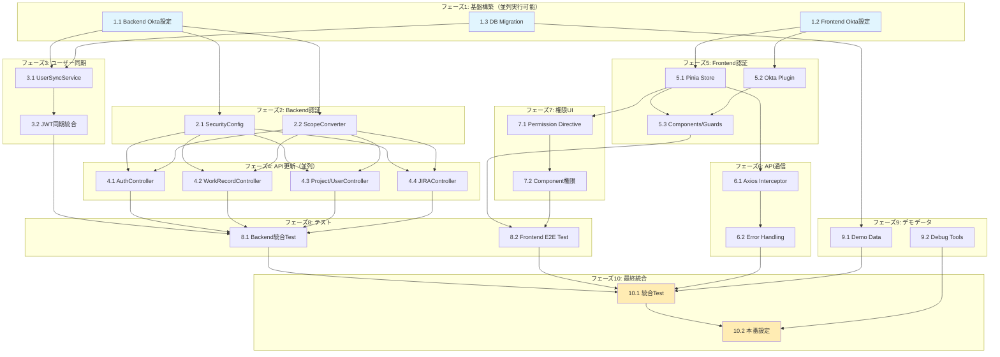

# Implementation Plan

## Tasks

### フェーズ1: 基盤構築（並列実行可能）

- [x] 1.1 Okta設定とSpring Security OAuth2依存関係の追加
  - build.gradleにspring-boot-starter-oauth2-resource-serverとokta-spring-boot-starterを追加
  - application.propertiesにOkta設定（issuer、client-id、client-secret）を追加
  - application-docker.propertiesとapplication-production.propertiesにも環境別設定を追加
  - _Requirements: 1.1, 1.2, 5.1_
  - _Previous: なし_
  - _After: 2.1, 2.2, 3.1_
  - _Suggested Coding Agent: springboot-backend-architect_

- [x] 1.2 フロントエンドOkta依存関係の追加
  - package.jsonに@okta/okta-vueと@okta/okta-auth-jsを追加
  - OktaAuthクライアントの設定ファイル（oktaConfig.ts）を作成
  - 環境変数設定（.env.development、.env.production）を追加
  - _Requirements: 7.1, 7.2_
  - _Previous: なし_
  - _After: 5.1, 5.2_
  - _Suggested Coding Agent: vue3-frontend-architect_

- [x] 1.3 データベースマイグレーション準備
  - V26__add_okta_user_id_column.sqlを作成してusersテーブルにokta_user_idカラムを追加
  - インデックスを追加してOkta IDによる検索を最適化
  - NULL許可でカラムを追加（既存データとの互換性維持）
  - _Requirements: 2.1, 2.6_
  - _Previous: なし_
  - _After: 3.1, 3.2, 9.1_
  - _Suggested Coding Agent: springboot-backend-architect_

### フェーズ2: バックエンド認証基盤（1.1完了後、並列実行可能）

- [x] 2.1 OktaSecurityConfigクラスの作成とテスト
  - OktaSecurityConfigTestを作成してJWT検証ロジックのテストを記述
  - SecurityFilterChainを設定してOAuth2 Resource Serverとして動作するよう実装
  - JWKS（JSON Web Key Set）による公開鍵取得とキャッシング設定を実装
  - CORS設定でOktaドメインを許可
  - _Requirements: 1.3, 1.7, 5.2_
  - _Previous: 1.1_
  - _After: 4.1, 4.2, 4.3_
  - _Suggested Coding Agent: springboot-backend-architect_

- [x] 2.2 スコープベース認可のカスタムコンバーター実装
  - OktaScopeConverterTestを作成してスコープ変換ロジックのテストを記述
  - JwtAuthenticationConverterをカスタマイズしてOktaのスコープを権限に変換
  - 3階層スコープ（resource:action:scope）のパース処理を実装
  - GrantedAuthorityへのマッピングロジックを追加
  - _Requirements: 3.1, 3.2, 3.3_
  - _Previous: 1.1_
  - _After: 4.1, 4.2, 4.3_
  - _Suggested Coding Agent: springboot-backend-architect_

### フェーズ3: ユーザー同期サービス（1.1, 1.3完了後、並列実行可能）

- [x] 3.1 OktaUserSyncServiceクラスとリポジトリの作成
  - OktaUserSyncServiceTestを作成して同期ロジックのテストを記述
  - UserRepositoryを拡張してOkta IDでのユーザー検索メソッドを追加
  - OktaUserSyncServiceを実装してユーザー情報の同期処理を追加
  - メールアドレスによる既存ユーザーとのリンク処理を実装
  - _Requirements: 2.1, 2.2, 2.6_
  - _Previous: 1.1, 1.3_
  - _After: 3.2_
  - _Suggested Coding Agent: springboot-backend-architect_

- [x] 3.2 JWTトークン処理とユーザー同期の統合
  - OktaAuthenticationSuccessHandlerTestを作成
  - 認証成功時にユーザー情報を同期するハンドラーを実装
  - ID Token内のクレーム（sub、email、name）を抽出して保存
  - 初回ログイン時の自動ユーザー作成を実装
  - _Requirements: 2.1, 2.2, 2.4_
  - _Previous: 3.1_
  - _After: 8.1_
  - _Suggested Coding Agent: springboot-backend-architect_

### フェーズ4: APIエンドポイント更新（2.1, 2.2完了後、並列実行可能）

- [x] 4.1 AuthControllerの更新とテスト
  - AuthControllerTestを更新してOkta認証フローのテストを追加
  - 既存のログインエンドポイントをOktaリダイレクト用に修正
  - トークン検証エンドポイント（/api/auth/validate）を追加
  - ログアウトエンドポイントをOkta SLOに対応させる
  - _Requirements: 1.1, 1.2, 4.1_
  - _Previous: 2.1, 2.2_
  - _After: 8.1, 10.1_
  - _Suggested Coding Agent: springboot-backend-architect_

- [x] 4.2 WorkRecordControllerのスコープベース認可実装
  - WorkRecordControllerTestを更新してスコープベース認可のテストを追加
  - @PreAuthorizeアノテーションで各メソッドにスコープ要件を設定
  - work-hours:read:own、work-hours:write:ownなどのスコープを適用
  - チーム承認用のwork-hours-approval:write:teamスコープを実装
  - _Requirements: 3.4, 3.5, 3.6_
  - _Previous: 2.1, 2.2_
  - _After: 8.1, 10.1_
  - _Suggested Coding Agent: springboot-backend-architect_

- [x] 4.3 ProjectControllerとUserControllerの認可更新
  - 各コントローラーのテストを更新してスコープベース認可を検証
  - ProjectControllerにprojects:*スコープを適用
  - UserControllerにusers:*スコープとsupervisors:*スコープを適用
  - 管理者専用エンドポイントに*:*:*スコープ要件を設定
  - _Requirements: 3.7, 3.8, 3.9_
  - _Previous: 2.1, 2.2_
  - _After: 8.1, 10.1_
  - _Suggested Coding Agent: springboot-backend-architect_

- [x] 4.4 JIRAControllerのスコープベース認可実装
  - JIRAコントローラー群にjira-*スコープを適用
  - 管理者限定のjira-connection:*:*スコープを設定
  - PMO用のjira-sync、jira-queries、jira-templatesスコープを実装
  - _Requirements: 3.8, 3.9_
  - _Previous: 2.1, 2.2_
  - _After: 8.1, 10.1_
  - _Suggested Coding Agent: springboot-backend-architect_

### フェーズ5: フロントエンド認証基盤（1.2完了後、並列実行可能）

- [x] 5.1 Pinia認証ストアの実装
  - AuthStoreTestを作成してストア動作のテストを記述
  - stores/auth.tsを更新してOktaトークン管理を実装
  - アクセストークン、IDトークン、リフレッシュトークンの保存処理
  - スコープとユーザー情報の管理機能を追加
  - _Requirements: 7.2, 7.3, 7.4_
  - _Previous: 1.2_
  - _After: 5.3, 6.1, 7.1_
  - _Suggested Coding Agent: vue3-frontend-architect_

- [x] 5.2 Okta Vue プラグインの初期化
  - main.tsでOktaプラグインを初期化
  - PKCEフローの設定を有効化
  - 開発環境と本番環境の設定切り替えを実装
  - _Requirements: 1.1, 1.6, 7.1_
  - _Previous: 1.2_
  - _After: 5.3_
  - _Suggested Coding Agent: vue3-frontend-architect_

- [x] 5.3 認証コンポーネントとルートガードの実装
  - LoginView.vueを更新してOktaログインボタンを実装
  - CallbackView.vueを作成してOIDCコールバック処理を実装
  - router/index.tsに認証ガードを追加して保護されたルートを設定
  - ログアウト処理コンポーネントを実装
  - _Requirements: 7.1, 7.5, 7.6_
  - _Previous: 5.1, 5.2_
  - _After: 8.2, 10.1_
  - _Suggested Coding Agent: vue3-frontend-architect_

### フェーズ6: API通信層（5.1完了後）

- [x] 6.1 APIクライアントのトークン自動付与機能
  - api.client.tsのテストを更新してトークン付与を検証
  - AxiosインターセプターでOktaアクセストークンを自動付与
  - トークン有効期限切れ時の自動リフレッシュ処理を実装
  - 401エラー時のトークンリフレッシュとリトライロジック
  - _Requirements: 7.3, 7.4, 5.3_
  - _Previous: 5.1_
  - _After: 6.2, 10.1_
  - _Suggested Coding Agent: vue3-frontend-architect_

- [x] 6.2 エラーハンドリングとユーザーフィードバック
  - error.handler.tsを更新して認証エラーを適切に処理
  - 認証失敗時のリダイレクト処理を実装
  - トークン期限切れ通知の実装
  - セッション管理とタイムアウト処理
  - _Requirements: 4.2, 4.3, 7.6_
  - _Previous: 6.1_
  - _After: 10.1_
  - _Suggested Coding Agent: vue3-frontend-architect_

### フェーズ7: 権限管理UI（5.1完了後、並列実行可能）

- [x] 7.1 権限ディレクティブとコンポーザブルの作成
  - usePermissionコンポーザブルのテストを作成
  - スコープチェック用のVueディレクティブ（v-can）を実装
  - usePermissionコンポーザブルで権限判定ロジックを実装
  - 3階層スコープの評価関数を作成
  - _Requirements: 7.7, 7.8, 3.10_
  - _Previous: 5.1_
  - _After: 7.2_
  - _Suggested Coding Agent: vue3-frontend-architect_

- [x] 7.2 コンポーネントレベルの権限制御実装
  - WorkRecordView.vueを更新してスコープベースで表示制御
  - ApprovalView.vueに承認権限チェックを追加
  - ProjectsView.vueとUsersView.vueに権限制御を実装
  - 権限不足時のフォールバックUI表示
  - _Requirements: 7.8, 7.9, 7.10_
  - _Previous: 7.1_
  - _After: 8.2, 10.1_
  - _Suggested Coding Agent: vue3-frontend-architect_

### フェーズ8: 統合テスト（各モジュール完了後）

- [ ] 8.1 バックエンド統合テストの作成
  - OktaAuthenticationIntegrationTestを作成
  - MockMvcでOAuth2認証フローをテスト
  - 各APIエンドポイントのスコープベース認可をテスト
  - ユーザー同期処理の統合テスト
  - _Requirements: 1.3, 2.1, 3.4_
  - _Previous: 3.2, 4.1, 4.2, 4.3, 4.4_
  - _After: 10.1_
  - _Suggested Coding Agent: qa-test-strategist_

- [ ] 8.2 フロントエンドE2Eテストの実装
  - Playwrightを使用してOkta認証フローのE2Eテストを作成
  - ログイン→作業時間入力→承認のワークフローをテスト
  - 権限不足時のアクセス制御をテスト
  - ログアウトとセッション管理をテスト
  - _Requirements: 7.1, 7.5, 4.1_
  - _Previous: 5.3, 7.2_
  - _After: 10.1_
  - _Suggested Coding Agent: qa-test-strategist_

### フェーズ9: デモデータとデバッグツール（並列実行可能）

- [ ] 9.1 Okta対応デモデータのFlyway Migration作成
  - V26__update_demo_users_okta.sqlを作成してOkta User IDを持つデモユーザーを追加
  - 開発者、マネジャー、PMO、管理者のサンプルユーザーを定義
  - 各ユーザーに対応するOktaスコープ設定用のコメントを記載
  - flywayClean、flywayMigrateでのリセット手順をREADMEに追記
  - _Requirements: 2.1, 2.6_
  - _Previous: 1.3_
  - _After: 10.1_
  - _Suggested Coding Agent: springboot-backend-architect_

- [ ] 9.2 デバッグとモニタリングツールの実装
  - JWTデコードユーティリティを作成
  - スコープ評価のデバッグログを追加
  - 認証フローのトレーシング機能を実装
  - メトリクス収集用のアスペクトを追加
  - _Requirements: 6.1, 6.2, 6.3_
  - _Previous: なし_
  - _After: 10.2_
  - _Suggested Coding Agent: springboot-backend-architect_

### フェーズ10: 最終統合

- [ ] 10.1 完全な認証フローの統合テスト
  - 全体的な統合テストスイートを作成
  - Okta → Frontend → Backend → DBの完全なフローを検証
  - 並行ログインセッションの処理を確認
  - トークンリフレッシュと有効期限管理を検証
  - _Requirements: 1.1-1.7, 2.1-2.6, 3.1-3.10_
  - _Previous: 4.1, 4.2, 4.3, 4.4, 5.3, 6.1, 6.2, 7.2, 8.1, 8.2, 9.1_
  - _After: 10.2_
  - _Suggested Coding Agent: qa-test-strategist_

- [ ] 10.2 本番環境設定と最終調整
  - Docker環境でのOkta設定を確認
  - 環境変数の設定とシークレット管理を実装
  - HTTPS必須設定とセキュリティヘッダーを確認
  - 負荷テストで1000同時ユーザーでの動作を検証
  - _Requirements: 5.1-5.8, 6.1-6.4_
  - _Previous: 9.2, 10.1_
  - _After: 完了_
  - _Suggested Coding Agent: springboot-backend-architect_

## Task Dependencies

## 並列実行戦略

### 並列実行可能なタスクグループ

1. **初期フェーズ（完全並列）**
   - 1.1, 1.2, 1.3: 相互に依存なし、3つ同時実行可能

2. **バックエンド認証フェーズ（並列）**
   - 2.1, 2.2: 1.1完了後、同時実行可能

3. **API更新フェーズ（並列）**
   - 4.1, 4.2, 4.3, 4.4: 2.1と2.2完了後、4つ同時実行可能

4. **フロントエンド基盤フェーズ（並列）**
   - 5.1, 5.2: 1.2完了後、同時実行可能

5. **UIとデモデータフェーズ（並列）**
   - 7.1, 9.1, 9.2: それぞれの前提条件満たせば並列実行可能

### マージポイント

- **フェーズ1完了後**: 基盤構築完了、メインブランチにマージ
- **フェーズ4完了後**: バックエンドAPI完了、メインブランチにマージ  
- **フェーズ5完了後**: フロントエンド基盤完了、メインブランチにマージ
- **フェーズ8完了後**: テスト完了、メインブランチにマージ

## 推奨実装順序

1. **Day 1**: タスク 1.1, 1.2, 1.3 を3人で並列実行
2. **Day 2**: タスク 2.1, 2.2, 3.1, 5.1, 5.2 を並列実行
3. **Day 3**: タスク 3.2, 4.1-4.4, 5.3 を並列実行
4. **Day 4**: タスク 6.1, 6.2, 7.1, 7.2, 9.1, 9.2 を並列実行
5. **Day 5**: タスク 8.1, 8.2 を並列実行
6. **Day 6**: タスク 10.1, 10.2 で最終統合