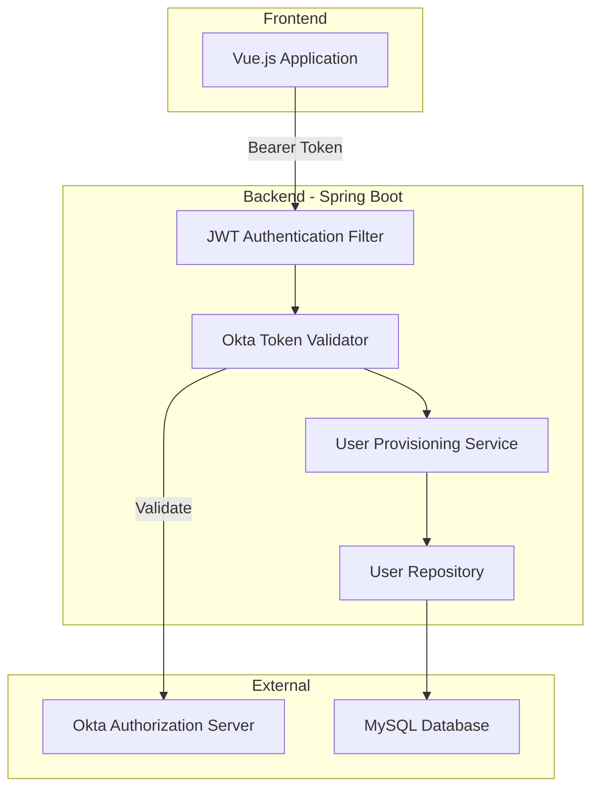
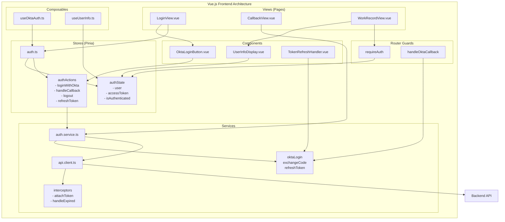
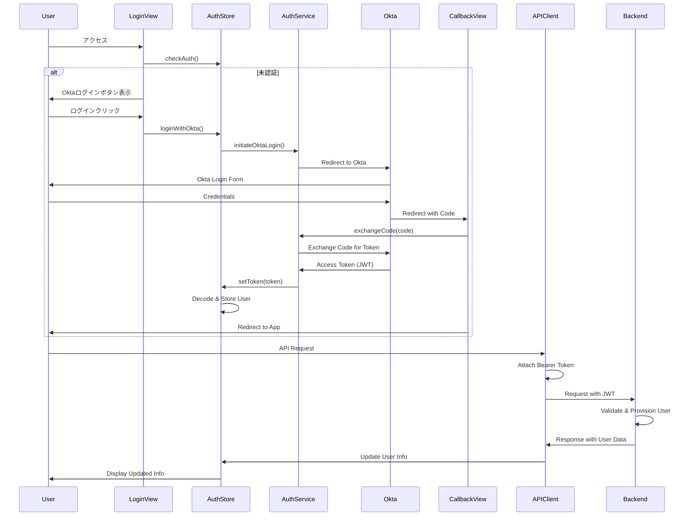
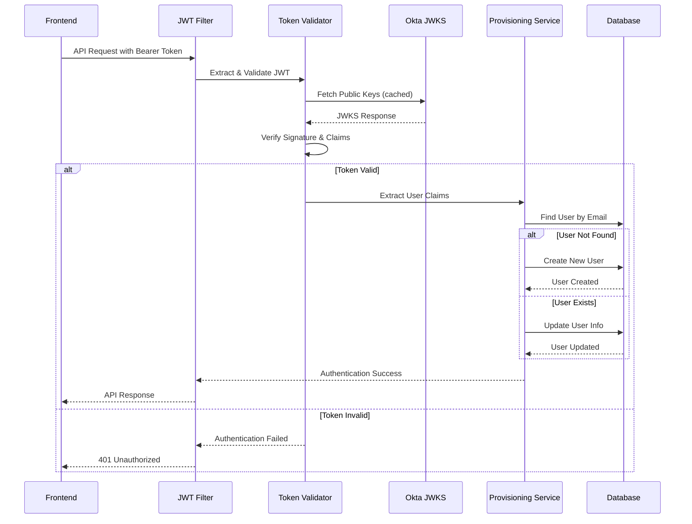
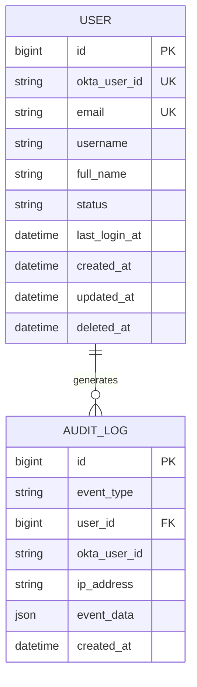
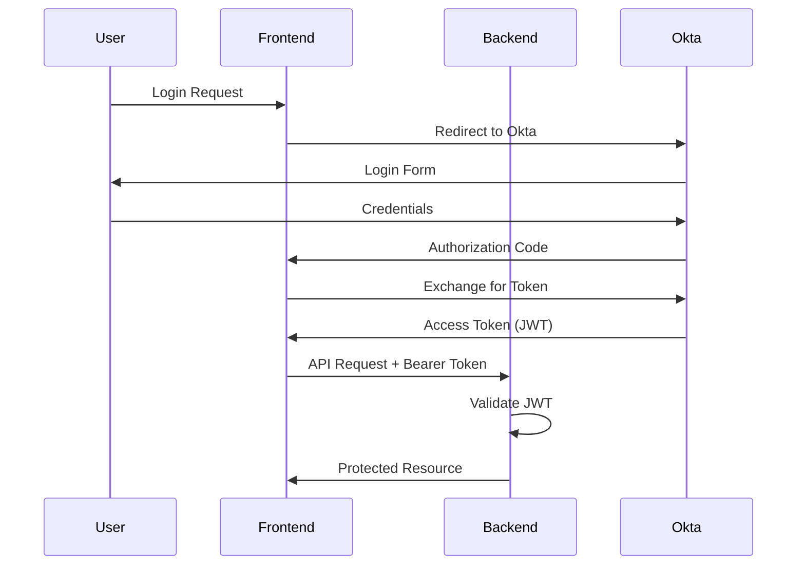
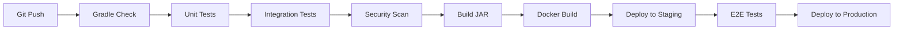

# Technical Design

## Overview

本設計は、フロントエンドから受信したOkta JWTトークンを検証し、ユーザー情報をローカルデータベースに反映するJust-In-Time (JIT) プロビジョニング機能の実装アプローチを定義します。Spring Boot 3.5.4とSpring Security OAuth2 Resource Serverを活用し、既存のDDDアーキテクチャに統合します。

## Requirements Mapping

### Design Component Traceability

各設計コンポーネントが対応する要件：

- **JWT検証フィルター** → Requirement 3: JWTトークン処理とデータ抽出
- **OktaUserProvisioningService** → Requirement 1: JWT検証による初回ユーザー登録
- **UserUpdateService** → Requirement 2: JWT検証による既存ユーザー情報の更新  
- **OktaAuthenticationProvider** → Requirement 3.1-3.6: トークン検証とクレーム抽出
- **UserProvisioningExceptionHandler** → Requirement 4: エラーハンドリングとリカバリー
- **UserInfoController** → Requirement 5: APIエンドポイントとレスポンス
- **AuditLogService** → Requirement 6: ログと監査
- **OktaConfigurationProperties** → Requirement 7: 設定と管理

### User Story Coverage

- **システム管理者のユーザー登録自動化**: OktaUserProvisioningServiceが初回アクセス時に自動的にユーザーを作成
- **既存ユーザー情報の最新化**: UserUpdateServiceがJWTクレームから最新情報を反映
- **セキュアなトークン検証**: OktaAuthenticationProviderが署名と有効期限を検証
- **エラーの適切な処理**: UserProvisioningExceptionHandlerが各種エラーをハンドリング

## Architecture

### システムアーキテクチャ



### フロントエンドコンポーネント詳細アーキテクチャ



### フロントエンドデータフロー



### Technology Stack

- **Backend Framework**: Spring Boot 3.5.4 (既存システムとの統合)
- **Security**: Spring Security OAuth2 Resource Server
- **JWT Library**: Spring Security JWT (内蔵)
- **Database**: MySQL 8.0 (既存)
- **ORM**: MyBatis 3.0.5 (既存)
- **Testing**: JUnit 5 + Mockito + TestContainers

### Architecture Decision Rationale

- **Spring Security OAuth2 Resource Server選択理由**: 
  - Spring Bootとのネイティブ統合
  - 自動的なJWKS更新機能
  - 設定ベースの実装で複雑性を削減
  
- **MyBatis継続使用**: 
  - 既存システムとの一貫性維持
  - 複雑なSQL制御が可能
  
- **MySQL継続使用**: 
  - 既存データとの互換性
  - UNIQUE制約でメールアドレス重複を防止

## Data Flow

### JWT検証とユーザープロビジョニングフロー



## Components and Interfaces

### Backend Services & Method Signatures

#### OktaUserProvisioningService
```java
@Service
public class OktaUserProvisioningService {
    
    /**
     * JWTクレームからユーザーを作成または更新
     */
    public User provisionUser(OktaClaims claims) {
        // emailでユーザー検索、存在しなければ作成、存在すれば更新
    }
    
    /**
     * 新規ユーザー作成
     */
    private User createUser(OktaClaims claims) {
        // ユーザーエンティティ作成とDB保存
    }
    
    /**
     * 既存ユーザー更新
     */
    private User updateUser(User existingUser, OktaClaims claims) {
        // 最新情報で更新、INACTIVEユーザーをACTIVEに
    }
}
```

#### OktaTokenValidator
```java
@Component
public class OktaTokenValidator {
    
    /**
     * JWTトークンを検証
     */
    public OktaClaims validateToken(String token) {
        // 署名、有効期限、issuer検証
    }
    
    /**
     * 必須クレームの存在確認
     */
    private void validateRequiredClaims(Jwt jwt) {
        // sub, emailクレームの検証
    }
}
```

### Frontend Components

#### Views (ページコンポーネント)

| Component | Responsibility | Props/State |
|-----------|---------------|-------------|
| LoginView.vue | ログインページ表示とOkta認証開始 | isLoading, errorMessage |
| CallbackView.vue | Oktaコールバック処理 | code (route param), state |
| WorkRecordView.vue | 認証後のメインビュー | user, workRecords |

#### UI Components

| Component | Responsibility | Props/State |
|-----------|---------------|-------------|
| OktaLoginButton.vue | Oktaログインボタン | disabled, loading |
| UserInfoDisplay.vue | ユーザー情報表示 | user, showDetails |
| TokenRefreshHandler.vue | トークン自動更新 | expiresIn, onRefresh |
| LoadingSpinner.vue | ローディング表示 | size, color |
| ErrorAlert.vue | エラーメッセージ表示 | message, type, dismissible |

#### Stores (Pinia)

| Store | State | Actions |
|-------|-------|---------|
| auth.ts | user, accessToken, refreshToken, isAuthenticated | loginWithOkta(), handleCallback(), logout(), refreshToken() |
| error.ts | errors[], currentError | addError(), clearError(), clearAll() |

#### Services

| Service | Methods | Purpose |
|---------|---------|---------|
| auth.service.ts | initiateOktaLogin(), exchangeCode(), refreshAccessToken() | Okta認証フロー処理 |
| api.client.ts | request(), get(), post(), put(), delete() | APIリクエスト処理とトークン管理 |
| token.service.ts | saveToken(), getToken(), removeToken(), isExpired() | トークンストレージ管理 |

#### Composables

| Composable | Returns | Usage |
|------------|---------|-------|
| useOktaAuth.ts | { login, logout, user, isAuthenticated } | Okta認証機能の提供 |
| useUserInfo.ts | { userInfo, updateUserInfo, loading } | ユーザー情報管理 |
| useTokenRefresh.ts | { scheduleRefresh, cancelRefresh } | トークン更新スケジューリング |

#### Router Guards

| Guard | Purpose | Implementation |
|-------|---------|---------------|
| requireAuth | 認証済みユーザーのみアクセス可 | auth.tsのisAuthenticatedをチェック |
| handleOktaCallback | Oktaコールバック処理 | CallbackViewへのルーティング |

### API Endpoints

| Method | Route | Purpose | Auth | Status Codes |
|--------|-------|---------|------|--------------|
| GET | /api/auth/me | 現在のユーザー情報取得 | Required | 200, 401, 500 |
| POST | /api/auth/okta/callback | Oktaコールバック処理 | Public | 200, 400, 500 |

## Data Models

### Domain Entities

1. **User**: システムユーザーエンティティ
2. **OktaClaims**: JWTクレーム値オブジェクト
3. **AuditLog**: 監査ログエンティティ

### Entity Relationships



### Data Model Definitions

#### Java Domain Models
```java
@Data
@Builder
public class User {
    private Long id;
    private String oktaUserId;
    private String email;
    private String username;
    private String fullName;
    private UserStatus status;
    private LocalDateTime lastLoginAt;
    private LocalDateTime createdAt;
    private LocalDateTime updatedAt;
    private LocalDateTime deletedAt;
}

@Data
@Builder
public class OktaClaims {
    private String sub;          // Okta User ID
    private String email;
    private String preferredUsername;
    private String name;
    private String iss;          // Issuer
    private Long exp;            // Expiration
}
```

### Database Schema

```sql
-- ユニーク制約の追加（Migration V28）
ALTER TABLE users 
ADD UNIQUE KEY uk_email_deleted (email, deleted_at);

-- 監査ログテーブル（既存のaudit_logsテーブルを使用）
-- event_typeに'USER_CREATED', 'USER_UPDATED'を追加
```

### Migration Strategy

- V28マイグレーション: email + deleted_atのユニーク制約追加
- 既存ユーザーのokta_user_id列は初回ログイン時に更新
- 後方互換性維持のため、従来のJWT認証も並行サポート

## Error Handling

### エラーハンドリング戦略

```java
@ControllerAdvice
public class OktaAuthenticationExceptionHandler {
    
    @ExceptionHandler(InvalidJwtException.class)
    public ResponseEntity<ErrorResponse> handleInvalidJwt(InvalidJwtException e) {
        // 401 Unauthorized: 不正なトークン
    }
    
    @ExceptionHandler(ExpiredJwtException.class)
    public ResponseEntity<ErrorResponse> handleExpiredJwt(ExpiredJwtException e) {
        // 401 Unauthorized: 期限切れトークン
    }
    
    @ExceptionHandler(MissingClaimException.class)
    public ResponseEntity<ErrorResponse> handleMissingClaim(MissingClaimException e) {
        // 400 Bad Request: 必須クレーム不足
    }
    
    @ExceptionHandler(DataIntegrityViolationException.class)
    public ResponseEntity<ErrorResponse> handleDuplicateEmail(DataIntegrityViolationException e) {
        // 409 Conflict: メールアドレス重複
    }
}
```

## Security Considerations

### Authentication & Authorization



### Data Protection

- **入力検証**: 
  - メールアドレス形式のバリデーション
  - SQLインジェクション対策（MyBatisパラメータバインディング）
  
- **トークン保護**:
  - HTTPSによる通信暗号化
  - トークンのlocalStorage保存を避け、メモリまたはセキュアクッキー使用
  
- **監査ログ**:
  - IPアドレスを除く個人情報はマスキング不要（要件6.5削除）

### Security Best Practices

- **OWASP Top 10対策**:
  - A01 アクセス制御の不備: JWT検証による認証
  - A02 暗号化の失敗: RS256署名アルゴリズム使用
  - A03 インジェクション: パラメータバインディング使用
  - A07 識別と認証の失敗: Okta MFA対応可能
  
- **レート制限**: Spring Securityのレート制限機能を設定
- **CORS設定**: フロントエンドドメインのみ許可

## Performance & Scalability

### Performance Targets

| Metric | Target | Measurement |
|--------|--------|-------------|
| JWT検証時間 | < 10ms | トークン検証処理 |
| ユーザー作成/更新 | < 50ms | DB処理時間 |
| /api/auth/me応答時間 | < 100ms | エンドツーエンド |
| JWKS更新間隔 | 1時間 | キャッシュ有効期限 |

### Caching Strategy

- **JWKS公開鍵キャッシュ**: 
  - Spring Securityの内蔵キャッシュ（1時間）
  - 手動リフレッシュ機能も提供
  
- **ユーザー情報キャッシュ**: 
  - 実装しない（常に最新情報を返す要件のため）

### Scalability Approach

- ステートレス認証によりアプリケーションサーバーの水平スケーリング可能
- データベース接続プール（HikariCP）で同時接続管理
- 非同期ログ記録で監査ログのパフォーマンス影響を最小化

## Testing Strategy

### Test Coverage Requirements

- **Unit Tests**: ≥80% コードカバレッジ（既存要件）
- **Integration Tests**: JWT検証フロー全体
- **Security Tests**: 不正トークン、期限切れトークンのテスト

### Testing Approach

#### 1. Unit Testing
```java
@Test
void testCreateUserWithValidClaims() {
    // OktaUserProvisioningServiceのユーザー作成ロジック
}

@Test
void testUpdateExistingUser() {
    // 既存ユーザー更新ロジック
}

@Test
void testInvalidEmailFormat() {
    // メールバリデーションエラー
}
```

#### 2. Integration Testing
```java
@SpringBootTest
@AutoConfigureMockMvc
class OktaAuthenticationIntegrationTest {
    
    @Test
    void testSuccessfulAuthentication() {
        // 有効なJWTでの認証成功
    }
    
    @Test
    void testExpiredToken() {
        // 期限切れトークンで401エラー
    }
}
```

#### 3. Security Testing
- 不正な署名のトークン拒否
- 異なるissuerのトークン拒否
- 必須クレーム欠落時のエラー

### CI/CD Pipeline



## Implementation Priorities

### Phase 1: Core JWT Validation (Week 1)
- JWT検証フィルター実装
- Okta設定プロパティ
- 基本的なエラーハンドリング

### Phase 2: User Provisioning (Week 2)
- ユーザー作成・更新サービス
- データベースマイグレーション
- 監査ログ実装

### Phase 3: Testing & Optimization (Week 3)
- 包括的なテストスイート
- パフォーマンス最適化
- ドキュメント作成

## Configuration Example

```yaml
# application.yml
spring:
  security:
    oauth2:
      resourceserver:
        jwt:
          issuer-uri: ${OKTA_ISSUER_URI:https://dev-example.okta.com/oauth2/default}
          jwk-set-uri: ${OKTA_JWK_SET_URI:https://dev-example.okta.com/oauth2/default/v1/keys}

okta:
  client:
    token-expiry-tolerance: 60 # seconds
    claim-mapping:
      user-id: sub
      email: email
      username: preferred_username
      full-name: name
```