# Implementation Plan

## Tasks

### Phase 1: バックエンド - JWT検証基盤

- [x] 1.1 Okta設定プロパティクラスの実装
  - OktaConfigurationPropertiesクラスを作成し、application.ymlからOkta設定を読み込む仕組みを実装
  - @ConfigurationPropertiesアノテーションを使用してissuer-uri、jwk-set-uri、claim-mappingなどを管理
  - 設定値のバリデーションとデフォルト値処理を実装
  - テストでは異なる設定値での動作を検証
  - _Requirements: 7.1, 7.2_
  - _Previous: なし_
  - _After: 1.2, 1.3_
  - Suggested Coding Agent: springboot-backend-architect

- [x] 1.2 OktaClaimsデータモデルの実装
  - JWT トークンから抽出されるクレーム情報を保持するOktaClaimsクラスを作成
  - sub、email、preferredUsername、name、iss、expフィールドを定義
  - Lombokの@Data、@Builderアノテーションを使用
  - 必須クレームのバリデーションメソッドを実装
  - _Requirements: 3.2, 3.3_
  - _Previous: 1.1_
  - _After: 1.3, 2.1_
  - Suggested Coding Agent: springboot-backend-architect

- [x] 1.3 JWT検証例外クラスの実装
  - InvalidJwtException、ExpiredJwtException、MissingClaimExceptionを作成
  - 各例外クラスに適切なエラーメッセージとHTTPステータスコードを定義
  - RuntimeExceptionを継承し、エラーの詳細情報を保持
  - 単体テストで例外の生成とメッセージを検証
  - _Requirements: 3.3, 3.6, 4.4_
  - _Previous: 1.1_
  - _After: 2.2, 3.1_
  - Suggested Coding Agent: springboot-backend-architect

### Phase 2: バックエンド - ユーザープロビジョニング

- [x] 2.1 UserエンティティへのOkta関連フィールド追加
  - 既存のUserエンティティにoktaUserIdフィールドを追加
  - lastLoginAtフィールドを追加
  - UserStatusのACTIVE、INACTIVE、SUSPENDED状態遷移ロジックを実装
  - 単体テストでフィールドの設定と取得を検証
  - _Requirements: 1.2, 2.2, 2.5_
  - _Previous: 1.2_
  - _After: 2.2, 2.3_
  - Suggested Coding Agent: springboot-backend-architect

- [x] 2.2 UserRepositoryインターフェースの拡張
  - findByEmailAndDeletedAtIsNullメソッドを追加
  - findByOktaUserIdメソッドを追加
  - updateLastLoginAtメソッドを追加
  - MyBatisマッパーアノテーションでSQL実装
  - _Requirements: 1.1, 1.5, 2.1_
  - _Previous: 2.1, 1.3_
  - _After: 2.3, 3.2_
  - Suggested Coding Agent: springboot-backend-architect

- [x] 2.3 データベースマイグレーション V28の作成
  - usersテーブルにokta_user_idカラムを追加（VARCHAR(255)、UNIQUE）
  - usersテーブルにlast_login_atカラムを追加（DATETIME）
  - email + deleted_atの複合ユニーク制約を追加
  - ロールバックスクリプトも作成
  - _Requirements: 1.5, 2.3, 4.3_
  - _Previous: 2.1, 2.2_
  - _After: 3.1, 3.2_
  - Suggested Coding Agent: springboot-backend-architect

### Phase 3: バックエンド - JWT検証とプロビジョニングサービス

- [x] 3.1 OktaTokenValidatorサービスの実装
  - Spring SecurityのJwtDecoderを使用してトークンを検証
  - 署名、有効期限、issuerの検証ロジックを実装
  - validateTokenメソッドでOktaClaimsオブジェクトを返す
  - 単体テストで正常系と異常系（無効トークン、期限切れ）を検証
  - _Requirements: 3.1, 3.4, 3.5, 3.6_
  - _Previous: 1.3, 2.3_
  - _After: 3.2, 3.3_
  - Suggested Coding Agent: springboot-backend-architect

- [x] 3.2 OktaUserProvisioningServiceの実装
  - provisionUserメソッドでユーザーの作成または更新を実行
  - createUserメソッドで新規ユーザーを作成（status=ACTIVE）
  - updateUserメソッドで既存ユーザー情報を更新
  - トランザクション管理とエラーハンドリングを実装
  - _Requirements: 1.1, 1.2, 1.3, 1.4, 2.1, 2.2, 2.3, 2.4, 2.5_
  - _Previous: 2.2, 2.3, 3.1_
  - _After: 3.3, 4.1_
  - Suggested Coding Agent: springboot-backend-architect

- [x] 3.3 AuditLogServiceの拡張
  - USER_CREATED、USER_UPDATEDイベントタイプを追加
  - OktaユーザーID、変更内容、IPアドレスを記録
  - 監査ログの90日アーカイブ機能を実装
  - 単体テストでログ記録と取得を検証
  - _Requirements: 6.1, 6.2, 6.3, 6.4, 6.5_
  - _Previous: 3.1, 3.2_
  - _After: 4.1, 4.2_
  - Suggested Coding Agent: springboot-backend-architect

### Phase 4: バックエンド - APIエンドポイントと認証フィルター

- [x] 4.1 OktaJwtAuthenticationFilterの実装
  - OncePerRequestFilterを継承してJWT検証フィルターを作成
  - AuthorizationヘッダーからBearerトークンを抽出
  - OktaTokenValidatorとOktaUserProvisioningServiceを呼び出し
  - SecurityContextHolderに認証情報を設定
  - _Requirements: 3.1, 5.1_
  - _Previous: 3.2, 3.3_
  - _After: 4.2, 4.3_
  - Suggested Coding Agent: springboot-backend-architect

- [x] 4.2 UserInfoControllerの実装
  - GET /api/auth/meエンドポイントを作成
  - 現在のユーザー情報を返すレスポンスDTOを定義
  - @AuthenticationPrincipalでユーザー情報を取得
  - 単体テストとMockMvcでAPIテストを実装
  - _Requirements: 5.1, 5.2, 5.3_
  - _Previous: 4.1, 3.3_
  - _After: 4.3, 5.1_
  - Suggested Coding Agent: springboot-backend-architect

- [x] 4.3 OktaAuthenticationExceptionHandlerの実装
  - @ControllerAdviceクラスで例外ハンドリングを統一
  - 各種JWT例外に対する適切なHTTPステータスとエラーレスポンス
  - セキュリティログへの記録処理を実装
  - MockMvcテストで各種エラーケースを検証
  - _Requirements: 4.1, 4.2, 4.4, 4.5_
  - _Previous: 4.1, 4.2_
  - _After: 5.1, 6.1_
  - Suggested Coding Agent: springboot-backend-architect

### Phase 5: フロントエンド - Okta認証基盤

- [x] 5.1 Okta認証設定とタイプ定義
  - src/config/okta.tsでOkta設定（clientId、issuer、redirectUri）を定義
  - src/types/auth.tsでOktaUser、OktaToken、AuthStateタイプを定義
  - 環境変数から設定値を読み込む仕組みを実装
  - 単体テストで設定値の読み込みを検証
  - _Requirements: 5.1, 7.1_
  - _Previous: 4.2, 4.3_
  - _After: 5.2, 5.3_
  - Suggested Coding Agent: vue3-frontend-architect

- [x] 5.2 認証サービス層の実装
  - src/services/auth.service.tsでOkta認証フローを実装
  - initiateOktaLogin、exchangeCode、refreshAccessTokenメソッドを作成
  - トークンの保存と取得をlocalStorageまたはメモリで管理
  - Jestでサービスメソッドの単体テストを実装
  - _Requirements: 3.1, 5.2_
  - _Previous: 5.1_
  - _After: 5.3, 5.4_
  - Suggested Coding Agent: vue3-frontend-architect

- [x] 5.3 Pinia認証ストアの実装
  - src/stores/auth.tsでuseAuthStoreを定義
  - user、accessToken、isAuthenticatedの状態管理
  - loginWithOkta、handleCallback、logout、refreshTokenアクションを実装
  - Vitestでストアの状態遷移をテスト
  - _Requirements: 5.1, 5.2_
  - _Previous: 5.1, 5.2_
  - _After: 5.4, 6.1_
  - Suggested Coding Agent: vue3-frontend-architect

### Phase 6: フロントエンド - 認証UIコンポーネント

- [x] 6.1 OktaLoginButtonコンポーネントの実装
  - src/components/OktaLoginButton.vueを作成
  - ログインボタンのUI、ローディング状態、エラー表示を実装
  - authストアのloginWithOktaアクションを呼び出し
  - Vue Test Utilsでコンポーネントテストを実装
  - _Requirements: 5.2_
  - _Previous: 4.3, 5.3_
  - _After: 6.2, 6.3_
  - Suggested Coding Agent: vue3-frontend-architect

- [x] 6.2 UserInfoDisplayコンポーネントの実装
  - src/components/UserInfoDisplay.vueを作成
  - ユーザー情報（名前、メール、最終ログイン）の表示UI
  - authストアからユーザー情報を取得して表示
  - コンポーネントテストで表示内容を検証
  - _Requirements: 5.2_
  - _Previous: 6.1_
  - _After: 6.3, 6.4_
  - Suggested Coding Agent: vue3-frontend-architect

- [x] 6.3 TokenRefreshHandlerコンポーネントの実装
  - src/components/TokenRefreshHandler.vueを作成
  - トークン有効期限の監視と自動更新ロジック
  - setIntervalで定期的にトークンをリフレッシュ
  - コンポーネントテストでタイマー動作を検証
  - _Requirements: 3.1_
  - _Previous: 6.1, 6.2_
  - _After: 6.4, 7.1_
  - Suggested Coding Agent: vue3-frontend-architect

### Phase 7: フロントエンド - ページとルーティング

- [ ] 7.1 LoginViewページの実装
  - src/views/LoginView.vueを作成
  - OktaLoginButtonコンポーネントを配置
  - 認証済みユーザーは自動的にリダイレクト
  - ページコンポーネントテストを実装
  - _Requirements: 5.1, 5.2_
  - _Previous: 6.3_
  - _After: 7.2, 7.3_
  - Suggested Coding Agent: vue3-frontend-architect

- [ ] 7.2 CallbackViewページの実装
  - src/views/CallbackView.vueを作成
  - OktaからのリダイレクトをハンドリングしてコードをExchange
  - 認証成功後にメインページへリダイレクト
  - エラー時の表示とリトライ機能を実装
  - _Requirements: 5.1_
  - _Previous: 7.1_
  - _After: 7.3, 7.4_
  - Suggested Coding Agent: vue3-frontend-architect

- [ ] 7.3 ルーターガードの実装
  - src/router/guards.tsでrequireAuthガードを作成
  - 未認証ユーザーをログインページへリダイレクト
  - handleOktaCallbackガードでコールバック処理
  - 単体テストでガードロジックを検証
  - _Requirements: 5.1_
  - _Previous: 7.1, 7.2_
  - _After: 7.4, 8.1_
  - Suggested Coding Agent: vue3-frontend-architect

### Phase 8: フロントエンド - API通信層

- [ ] 8.1 APIクライアントへのインターセプター追加
  - src/services/api.client.tsにBearerトークン付与インターセプターを追加
  - 401エラー時の自動トークンリフレッシュを実装
  - リフレッシュ失敗時はログインページへリダイレクト
  - Axiosモックでインターセプターをテスト
  - _Requirements: 3.1, 5.3_
  - _Previous: 7.3_
  - _After: 8.2, 8.3_
  - Suggested Coding Agent: vue3-frontend-architect

- [ ] 8.2 useOktaAuth Composableの実装
  - src/composables/useOktaAuth.tsを作成
  - 認証状態とアクションを提供するComposition API
  - login、logout、user、isAuthenticatedを返す
  - 単体テストでComposableの動作を検証
  - _Requirements: 5.1, 5.2_
  - _Previous: 8.1_
  - _After: 8.3, 9.1_
  - Suggested Coding Agent: vue3-frontend-architect

- [ ] 8.3 useUserInfo Composableの実装
  - src/composables/useUserInfo.tsを作成
  - /api/auth/meエンドポイントからユーザー情報を取得
  - ローディング状態とエラーハンドリングを実装
  - 単体テストでAPI呼び出しとエラーケースを検証
  - _Requirements: 5.1, 5.2, 5.3_
  - _Previous: 8.1, 8.2_
  - _After: 9.1, 9.2_
  - Suggested Coding Agent: vue3-frontend-architect

### Phase 9: 統合テスト

- [ ] 9.1 バックエンド統合テストの実装
  - OktaAuthenticationIntegrationTestクラスを作成
  - 正常な認証フロー、期限切れトークン、不正トークンのテストケース
  - ユーザー作成と更新のエンドツーエンドテスト
  - TestContainersでMySQLを使用した実環境テスト
  - _Requirements: 1.1, 1.2, 1.3, 1.4, 1.5, 2.1, 2.2, 2.3, 2.4, 2.5, 3.1, 3.2, 3.3, 3.4, 3.5, 3.6_
  - _Previous: 8.2, 8.3_
  - _After: 9.2, 9.3_
  - Suggested Coding Agent: qa-test-strategist

- [ ] 9.2 フロントエンド統合テストの実装
  - Cypressでログインフローのエンドツーエンドテストを作成
  - ログイン → コールバック → ユーザー情報表示の一連のフローをテスト
  - トークンリフレッシュの自動実行を検証
  - エラーケースとリトライ機能をテスト
  - _Requirements: 5.1, 5.2, 5.3_
  - _Previous: 9.1_
  - _After: 9.3, 10.1_
  - Suggested Coding Agent: qa-test-strategist

- [ ] 9.3 セキュリティテストの実装
  - 不正な署名のトークン拒否テスト
  - 異なるissuerのトークン拒否テスト
  - 必須クレーム欠落時のエラーテスト
  - SQLインジェクション対策の確認テスト
  - _Requirements: 3.3, 3.4, 3.5, 3.6, 4.4_
  - _Previous: 9.1, 9.2_
  - _After: 10.1, 10.2_
  - Suggested Coding Agent: qa-test-strategist

### Phase 10: 最終統合と設定

- [ ] 10.1 Spring SecurityとOkta設定の統合
  - OktaSecurityConfigクラスでSecurityFilterChainを更新
  - JwtAuthenticationFilterをフィルターチェーンに追加
  - CORS設定でフロントエンドドメインを許可
  - application.ymlにOkta設定値を追加
  - _Requirements: 7.1, 7.2_
  - _Previous: 9.2, 9.3_
  - _After: 10.2, 10.3_
  - Suggested Coding Agent: springboot-backend-architect

- [ ] 10.2 フロントエンドルーティングの最終設定
  - src/router/index.tsに認証ガードを適用
  - /login、/callback、保護されたルートを設定
  - 404ページとエラーページのルーティング追加
  - ルーターテストで全ルートの動作を検証
  - _Requirements: 5.1_
  - _Previous: 10.1_
  - _After: 10.3_
  - Suggested Coding Agent: vue3-frontend-architect

- [ ] 10.3 全体システムの動作確認
  - Docker Composeで全サービスを起動
  - 新規ユーザーのOkta認証とプロビジョニングを確認
  - 既存ユーザーの情報更新を確認
  - 監査ログの記録を確認
  - _Requirements: 全要件_
  - _Previous: 10.1, 10.2_
  - _After: なし_
  - Suggested Coding Agent: qa-test-strategist

## Task Dependencies

```mermaid
graph TD
    subgraph "Phase 1: JWT検証基盤"
        1.1[Okta設定プロパティ]
        1.2[OktaClaimsモデル]
        1.3[JWT例外クラス]
        1.1 --> 1.2
        1.1 --> 1.3
    end
    
    subgraph "Phase 2: ユーザープロビジョニング"
        2.1[Userエンティティ拡張]
        2.2[UserRepository拡張]
        2.3[DBマイグレーション]
        1.2 --> 2.1
        2.1 --> 2.2
        2.1 --> 2.3
        1.3 --> 2.2
        2.2 --> 2.3
    end
    
    subgraph "Phase 3: 検証とプロビジョニング"
        3.1[OktaTokenValidator]
        3.2[UserProvisioningService]
        3.3[AuditLogService]
        1.3 --> 3.1
        2.3 --> 3.1
        2.2 --> 3.2
        2.3 --> 3.2
        3.1 --> 3.2
        3.1 --> 3.3
        3.2 --> 3.3
    end
    
    subgraph "Phase 4: APIエンドポイント"
        4.1[JwtAuthenticationFilter]
        4.2[UserInfoController]
        4.3[ExceptionHandler]
        3.2 --> 4.1
        3.3 --> 4.1
        4.1 --> 4.2
        3.3 --> 4.2
        4.1 --> 4.3
        4.2 --> 4.3
    end
    
    subgraph "Phase 5: フロントエンド基盤"
        5.1[Okta設定とタイプ]
        5.2[認証サービス]
        5.3[Piniaストア]
        4.2 --> 5.1
        4.3 --> 5.1
        5.1 --> 5.2
        5.1 --> 5.3
        5.2 --> 5.3
    end
    
    subgraph "Phase 6: 認証UI"
        6.1[LoginButton]
        6.2[UserInfoDisplay]
        6.3[TokenRefreshHandler]
        4.3 --> 6.1
        5.3 --> 6.1
        6.1 --> 6.2
        6.1 --> 6.3
        6.2 --> 6.3
    end
    
    subgraph "Phase 7: ページとルーティング"
        7.1[LoginView]
        7.2[CallbackView]
        7.3[ルーターガード]
        6.3 --> 7.1
        7.1 --> 7.2
        7.1 --> 7.3
        7.2 --> 7.3
    end
    
    subgraph "Phase 8: API通信"
        8.1[APIインターセプター]
        8.2[useOktaAuth]
        8.3[useUserInfo]
        7.3 --> 8.1
        8.1 --> 8.2
        8.1 --> 8.3
        8.2 --> 8.3
    end
    
    subgraph "Phase 9: 統合テスト"
        9.1[バックエンド統合テスト]
        9.2[フロントエンド統合テスト]
        9.3[セキュリティテスト]
        8.2 --> 9.1
        8.3 --> 9.1
        9.1 --> 9.2
        9.1 --> 9.3
        9.2 --> 9.3
    end
    
    subgraph "Phase 10: 最終統合"
        10.1[Spring Security統合]
        10.2[ルーティング最終設定]
        10.3[全体動作確認]
        9.2 --> 10.1
        9.3 --> 10.1
        10.1 --> 10.2
        10.1 --> 10.3
        10.2 --> 10.3
    end
```

## 並列実行可能なタスクグループ

以下のタスクグループは並列実行が可能です：

**Group 1 (Phase 1)**: 1.1, 1.2, 1.3を並列実行後、マージ
**Group 2 (Phase 2)**: 2.1完了後、2.2と2.3を並列実行、マージ  
**Group 3 (Phase 5-6)**: 5.1完了後、5.2と5.3を並列実行、その後6.1, 6.2, 6.3を並列実行、マージ
**Group 4 (Phase 7-8)**: 7.1と7.2を並列実行後、8.1, 8.2, 8.3を並列実行、マージ
**Group 5 (Phase 9)**: 9.1, 9.2, 9.3を並列実行、マージ

各グループ完了後は `parallel-tasks-git-merger-agent` を使用してメインブランチにマージしてから次のフェーズに進みます。