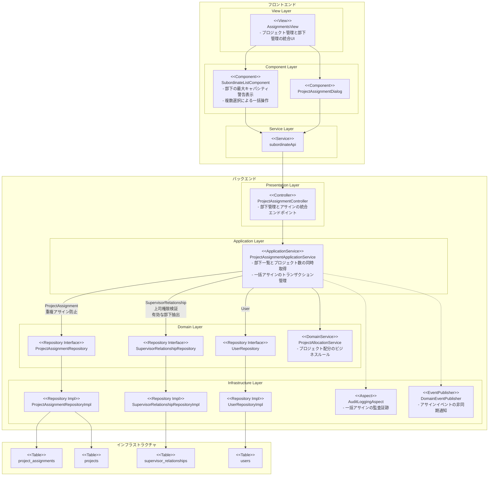
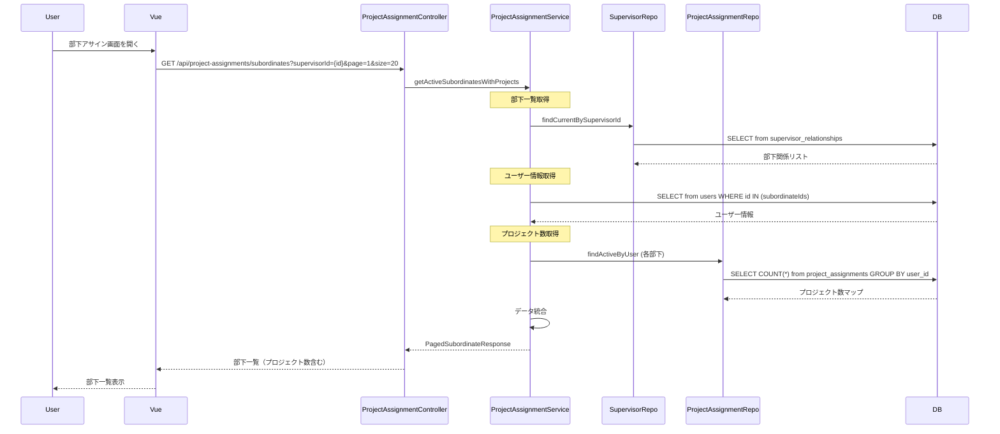
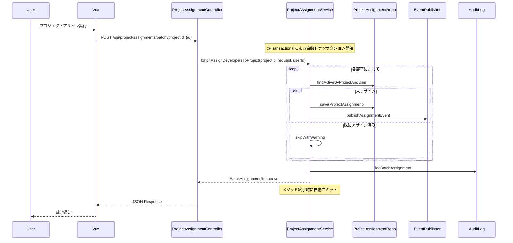
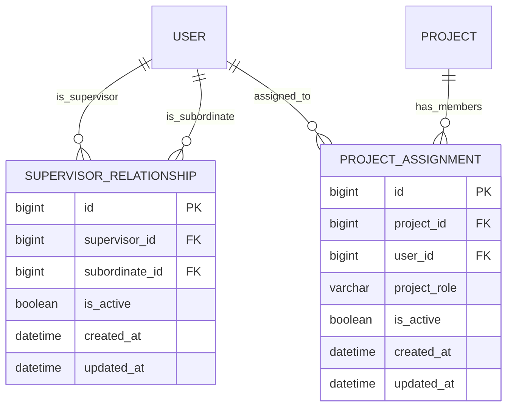

# 技術設計書

## 概要
本設計書は、部下プロジェクトアサイン機能の技術実装アプローチを定義します。既存のSupervisorRelationshipエンティティとProjectAssignmentエンティティを活用し、上司が部下に対して効率的にプロジェクトをアサインできる機能を実現します。UIは既存のAssignmentsViewと統一性を保ち、バッチ処理とトランザクション管理により大量の部下へのアサインにも対応します。

## 要件マッピング

### 設計コンポーネントのトレーサビリティ
各設計コンポーネントが対応する要件:
- **SubordinateListComponent** → 要件1: 部下一覧表示機能（有効な部下のみ表示）
- **SubordinateSelectionManager** → 要件2: 部下選択機能（複数選択、全選択）
- **ProjectAssignmentDialog** → 要件3: プロジェクト選択・アサイン機能
- **SubordinateProjectAssignmentView** → 要件4: UI統一性（AssignmentsViewと同じレイアウト）
- **SubordinateAuthorizationService** → 要件5: 権限管理（上司権限チェック）
- **BatchAssignmentService** → 要件6: データ整合性（トランザクション管理）
- **PerformanceOptimization** → 要件7: パフォーマンス要件（ページネーション、キャッシング）
- **AuditLoggingIntegration** → 要件8: 監査とログ記録

### ユーザーストーリーカバレッジ
- ユーザーストーリー1（部下一覧確認）: SubordinateListComponent + SupervisorApplicationServiceの拡張
- ユーザーストーリー2（複数選択）: SubordinateSelectionManagerによるステート管理
- ユーザーストーリー3（プロジェクトアサイン）: BatchAssignmentServiceによるバッチ処理実装
- ユーザーストーリー4（UI統一性）: Vuetifyコンポーネントの再利用

## アーキテクチャ



### 技術スタック
既存システムの技術スタックを活用:

- **フロントエンド**: Vue 3.5.13 + TypeScript 5.6 + Vuetify 3
- **バックエンド**: Spring Boot 3.5.4 + Java 17 + DDD Architecture
- **データベース**: MySQL 8.0 + MyBatis 3.0.5
- **認証**: JWT (io.jsonwebtoken:jjwt 0.12.6)
- **テスティング**: JUnit 5 + Mockito + Vitest + Playwright
- **監査**: Spring AOP (AuditLoggingAspect)

### アーキテクチャ決定の根拠
- **既存エンティティの活用**: SupervisorRelationshipとProjectAssignmentを再利用することで、実装工数を削減し、データ整合性を保証
- **バッチ処理の採用**: 複数部下への同時アサインをトランザクション内で処理し、パフォーマンスとデータ整合性を両立
- **Vuetifyコンポーネント**: 既存UIとの統一性を保ち、学習コストを最小化
- **AOPによる監査**: 既存のAuditLoggingAspectを活用し、コンプライアンス要件を満たす

## データフロー

### 部下一覧取得フロー（プロジェクト数同時取得）


### バッチアサインフロー


## コンポーネントとインターフェース

### バックエンドサービス＆メソッドシグネチャ

#### ProjectAssignmentApplicationService (既存クラスを拡張)
```java
@Service
@Transactional
public class ProjectAssignmentApplicationService {
    // 既存メソッド
    public ProjectAssignment assignDeveloperToProject(String projectId, String developerUserId, String projectRole, String userId);
    public ProjectAssignment updateAssignment(String assignmentId, String projectRole, String userId);
    public List<ProjectAssignment> findByUser(String userId);  // 既存：ユーザーのアサイン一覧
    
    // 新規追加メソッド
    public BatchAssignmentResponse batchAssignDevelopersToProject(String projectId, BatchAssignmentRequest request, String userId);  // 一括アサイン
    public PagedSubordinateResponse getActiveSubordinatesWithProjects(String supervisorId, int page, int size);  // 部下一覧とプロジェクト数を同時取得
}
```

### フロントエンドコンポーネント

| コンポーネント名 | 責任 | Props/State概要 |
|---------------|------|----------------|
| AssignmentsView（既存を拡張） | メインビューコンポーネント | state: プロジェクトリスト、部下リスト、選択状態、タブ状態 |
| SubordinateListComponent（新規） | 部下一覧テーブル表示 | props: 部下データ、選択ハンドラー |
| SubordinateSelectionManager | 選択状態管理 | state: 選択ID配列、全選択フラグ |
| ProjectAssignmentDialog（既存を共有） | プロジェクト選択ダイアログ | props: プロジェクトリスト、アサインハンドラー |
| SubordinatePagination | ページネーション制御 | props: 総件数、現在ページ、ページサイズ |

### APIエンドポイント

| メソッド | ルート | 目的 | 認証 | ステータスコード |
|---------|--------|------|------|-----------------|
| GET | /api/project-assignments/subordinates | 有効な部下一覧とプロジェクト数取得 | 必須 | 200, 401, 403, 500 |
| POST | /api/project-assignments/batch | バッチプロジェクトアサイン | 必須 | 201, 400, 401, 403, 409, 500 |
| GET | /api/projects/active | アクティブプロジェクト一覧（既存） | 必須 | 200, 401, 500 |

## データモデル

### ドメインエンティティ
既存エンティティを活用:
1. **SupervisorRelationship**: 上司-部下関係（既存）
2. **ProjectAssignment**: プロジェクトアサイン（既存）
3. **User**: ユーザーエンティティ（既存）
4. **Project**: プロジェクトエンティティ（既存）

### エンティティ関係


### DTOモデル定義

#### リクエストDTO
```java
@Data
public class BatchAssignmentRequest {
    private List<String> developerUserIds;  // アサイン対象のユーザーIDリスト
    private String projectRole;              // プロジェクト内の役割
}

@Data
public class SubordinateSearchCriteria {
    private String supervisorId;
    private Boolean isActive;
    private Integer page;
    private Integer size;
}
```

#### レスポンスDTO
```java
@Data
public class SubordinateInfo {
    private String id;
    private String name;
    private String email;
    private Integer currentProjectCount;  // 現在のプロジェクト数
    private Boolean isMaxCapacity;         // 最大キャパシティに達しているか
}

@Data  
public class PagedSubordinateResponse {
    private List<SubordinateInfo> subordinates;
    private Integer totalElements;
    private Integer totalPages;
    private Integer currentPage;
    private Integer pageSize;
}

@Data
public class BatchAssignmentResponse {
    private String projectId;
    private Integer successCount;
    private Integer skippedCount;
    private Integer failedCount;
    private List<AssignmentResult> results;
}

@Data
public class AssignmentResult {
    private String userId;
    private String userName;
    private String assignmentId;
    private Boolean success;
    private Boolean skipped;
    private String message;
}
```

### データベーススキーマ
既存のテーブルを使用（変更なし）:
- `supervisor_relationships`: 上司-部下関係テーブル
- `project_assignments`: プロジェクトアサインテーブル
- `users`: ユーザーテーブル
- `projects`: プロジェクトテーブル

### マイグレーション戦略
- 新規テーブルは不要（既存テーブルを活用）
- インデックス追加: `supervisor_relationships.supervisor_id` にインデックス（パフォーマンス向上）
- Flyway V19マイグレーション: インデックス追加のみ

## エラーハンドリング

### バックエンドエラー処理
```java
// カスタム例外クラス
public class SubordinateAssignmentException extends DomainException {
    public SubordinateAssignmentException(String message) {
        super(message);
    }
}

public class UnauthorizedAssignmentException extends DomainException {
    public UnauthorizedAssignmentException(String message) {
        super(message);
    }
}

// GlobalExceptionHandlerでの処理
@ExceptionHandler(SubordinateAssignmentException.class)
public ResponseEntity<ErrorResponse> handleAssignmentException(SubordinateAssignmentException e) {
    return ResponseEntity.status(HttpStatus.BAD_REQUEST)
        .body(new ErrorResponse("ASSIGNMENT_ERROR", e.getMessage()));
}
```

### フロントエンドエラー処理
```typescript
// エラーハンドラー
const handleBatchAssignmentError = (error: AxiosError) => {
    if (error.response?.status === 403) {
        showToast('権限がありません', 'error');
    } else if (error.response?.status === 409) {
        showToast('一部の部下は既にアサイン済みです', 'warning');
    } else {
        showToast('アサイン処理中にエラーが発生しました', 'error');
    }
};
```

## セキュリティ考慮事項

### 認証＆認可
- JWT認証必須（既存のJwtAuthenticationFilter使用）
- 上司権限チェック: SupervisorRelationshipで検証
- PMO/ADMINロール特権: Spring Securityの@PreAuthorizeで制御

### データ保護
- 入力検証: Bean Validationによる必須項目・型チェック
- SQLインジェクション対策: MyBatisのパラメータバインディング
- XSS対策: Vue.jsの自動エスケープ機能

### セキュリティベストプラクティス
- APIレート制限: 1分あたり60リクエストまで
- CORS設定: 既存のSecurityConfigを活用
- セキュリティヘッダー: Spring Securityのデフォルト設定
- 監査ログ: すべてのアサイン操作をAuditLoggingAspectで記録

## パフォーマンス＆スケーラビリティ

### パフォーマンスターゲット
| メトリック | 目標値 | 測定方法 |
|-----------|--------|---------|
| 部下一覧取得 (p95) | < 3秒 | APIエンドポイント計測 |
| バッチアサイン (p95) | < 5秒 | 100人アサイン時 |
| データベースクエリ (p99) | < 100ms | MyBatisログ監視 |
| 同時ユーザー | > 100 | 負荷テスト |

### パフォーマンス最適化
- **SQLクエリ最適化**: JOINを使用して N+1問題を回避
- **必要なフィールドのみ取得**: 部下一覧取得時に表示に必要な情報のみ取得
- **インデックス活用**: supervisor_idインデックスによる検索高速化

### スケーラビリティアプローチ
- ページネーション: 20件/ページでメモリ使用量を制限
- バッチ処理: ApplicationServiceの@Transactionalによる自動管理
- インデックス最適化: supervisor_idにインデックス追加
- トランザクション管理: Spring Bootの宣言的トランザクション管理を活用

## テスト戦略

### テストカバレッジ要件
- **ユニットテスト**: ≥80% コードカバレッジ（JaCoCo）
- **統合テスト**: すべてのAPIエンドポイント
- **E2Eテスト**: 主要ユーザーフロー
- **パフォーマンステスト**: 100人同時アサインシナリオ

### テストアプローチ

#### バックエンドテスト
```java
@SpringBootTest
@AutoConfigureMockMvc
class SubordinateControllerTest {
    @Test
    void testGetActiveSubordinates_Success() { }
    @Test
    void testBatchAssignment_TransactionRollback() { }
    @Test
    void testUnauthorizedAccess_Returns403() { }
}

@Test
class BatchAssignmentServiceTest {
    @Test
    void testDuplicateAssignmentFiltering() { }
    @Test
    void testTransactionRollbackOnError() { }
}
```

#### フロントエンドテスト
```typescript
// Vitestユニットテスト
describe('SubordinateSelectionManager', () => {
    it('should handle select all functionality', () => {});
    it('should maintain selection state across pagination', () => {});
});

// Playwright E2Eテスト
test('subordinate batch assignment flow', async ({ page }) => {
    await page.goto('/subordinate-assignments');
    await page.click('[data-test="select-all"]');
    await page.click('[data-test="assign-project"]');
    // ...
});
```

### CI/CDパイプライン


## 実装フェーズ

### フェーズ1: バックエンド基盤（2日）
- SubordinateApplicationService実装
- BatchAssignmentService実装
- SubordinateController実装
- MyBatisマッパー拡張

### フェーズ2: フロントエンド実装（3日）
- SubordinateProjectAssignmentView作成
- コンポーネント群実装
- subordinateApiサービス実装
- Vuexストア拡張

### フェーズ3: 統合＆テスト（2日）
- APIエンドポイント統合
- E2Eテスト実装
- パフォーマンステスト
- バグ修正

### フェーズ4: デプロイメント（1日）
- Flywayマイグレーション
- ステージング環境検証
- 本番デプロイ
- 監視設定