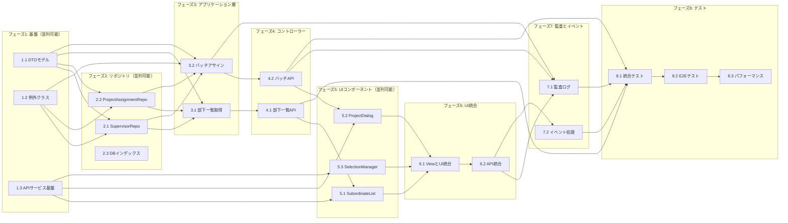

# 実装計画

## タスク

### フェーズ1: 基盤とインターフェース定義 (並列実行可能)

- [ ] 1.1. DTOモデルとリクエスト/レスポンスクラスの作成
  - BatchAssignmentRequest, SubordinateSearchCriteriaのリクエストDTOクラスを作成
  - SubordinateInfo, PagedSubordinateResponse, BatchAssignmentResponse, AssignmentResultのレスポンスDTOクラスを作成
  - Bean Validationアノテーションを追加
  - _要件: 1.3, 3.1, 3.4_
  - _次タスク: 2.1, 2.2, 3.1_
  - _推奨コーディングエージェント: springboot-backend-architect_

- [ ] 1.2. カスタム例外クラスの定義とテスト作成
  - SubordinateAssignmentExceptionクラスのテストを作成
  - UnauthorizedAssignmentExceptionクラスのテストを作成
  - 両例外クラスを実装してテストをパス
  - GlobalExceptionHandlerにハンドラーメソッドを追加
  - _要件: 5.2, 5.4, 6.2_
  - _次タスク: 2.1, 2.2_
  - _推奨コーディングエージェント: springboot-backend-architect_

- [ ] 1.3. フロントエンドAPIサービスの基盤準備
  - subordinateApi.tsファイルを作成
  - 基本的なAPIメソッドのインターフェースを定義
  - エラーハンドリング用のヘルパー関数を実装
  - _要件: 1.5, 3.6, 7.1_
  - _次タスク: 5.1, 5.2_
  - _推奨コーディングエージェント: vue3-frontend-architect_

### フェーズ2: リポジトリ層の拡張 (並列実行可能)

- [ ] 2.1. SupervisorRelationshipRepositoryの拡張とテスト
  - findActiveSubordinatesBySupervisorIdメソッドのテストを作成
  - ページネーション対応のfindActiveSubordinatesBySupervisorIdを実装
  - is_activeとUser.is_deletedの条件を含む検索ロジックを実装
  - MyBatisマッパーでJOIN SQLを記述（N+1問題回避）
  - _要件: 1.1, 1.6, 1.8, 1.9, 7.2_
  - _前タスク: 1.1, 1.2_
  - _次タスク: 3.1, 3.2_
  - _推奨コーディングエージェント: springboot-backend-architect_

- [ ] 2.2. ProjectAssignmentRepositoryの拡張とテスト
  - countActiveProjectsByUserIdsメソッドのテストを作成
  - バッチ処理用のcountActiveProjectsByUserIdsを実装
  - findByProjectAndUserInメソッドのテストを作成
  - 重複チェック用のfindByProjectAndUserInを実装
  - _要件: 1.3, 3.3, 3.5, 6.4_
  - _前タスク: 1.1, 1.2_
  - _次タスク: 3.1, 3.2_
  - _推奨コーディングエージェント: springboot-backend-architect_

- [ ] 2.3. データベースインデックスの追加
  - Flyway V19マイグレーションスクリプトを作成
  - supervisor_relationships.supervisor_idにインデックス追加
  - マイグレーションテストを実行
  - _要件: 7.2, 7.4_
  - _次タスク: 3.1, 3.2_
  - _推奨コーディングエージェント: springboot-backend-architect_

### フェーズ3: アプリケーションサービス層

- [ ] 3.1. ProjectAssignmentApplicationServiceの部下一覧取得機能
  - getActiveSubordinatesWithProjectsメソッドのテストを作成
  - ページネーション対応の部下一覧取得を実装
  - プロジェクト数の同時取得ロジックを実装
  - 最大キャパシティ判定ロジックを追加
  - _要件: 1.1, 1.3, 1.7, 2.3, 7.2_
  - _前タスク: 1.1, 2.1, 2.2_
  - _次タスク: 4.1_
  - _推奨コーディングエージェント: springboot-backend-architect_

- [ ] 3.2. ProjectAssignmentApplicationServiceのバッチアサイン機能
  - batchAssignDevelopersToProjectメソッドのテストを作成
  - 権限チェックロジックのテストを作成
  - @Transactionalによるトランザクション管理の実装
  - 重複アサインのスキップ処理を実装
  - エラー時のロールバックテストを作成
  - _要件: 3.1, 3.4, 3.5, 3.7, 6.1, 6.2_
  - _前タスク: 1.1, 1.2, 2.1, 2.2_
  - _次タスク: 4.2, 7.1_
  - _推奨コーディングエージェント: springboot-backend-architect_

### フェーズ4: コントローラー層とAPI統合

- [ ] 4.1. ProjectAssignmentControllerの部下一覧エンドポイント
  - GET /api/project-assignments/subordinatesのテストを作成
  - コントローラーメソッドを実装
  - 認証・認可のテスト（403エラーケース）を作成
  - ページネーションパラメータの検証を実装
  - _要件: 1.1, 5.1, 5.2, 7.1_
  - _前タスク: 3.1_
  - _次タスク: 5.1, 8.1_
  - _推奨コーディングエージェント: springboot-backend-architect_

- [ ] 4.2. ProjectAssignmentControllerのバッチアサインエンドポイント
  - POST /api/project-assignments/batchのテストを作成
  - バッチアサインコントローラーメソッドを実装
  - 権限エラー（403）のテストケースを作成
  - 重複エラー（409）のテストケースを作成
  - _要件: 3.1, 3.2, 5.2, 5.4_
  - _前タスク: 3.2_
  - _次タスク: 5.2, 8.1_
  - _推奨コーディングエージェント: springboot-backend-architect_

### フェーズ5: フロントエンドコンポーネント実装 (並列実行可能)

- [ ] 5.1. SubordinateListComponentの実装
  - コンポーネントのテストファイルを作成
  - Vuetify v-data-tableを使用したテーブル実装
  - 複数選択機能のテストを作成して実装
  - プロジェクト数表示と最大キャパシティ警告の実装
  - _要件: 1.3, 2.1, 2.3, 2.4, 4.2_
  - _前タスク: 1.3, 4.1_
  - _次タスク: 6.1_
  - _推奨コーディングエージェント: vue3-frontend-architect_

- [ ] 5.2. ProjectAssignmentDialogの拡張
  - 部下用のプロジェクト選択ダイアログテストを作成
  - 既存のProjectAssignmentDialogを拡張
  - アクティブプロジェクトのみ表示するフィルター実装
  - 選択確認とキャンセル機能のテスト実装
  - _要件: 3.3, 4.1, 4.3_
  - _前タスク: 1.3, 4.2_
  - _次タスク: 6.1_
  - _推奨コーディングエージェント: vue3-frontend-architect_

- [ ] 5.3. SubordinateSelectionManagerの状態管理
  - 選択状態管理のユニットテストを作成
  - 全選択/全解除機能の実装
  - ページネーション跨ぎの選択状態保持を実装
  - 選択数カウンターの表示ロジック実装
  - _要件: 2.1, 2.2, 2.4, 2.5_
  - _前タスク: 1.3_
  - _次タスク: 6.1_
  - _推奨コーディングエージェント: vue3-frontend-architect_

### フェーズ6: フロントエンド統合とビュー実装

- [ ] 6.1. AssignmentsViewの拡張と統合
  - 既存のAssignmentsViewにタブ機能を追加するテストを作成
  - 「プロジェクト管理」と「部下管理」タブを実装
  - SubordinateListComponentの統合
  - ProjectAssignmentDialogとの連携実装
  - _要件: 4.1, 4.2, 4.3, 4.5_
  - _前タスク: 5.1, 5.2, 5.3_
  - _次タスク: 6.2, 7.1_
  - _推奨コーディングエージェント: vue3-frontend-architect_

- [ ] 6.2. subordinateApiサービスの完全実装
  - APIサービスの統合テストを作成
  - getActiveSubordinatesメソッドの実装
  - batchAssignToProjectメソッドの実装
  - エラーハンドリングとトースト通知の統合
  - _要件: 1.5, 3.6, 3.7, 7.3_
  - _前タスク: 6.1_
  - _次タスク: 7.1, 7.2_
  - _推奨コーディングエージェント: vue3-frontend-architect_

### フェーズ7: 監査ログとイベント処理

- [ ] 7.1. AuditLoggingAspectの拡張
  - バッチアサイン用の監査ログテストを作成
  - @AuditLogアノテーションをバッチアサインメソッドに追加
  - 各部下のアサインを個別の監査レコードとして記録
  - セキュリティエラーの監査ログ記録を実装
  - _要件: 8.1, 8.2, 8.3, 8.4, 8.5_
  - _前タスク: 3.2, 4.2, 6.1, 6.2_
  - _次タスク: 8.1_
  - _推奨コーディングエージェント: springboot-backend-architect_

- [ ] 7.2. DomainEventPublisherの活用
  - ProjectAssignmentEventのテストを作成
  - バッチアサイン時のイベント発行を実装
  - DomainEventEntityへの記録を実装
  - 非同期イベント処理のテストを作成
  - _要件: 3.8, 6.5_
  - _前タスク: 6.2_
  - _次タスク: 8.1_
  - _推奨コーディングエージェント: springboot-backend-architect_

### フェーズ8: 統合テストとE2Eテスト

- [ ] 8.1. APIエンドポイントの統合テスト
  - 部下一覧取得の統合テストを作成
  - バッチアサインの統合テストを作成
  - 権限エラーケースの統合テストを作成
  - トランザクションロールバックの統合テストを作成
  - _要件: 5.1, 5.2, 6.1, 6.2_
  - _前タスク: 4.1, 4.2, 7.1, 7.2_
  - _次タスク: 8.2_
  - _推奨コーディングエージェント: qa-test-strategist_

- [ ] 8.2. E2Eテストの実装
  - Playwrightを使用したE2Eテストファイルを作成
  - ログイン→部下一覧表示→選択→アサインのフローテスト
  - エラーケースのE2Eテストを作成
  - ページネーションとフィルタリングのE2Eテスト
  - _要件: 1.1, 2.1, 3.1, 4.1_
  - _前タスク: 8.1_
  - _次タスク: 8.3_
  - _推奨コーディングエージェント: qa-test-strategist_

- [ ] 8.3. パフォーマンステストとカバレッジ確認
  - 100人同時アサインのパフォーマンステストを作成
  - JaCoCoカバレッジレポートの確認（80%以上）
  - フロントエンドカバレッジの確認
  - 負荷テストで100同時ユーザーのテスト実施
  - _要件: 7.1, 7.2, 7.4, 7.5_
  - _前タスク: 8.2_
  - _推奨コーディングエージェント: qa-test-strategist_

## タスク依存関係

## 並列実行可能なタスクグループ

### グループ1（初期並列実行）
- 1.1, 1.2, 1.3 - 基盤クラスとインターフェース定義
- **推奨割り当て**: 
  - springboot-backend-architect (1.1, 1.2)
  - vue3-frontend-architect (1.3)

### グループ2（リポジトリ層並列実行）
- 2.1, 2.2, 2.3 - リポジトリ拡張とインデックス追加
- **推奨割り当て**: springboot-backend-architect (全タスク)

### グループ3（UIコンポーネント並列実行）
- 5.1, 5.2, 5.3 - フロントエンドコンポーネント実装
- **推奨割り当て**: vue3-frontend-architect (全タスク)

## 実装優先順位とタイムライン

1. **Day 1**: フェーズ1（並列）→ フェーズ2（並列）
2. **Day 2**: フェーズ3 → フェーズ4
3. **Day 3**: フェーズ5（並列）→ フェーズ6
4. **Day 4**: フェーズ7 → フェーズ8（統合テスト）
5. **Day 5**: フェーズ8（E2E・パフォーマンステスト）

## エージェント別タスク配分

### springboot-backend-architect担当 (13タスク)
- フェーズ1: 1.1, 1.2
- フェーズ2: 2.1, 2.2, 2.3
- フェーズ3: 3.1, 3.2
- フェーズ4: 4.1, 4.2
- フェーズ7: 7.1, 7.2

### vue3-frontend-architect担当 (7タスク)
- フェーズ1: 1.3
- フェーズ5: 5.1, 5.2, 5.3
- フェーズ6: 6.1, 6.2

### qa-test-strategist担当 (3タスク)
- フェーズ8: 8.1, 8.2, 8.3

## 成功基準

- [ ] すべてのユニットテストがパス
- [ ] JaCoCoカバレッジ80%以上達成
- [ ] 統合テストがすべてパス
- [ ] E2Eテストがすべてパス
- [ ] パフォーマンステスト目標達成（3秒以内の応答）
- [ ] コードレビュー完了