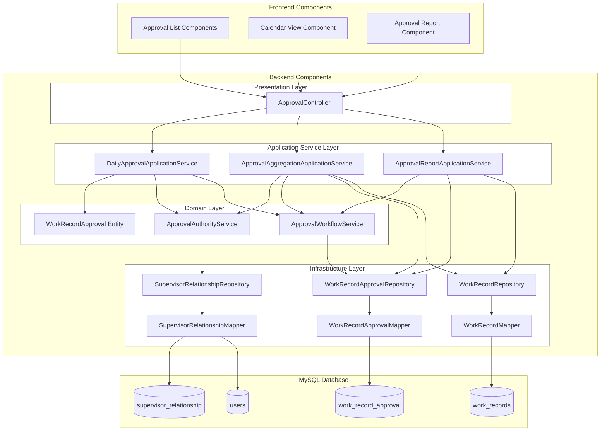
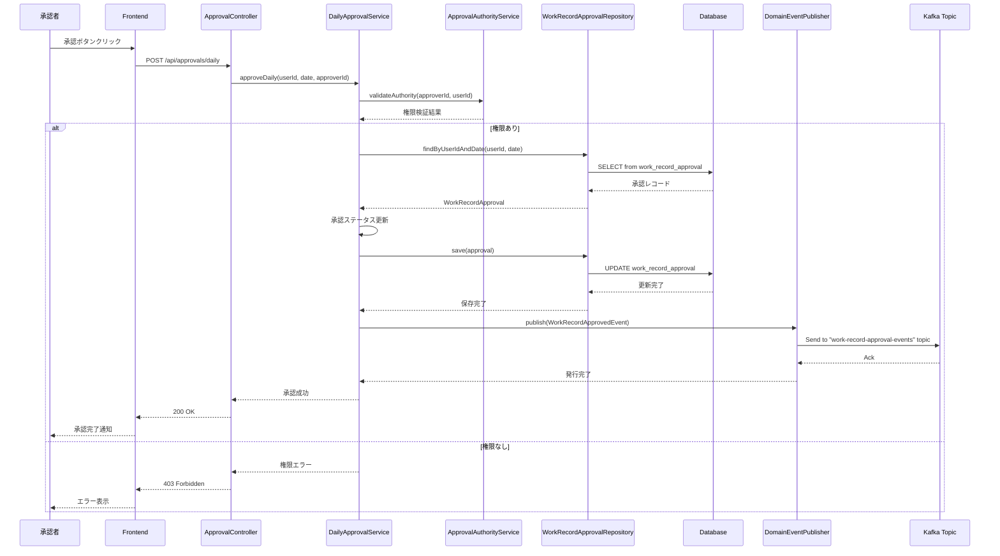
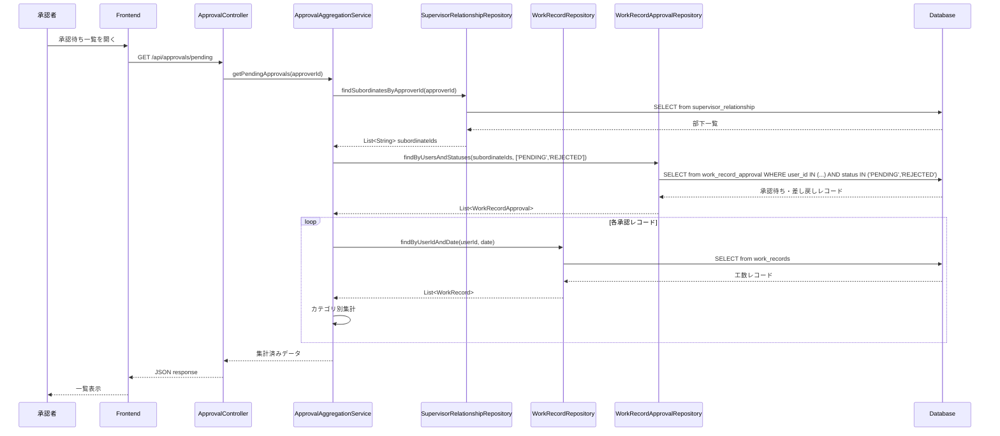
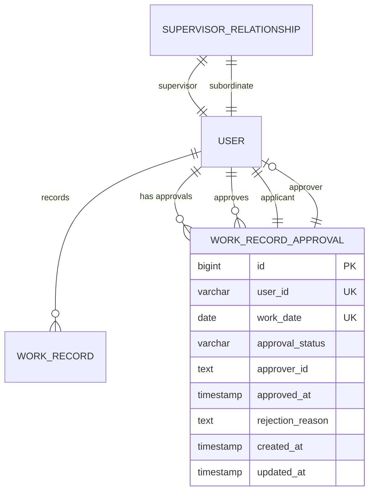
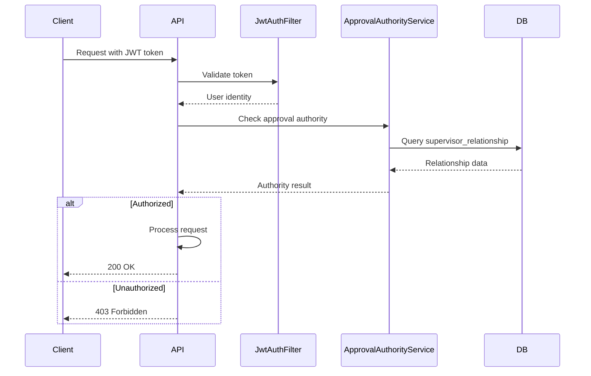
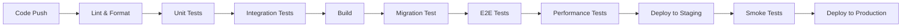

# Technical Design

## Overview

本設計書は、工数承認の単位を現在の「申請者/案件/日付」の3次元から「申請者/日付」の2次元に変更する機能の技術設計を定義します。この変更により、承認者は特定日のすべての案件工数を一括で承認でき、承認プロセスが大幅に簡素化されます。

主要な設計ポイント：
- 新規テーブル`WorkRecordApproval`の導入による承認管理の最適化
- 既存の承認フローとの互換性を保ちながらの段階的移行
- 承認者の作業効率を最大化するUIの実装
- 既存データの安全な移行戦略

## Requirements Mapping

### Design Component Traceability

各設計コンポーネントが対応する要件：

- **WorkRecordApprovalエンティティ** → REQ-3: データモデルの最適化
- **DailyApprovalService** → REQ-1: 承認単位の統合、REQ-4: 承認権限の検証
- **ApprovalAggregationService** → REQ-2: 承認対象の集約表示
- **ApprovalController改修** → REQ-7: 承認APIの実装
- **ApprovalListコンポーネント** → REQ-5: 承認画面のUI最適化
- **CalendarViewコンポーネント** → REQ-6: 申請者向け承認状況表示
- **DataMigrationService** → REQ-8: データ移行戦略
- **ApprovalReportService** → REQ-9: 承認状況レポート

### User Story Coverage

- **承認者ストーリー（REQ-1, 2, 5）**: 一括承認機能とUIの最適化により対応
- **申請者ストーリー（REQ-6）**: カレンダービューと承認状況表示により対応
- **システム管理者ストーリー（REQ-3, 8）**: データモデル最適化と移行戦略により対応
- **フロントエンド開発者ストーリー（REQ-7）**: 新規APIエンドポイントの提供により対応
- **マネージャーストーリー（REQ-9）**: レポート機能の実装により対応

## Architecture

### High-Level System Architecture



### Technology Stack

既存のシステムアーキテクチャを活用し、以下の技術スタックで実装：

- **Frontend**: Vue 3.5.13 + TypeScript 5.6 + Vuetify 3
- **Backend**: Spring Boot 3.5.4 + Java 17
- **Database**: MySQL 8.0
- **Data Access**: MyBatis 3.0.5
- **Authentication**: JWT (既存実装を活用)
- **Testing**: JUnit 5 + Mockito (Backend), Vitest (Frontend)
- **Migration**: Flyway
- **Messaging**: Apache Kafka (ドメインイベント発行)

### Architecture Decision Rationale

- **新規テーブル方式の採用**: 既存のWorkRecordテーブルを変更せず、新規WorkRecordApprovalテーブルを追加することで、既存機能への影響を最小化
- **MyBatisの継続使用**: 既存のデータアクセス層との一貫性を保ち、開発効率を維持
- **ドメイン駆動設計の適用**: 承認ロジックをドメインサービスに集約し、ビジネスルールの管理を明確化
- **段階的移行戦略**: 既存データを安全に移行し、ロールバック可能な実装
- **イベント駆動アーキテクチャの導入**: Kafkaを使用してドメインイベントを発行し、他システムとの連携や監査ログの非同期処理を可能に

## Data Flow

### 承認処理フロー



### 工数集計フロー



## Components and Interfaces

### Backend Services & Method Signatures

#### Application Services

##### DailyApprovalApplicationService
```java
@Service
@RequiredArgsConstructor
public class DailyApprovalApplicationService {
    private final WorkRecordApprovalRepository repository;
    private final ApprovalAuthorityService authorityService;
    private final DomainEventPublisher eventPublisher;
    
    @Transactional
    public ApprovalResult approveDaily(String userId, LocalDate date, String approverId) {
        // 権限検証
        if (!authorityService.validateAuthority(approverId, userId)) {
            throw new UnauthorizedException("承認権限がありません");
        }
        
        // 承認レコード取得・更新
        WorkRecordApproval approval = repository.findByUserIdAndDate(userId, date);
        approval.approve(approverId);
        repository.save(approval);
        
        // ドメインイベント発行
        WorkRecordApprovedEvent event = new WorkRecordApprovedEvent(
            userId, date, approverId, LocalDateTime.now()
        );
        eventPublisher.publish(event);
        
        return new ApprovalResult(approval);
    }
    
    @Transactional
    public ApprovalResult rejectDaily(String userId, LocalDate date, String approverId, String reason) {
        // 権限検証
        if (!authorityService.validateAuthority(approverId, userId)) {
            throw new UnauthorizedException("承認権限がありません");
        }
        
        // 差し戻しレコード更新
        WorkRecordApproval approval = repository.findByUserIdAndDate(userId, date);
        approval.reject(approverId, reason);
        repository.save(approval);
        
        // ドメインイベント発行
        WorkRecordRejectedEvent event = new WorkRecordRejectedEvent(
            userId, date, approverId, reason, LocalDateTime.now()
        );
        eventPublisher.publish(event);
        
        return new ApprovalResult(approval);
    }
    
    // 一括承認処理を実行
    public List<ApprovalResult> approveBatch(List<ApprovalRequest> requests, String approverId);
    
    // 承認ステータスを確認
    public ApprovalStatus getApprovalStatus(String userId, LocalDate date);
}
```

##### ApprovalAggregationApplicationService
```java
@Service  
public class ApprovalAggregationApplicationService {
    // 承認待ち一覧を取得（集計済み）
    public List<AggregatedApproval> getPendingApprovals(String approverId);
    
    // カテゴリ別工数を集計
    public Map<String, BigDecimal> aggregateByCategory(String userId, LocalDate date);
    
    // 案件ごとの内訳を取得
    public List<ProjectBreakdown> getProjectBreakdown(String userId, LocalDate date);
}
```

##### ApprovalReportApplicationService
```java
@Service
public class ApprovalReportApplicationService {
    // 承認状況サマリーを取得
    public ApprovalSummary getApprovalSummary(String managerId);
    
    // リアルタイム更新用データ取得
    public ApprovalSummary getRealtimeUpdate(String managerId, Long lastUpdateId);
}
```

#### Domain Services

##### ApprovalAuthorityService
```java
@Service
public class ApprovalAuthorityService {
    // 承認権限を検証
    public boolean validateAuthority(String approverId, String userId);
    
    // 部下一覧を取得
    public List<String> getSubordinateIds(String supervisorId);
}
```

##### ApprovalWorkflowService
```java
@Service
public class ApprovalWorkflowService {
    // 承認ワークフローを処理
    public void processApproval(WorkRecordApproval approval, ApprovalStatus newStatus);
    
    // 承認履歴を記録
    public void recordApprovalHistory(WorkRecordApproval approval);
}
```

#### Infrastructure Services

##### DomainEventPublisher
```java
@Component
@RequiredArgsConstructor
public class DomainEventPublisher {
    private final KafkaTemplate<String, Object> kafkaTemplate;
    
    public void publish(DomainEvent event) {
        String topic = "work-record-approval-events";
        String key = event.getAggregateId();
        kafkaTemplate.send(topic, key, event);
    }
}
```

#### Domain Events

##### WorkRecordApprovedEvent
```java
@Data
@AllArgsConstructor
public class WorkRecordApprovedEvent implements DomainEvent {
    private String userId;
    private LocalDate workDate;
    private String approverId;
    private LocalDateTime approvedAt;
    
    @Override
    public String getAggregateId() {
        return userId + "_" + workDate;
    }
}
```

##### WorkRecordRejectedEvent
```java
@Data
@AllArgsConstructor
public class WorkRecordRejectedEvent implements DomainEvent {
    private String userId;
    private LocalDate workDate;
    private String approverId;
    private String rejectionReason;
    private LocalDateTime rejectedAt;
    
    @Override
    public String getAggregateId() {
        return userId + "_" + workDate;
    }
}
```

### Frontend Components

| Component Name | Responsibility | Props/State Summary |
|----------------|----------------|---------------------|
| ApprovalList | 承認待ち一覧の表示と操作 | props: approvals[], onApprove, onReject; state: selectedItems, expandedRows |
| DailyApprovalRow | 申請者/日付単位の承認行 | props: approval, expanded; state: rejectionReason |
| CategoryBreakdown | カテゴリ別工数の表示 | props: categories, total |
| ProjectDetails | 案件ごとの内訳表示 | props: projects, visible |
| ApprovalCalendar | カレンダー形式の承認状況表示 | props: userId, month; state: approvalStatuses |
| ApprovalStatusBadge | 承認ステータスのバッジ表示 | props: status, showTooltip |
| RejectionDialog | 差し戻し理由入力ダイアログ | props: visible, onSubmit; state: reason |
| ApprovalReport | 承認状況レポート表示 | props: managerId; state: summary, autoRefresh |

### API Endpoints

| Method | Route | Purpose | Auth | Status Codes |
|--------|-------|---------|------|--------------|
| GET | /api/approvals/pending | 承認待ち一覧取得（改修） | Required | 200, 401, 500 |
| POST | /api/approvals/daily | 日次承認実行（新規） | Required | 200, 400, 401, 403, 409, 500 |
| POST | /api/approvals/daily/reject | 日次差し戻し（新規） | Required | 200, 400, 401, 403, 500 |
| POST | /api/approvals/batch | 一括承認（新規） | Required | 200, 400, 401, 403, 500 |
| GET | /api/approvals/status/:userId/:date | 承認状況確認（新規） | Required | 200, 401, 404, 500 |
| GET | /api/approvals/calendar/:userId | カレンダー用承認状況（新規） | Required | 200, 401, 500 |
| GET | /api/approvals/report | 承認レポート取得（新規） | Required | 200, 401, 500 |

## Data Models

### Domain Entities

1. **WorkRecordApproval**: 申請者/日付単位の承認管理エンティティ（新規）
2. **WorkRecord**: 既存の工数記録エンティティ（変更なし）
3. **User**: ユーザーエンティティ（変更なし）
4. **SupervisorRelationship**: 上司関係エンティティ（変更なし）

### Entity Relationships



### Data Model Definitions

#### Java Entity
```java
@Data
@Builder
@NoArgsConstructor
@AllArgsConstructor
public class WorkRecordApproval {
    private Long id;
    private String userId;           // 申請者ID
    private LocalDate workDate;      // 作業日
    private ApprovalStatus approvalStatus;  // PENDING, APPROVED, REJECTED
    private String approverId;       // 承認者ID
    private LocalDateTime approvedAt;
    private String rejectionReason;
    private LocalDateTime createdAt;
    private LocalDateTime updatedAt;
}
```

#### TypeScript Interface
```typescript
interface WorkRecordApproval {
  id: number;
  userId: string;
  workDate: string;  // YYYY-MM-DD format
  approvalStatus: 'PENDING' | 'APPROVED' | 'REJECTED';
  approverId?: string;
  approvedAt?: string;
  rejectionReason?: string;
  createdAt: string;
  updatedAt: string;
}

interface AggregatedApproval {
  userId: string;
  userName: string;
  workDate: string;
  totalHours: number;
  categoryBreakdown: Map<string, number>;
  projectDetails: ProjectBreakdown[];
  approvalStatus: string;
}
```

### Database Schema

```sql
-- V17__create_work_record_approval_table.sql
CREATE TABLE work_record_approval (
    id BIGINT AUTO_INCREMENT PRIMARY KEY,
    user_id VARCHAR(255) NOT NULL,
    work_date DATE NOT NULL,
    approval_status VARCHAR(20) NOT NULL DEFAULT 'PENDING',
    approver_id TEXT,
    approved_at TIMESTAMP NULL,
    rejection_reason TEXT,
    created_at TIMESTAMP DEFAULT CURRENT_TIMESTAMP,
    updated_at TIMESTAMP DEFAULT CURRENT_TIMESTAMP ON UPDATE CURRENT_TIMESTAMP,
    
    UNIQUE KEY uk_user_date (user_id, work_date),
    INDEX idx_status (approval_status),
    INDEX idx_approver (approver_id(255)),
    INDEX idx_work_date (work_date),
    
    CONSTRAINT chk_status CHECK (approval_status IN ('PENDING', 'APPROVED', 'REJECTED'))
) ENGINE=InnoDB DEFAULT CHARSET=utf8mb4;
```

### Migration Strategy

1. **新規テーブル作成**: Flyway V17マイグレーションでwork_record_approvalテーブルを作成
2. **データ移行スクリプト**: 既存のwork_recordsテーブルから承認情報を抽出・集約
3. **整合性チェック**: 移行後のデータ検証とロールバック機能
4. **インデックス最適化**: パフォーマンスを考慮したインデックス設計

## Error Handling

### エラー処理戦略

1. **権限エラー (403)**: 承認権限がない場合の処理
   - SupervisorRelationshipの検証
   - 明確なエラーメッセージの返却

2. **競合エラー (409)**: 承認済み日付への工数登録試行
   - WorkRecordApprovalのステータスチェック
   - ユーザーへの適切なフィードバック

3. **データ整合性エラー (400)**: 不正なリクエストデータ
   - 入力検証の実装
   - バリデーションエラーの詳細表示

4. **システムエラー (500)**: 予期しないエラー
   - トランザクションロールバック
   - エラーログの記録
   - ユーザーフレンドリーなメッセージ

## Security Considerations

### Authentication & Authorization



### Data Protection

- **入力検証**: すべてのAPIエンドポイントで厳格な入力検証
- **SQLインジェクション対策**: MyBatisのパラメータバインディング使用
- **XSS対策**: フロントエンドでの適切なエスケープ処理
- **CSRF対策**: Spring SecurityのCSRF保護機能を活用

### Security Best Practices

- **最小権限の原則**: 承認者は自分の部下の承認のみ可能
- **監査ログ**: すべての承認操作をAuditLoggingAspectで記録
- **データの暗号化**: センシティブデータの暗号化（却下理由等）
- **レート制限**: 承認APIへの過度なアクセスを制限

## Performance & Scalability

### Performance Targets

| Metric | Target | Measurement |
|--------|--------|-------------|
| 承認待ち一覧取得 (p95) | < 300ms | API response time |
| 日次承認処理 (p99) | < 500ms | API response time |
| カテゴリ集計 (p99) | < 100ms | Query execution |
| 同時承認処理 | > 100 req/sec | Load testing |
| データベースクエリ (p99) | < 50ms | Query monitoring |

### Caching Strategy

- **承認待ち一覧**: Redis/Memcachedで5分間キャッシュ
- **カテゴリ集計結果**: アプリケーションレベルで10分間キャッシュ
- **承認権限情報**: セッション期間中キャッシュ
- **レポートデータ**: 定期的な事前集計とキャッシュ

### Scalability Approach

- **インデックス最適化**: user_id, work_date, approval_statusに複合インデックス
- **バッチ処理**: 一括承認時のバルクアップデート
- **非同期処理**: レポート生成とCSVエクスポートの非同期実行
- **コネクションプーリング**: HikariCPの適切な設定

## Testing Strategy

### Test Coverage Requirements

- **Unit Tests**: ≥80% コードカバレッジ（JaCoCo）
- **Integration Tests**: すべての新規APIエンドポイント
- **E2E Tests**: 承認フロー全体のシナリオテスト
- **Performance Tests**: 100同時ユーザーでの負荷テスト

### Testing Approach

1. **Unit Testing**
   ```java
   @Test
   void testApproveDailyWithValidAuthority() {
       // Given
       String userId = "user001";
       LocalDate date = LocalDate.now();
       String approverId = "approver001";
       
       // When
       ApprovalResult result = service.approveDaily(userId, date, approverId);
       
       // Then
       assertEquals(ApprovalStatus.APPROVED, result.getStatus());
   }
   ```

2. **Integration Testing**
   - MyBatisマッパーのテスト
   - トランザクション処理のテスト
   - 権限検証の統合テスト

3. **End-to-End Testing**
   ```typescript
   describe('Approval Workflow', () => {
     it('should approve daily work records', async () => {
       // Login as approver
       await login('approver@example.com');
       
       // Navigate to approval list
       await page.goto('/approvals/pending');
       
       // Click approve button
       await page.click('[data-test="approve-btn"]');
       
       // Verify status update
       expect(await page.locator('[data-test="status"]')).toHaveText('承認済み');
     });
   });
   ```

4. **Performance Testing**
   - JMeterでの負荷テスト
   - 承認待ち一覧の表示速度測定
   - 一括承認のスループット測定

### CI/CD Pipeline



## Implementation Phases

### Phase 1: Backend Implementation (Week 1-2)
- WorkRecordApprovalエンティティとリポジトリの実装
- DailyApprovalServiceの実装
- 承認APIエンドポイントの実装
- データ移行スクリプトの作成

### Phase 2: Frontend Implementation (Week 2-3)
- 承認待ち一覧画面の改修
- カレンダービューの実装
- 差し戻し機能の実装

### Phase 3: Testing & Migration (Week 3-4)
- 統合テストの実施
- パフォーマンステスト
- 本番データの移行準備
- ドキュメント作成