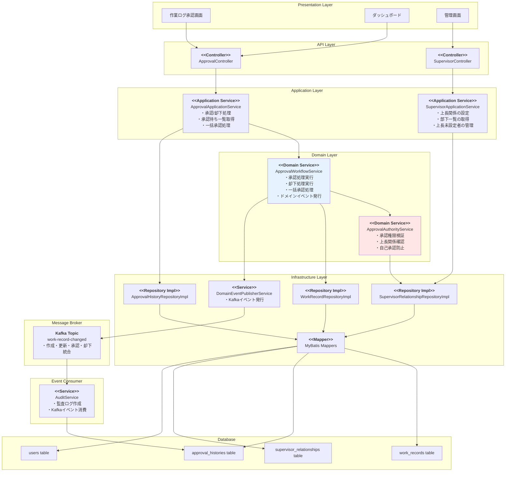
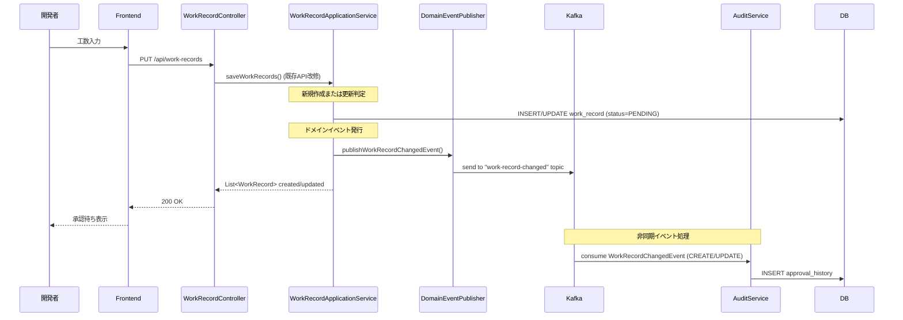
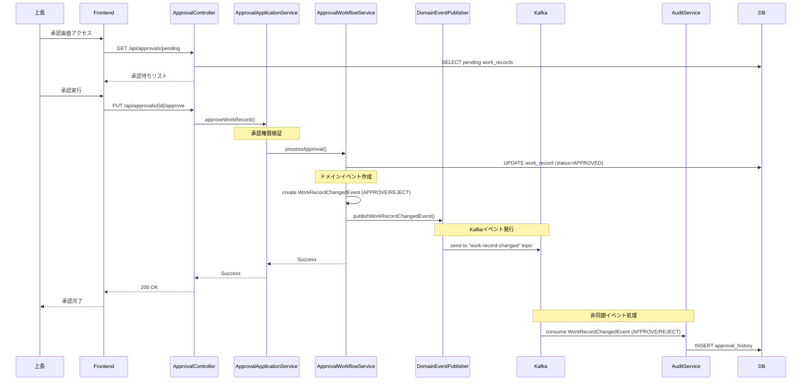
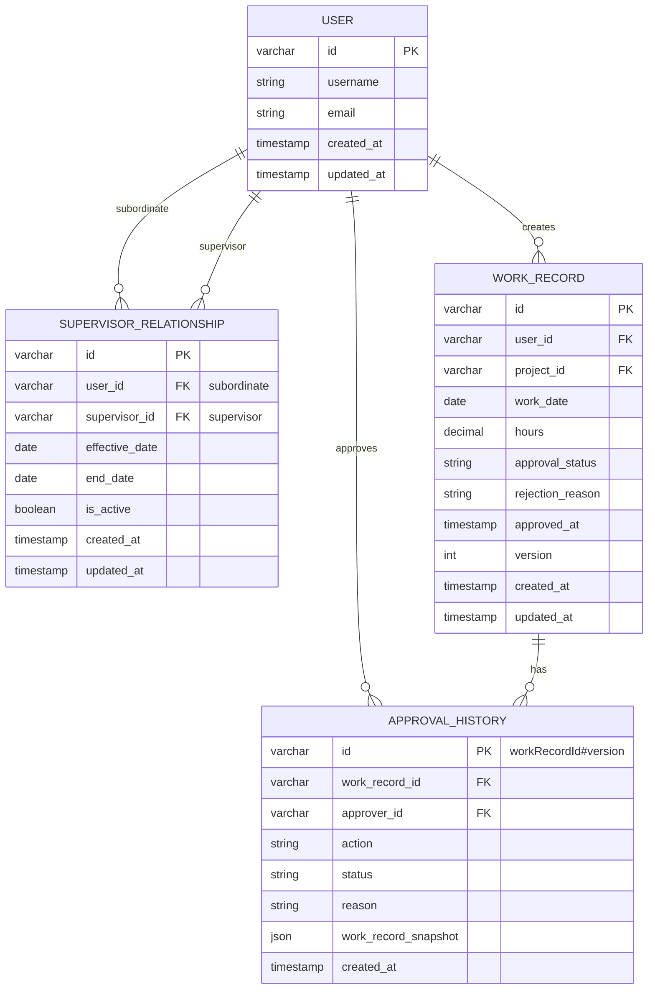
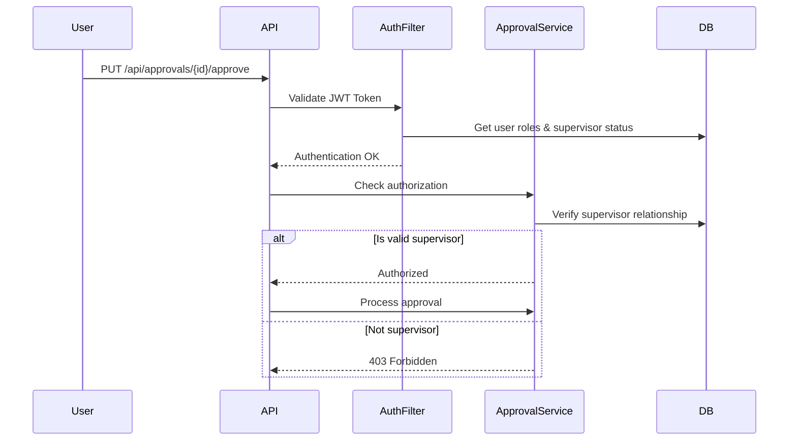
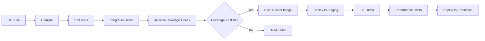
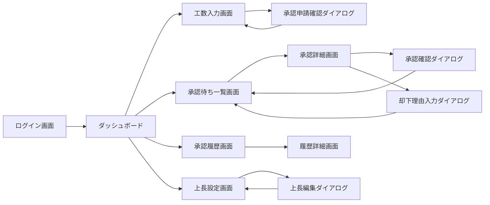

# 技術設計書

## 概要
本設計書は、開発工数管理システムに承認機能を追加するための技術実装方針を定義します。開発者が入力した工数データに対して、上長による承認ワークフローを実装し、工数データの正確性と信頼性を向上させます。

## 要件マッピング

### 設計コンポーネントのトレーサビリティ
各設計コンポーネントが対応する要件：

- **承認ワークフローエンジン** → REQ-1: 承認ワークフロー管理
- **上長管理モジュール** → REQ-2: 承認者管理
- **承認UI/APIレイヤー** → REQ-3: 承認画面と操作
- **承認履歴管理** → REQ-4: 承認済み工数の管理
- **ダッシュボード/可視化** → REQ-5: 承認状況の可視化
- **監査ログシステム** → REQ-6: 監査とコンプライアンス
- **UIコンポーネント** → REQ-7: ユーザビリティとアクセシビリティ

### ユーザーストーリーカバレッジ
- **開発者ストーリー**: 工数入力後の承認待ち状態管理、承認状況の確認
- **上長ストーリー**: 部下の工数承認/却下、一括承認機能
- **システム管理者ストーリー**: 上長設定管理、承認者未設定ユーザーの管理

## アーキテクチャ

### システム全体構成



### 技術スタック

- **Backend**: Spring Boot 3.5.4 + Java 17（既存）
- **Database**: MySQL 8.0（既存）
- **Data Access**: MyBatis 3.0.5（既存）
- **Security**: Spring Security + JWT（既存）
- **Migration**: Flyway（既存）
- **Testing**: JUnit 5 + Mockito（既存）
- **Message Broker**: Apache Kafka (ドメインイベント発行・消費)
  - トピック: `work-record-changed` (作成・更新・承認・却下統合)

### アーキテクチャ決定根拠

- **なぜステートマシンを使わないか**: 承認フローがシンプル（PENDING → APPROVED/REJECTED）なため、Enumベースの状態管理で十分
- **なぜ承認履歴を別テーブルにするか**: 監査要件を満たすため、改ざん防止と永続的な記録保持が必要
- **なぜ上長関係を別テーブルにするか**: 履歴管理と柔軟な関係変更を可能にし、複数の上長設定（将来拡張）にも対応可能
- **なぜ楽観的ロックを使うか**: 同時承認操作の競合を防ぎつつ、パフォーマンスを維持

## データフロー

### 主要ユーザーフロー

#### 1. 工数入力と承認申請フロー



#### 2. 上長による承認フロー



## コンポーネントとインターフェース

### バックエンドサービスとメソッドシグネチャ

#### Domain Layer

```java
// Domain Event - 工数記録変更イベント（作成・更新・承認統合）
public record WorkRecordChangedEvent(
    String eventId, // workRecordId#version形式（例: "wr-123#1", "wr-123#2"）
    String workRecordId,
    String userId,
    String projectId,
    LocalDate workDate,
    String action, // CREATE, UPDATE, APPROVE, REJECT
    ApprovalStatus previousStatus, // 新規作成時はnull
    ApprovalStatus currentStatus,
    String approverId, // 承認・却下時のみ設定
    String rejectionReason, // 却下時のみ設定
    LocalDateTime occurredAt
) {
    // 新規作成用ファクトリメソッド
    public static WorkRecordChangedEvent forCreation(
            String workRecordId, String userId, String projectId, 
            LocalDate workDate, ApprovalStatus currentStatus, int version) {
        return new WorkRecordChangedEvent(
            workRecordId + "#" + version,
            workRecordId,
            userId,
            projectId,
            workDate,
            "CREATE",
            null,
            currentStatus,
            null,
            null,
            LocalDateTime.now()
        );
    }
    
    // 更新用ファクトリメソッド
    public static WorkRecordChangedEvent forUpdate(
            String workRecordId, String userId, String projectId, 
            LocalDate workDate, ApprovalStatus previousStatus, 
            ApprovalStatus currentStatus, int version) {
        return new WorkRecordChangedEvent(
            workRecordId + "#" + version,
            workRecordId,
            userId,
            projectId,
            workDate,
            "UPDATE",
            previousStatus,
            currentStatus,
            null,
            null,
            LocalDateTime.now()
        );
    }
    
    // 承認・却下用ファクトリメソッド
    public static WorkRecordChangedEvent forApprovalAction(
            String workRecordId, String userId, String projectId, 
            LocalDate workDate, ApprovalStatus previousStatus, 
            ApprovalStatus currentStatus, String approverId, 
            String rejectionReason, int version) {
        return new WorkRecordChangedEvent(
            workRecordId + "#" + version,
            workRecordId,
            userId,
            projectId,
            workDate,
            currentStatus == ApprovalStatus.APPROVED ? "APPROVE" : "REJECT",
            previousStatus,
            currentStatus,
            approverId,
            rejectionReason,
            LocalDateTime.now()
        );
    }
    
    public boolean isCreation() {
        return "CREATE".equals(action);
    }
    
    public boolean isUpdate() {
        return "UPDATE".equals(action);
    }
    
    public boolean isApproval() {
        return "APPROVE".equals(action);
    }
    
    public boolean isRejection() {
        return "REJECT".equals(action);
    }
    
    public boolean isStatusChange() {
        return isApproval() || isRejection();
    }
}

// Domain Entity - WorkRecord (既存エンティティ拡張)
public class WorkRecord {
    // 既存フィールド...
    private ApprovalStatus approvalStatus = ApprovalStatus.PENDING;
    private int version = 0; // 楽観的ロック用バージョン番号
    
    public static WorkRecord create(String userId, String projectId, LocalDate workDate, 
                                   CategoryHours categoryHours, String description, String createdBy) {
        // 既存の作成処理...
        WorkRecord workRecord = new WorkRecord(userId, projectId, workDate, categoryHours, description, createdBy);
        workRecord.approvalStatus = ApprovalStatus.PENDING;
        workRecord.version = 1; // 新規作成時はバージョン1
        return workRecord;
    }
    
    public void updateWorkRecord(CategoryHours categoryHours, String description) {
        // 既存の更新処理...
        
        // 承認ステータスをリセット
        this.approvalStatus = ApprovalStatus.PENDING;
        this.version++; // 更新時にバージョンをインクリメント
    }
    
    public void approve(String approverId) {
        if (this.approvalStatus != ApprovalStatus.PENDING) {
            throw new IllegalStateException("Work record is not in pending status");
        }
        this.approvalStatus = ApprovalStatus.APPROVED;
        this.version++; // 承認時にバージョンをインクリメント
    }
    
    public void reject(String approverId, String reason) {
        if (this.approvalStatus != ApprovalStatus.PENDING) {
            throw new IllegalStateException("Work record is not in pending status");
        }
        this.approvalStatus = ApprovalStatus.REJECTED;
        this.version++; // 却下時にバージョンをインクリメント
    }
    
    public ApprovalStatus getApprovalStatus() {
        return this.approvalStatus;
    }
    
    public int getVersion() {
        return this.version;
    }
}

// Domain Entity
public class WorkRecordApproval {
    private String workRecordId;
    private ApprovalStatus status;  // Value Object
    private String supervisorId;
    private String rejectionReason;
    private LocalDateTime approvedAt;
    
    public void approve(String approverId) // 承認実行
    public void reject(String approverId, String reason) // 却下実行
    public boolean canBeEditedBy(String userId) // 編集可能判定
}

// Domain Entity - 承認履歴
public class ApprovalHistory {
    private final String id; // イベントID（workRecordId#version形式、例: "wr-123#1", "wr-123#2"）
    private final String workRecordId;
    private final String approverId;
    private final String action; // CREATE, UPDATE, APPROVE, REJECT
    private final ApprovalStatus previousStatus;
    private final ApprovalStatus newStatus;
    private final String rejectionReason;
    private final String workRecordSnapshot; // WorkRecordChangedEventのJSON形式スナップショット
    private final LocalDateTime createdAt;
    
    public ApprovalHistory(String id, String workRecordId, String approverId,
                          String action, ApprovalStatus previousStatus, 
                          ApprovalStatus newStatus, String rejectionReason,
                          String workRecordSnapshot, LocalDateTime createdAt) {
        this.id = id;
        this.workRecordId = workRecordId;
        this.approverId = approverId;
        this.action = action;
        this.previousStatus = previousStatus;
        this.newStatus = newStatus;
        this.rejectionReason = rejectionReason;
        this.workRecordSnapshot = workRecordSnapshot;
        this.createdAt = createdAt;
    }
    
    // Getters...
}

// Domain Entity - 上長関係
public class SupervisorRelationship {
    private String id;
    private String userId;
    private String supervisorId;
    private LocalDate effectiveDate;
    private LocalDate endDate;
    private Boolean isActive;
    
    // ビジネスロジック
    public boolean isEffectiveOn(LocalDate date) {
        // 指定日に有効な上長関係かを判定
        if (!isActive) return false;
        if (date.isBefore(effectiveDate)) return false;
        if (endDate != null && date.isAfter(endDate)) return false;
        return true;
    }
    
    public void terminate(LocalDate endDate) {
        // 上長関係を終了
        if (this.endDate != null) {
            throw new IllegalStateException("Relationship already terminated");
        }
        if (endDate.isBefore(effectiveDate)) {
            throw new IllegalArgumentException("End date cannot be before effective date");
        }
        this.endDate = endDate;
        this.isActive = false;
    }
    
    public void changeSupervisor(String newSupervisorId, LocalDate changeDate) {
        // 上長を変更（現在の関係を終了し、新しい関係の開始を示唆）
        if (newSupervisorId.equals(this.supervisorId)) {
            throw new IllegalArgumentException("New supervisor is same as current");
        }
        this.terminate(changeDate.minusDays(1));
    }
    
    public boolean canApprove(String approverId) {
        // 指定されたユーザーが承認権限を持つか判定
        return this.supervisorId.equals(approverId) && this.isActive;
    }
    
    public boolean isSelfSupervision() {
        // 自己監督（自分が自分の上長）かを判定
        return this.userId.equals(this.supervisorId);
    }
}

// Value Object
public enum ApprovalStatus {
    PENDING,    // 承認待ち
    APPROVED,   // 承認済み
    REJECTED    // 却下
}

// Domain Service - 承認権限検証
@Service
@RequiredArgsConstructor
public class ApprovalAuthorityService {
    private final SupervisorRelationshipRepository supervisorRelationshipRepository;
    
    public void validateApprovalAuthority(String workRecordUserId, String approverId) {
        // 1. 自己承認の防止
        if (workRecordUserId.equals(approverId)) {
            throw new SelfApprovalException("Self-approval is not allowed");
        }
        
        // 2. 上長関係の確認
        SupervisorRelationship relationship = supervisorRelationshipRepository
            .findActiveByUserId(workRecordUserId)
            .orElseThrow(() -> new SupervisorNotSetException("Supervisor not set for user: " + workRecordUserId));
        
        // 3. 承認権限の検証
        if (!relationship.getSupervisorId().equals(approverId)) {
            throw new UnauthorizedApprovalException(
                "User " + approverId + " is not authorized to approve work records of user " + workRecordUserId
            );
        }
    }
    
    public List<String> getSubordinateIds(String supervisorId) {
        return supervisorRelationshipRepository.findSubordinateIdsBySupervisorId(supervisorId);
    }
    
    public Optional<String> getActiveSupervisorId(String userId) {
        return supervisorRelationshipRepository
            .findActiveByUserId(userId)
            .map(SupervisorRelationship::getSupervisorId);
    }
}

// Domain Service - 承認ワークフロー
@Service
@RequiredArgsConstructor
public class ApprovalWorkflowService {
    private final WorkRecordRepository workRecordRepository;
    private final ApprovalAuthorityService approvalAuthorityService;
    private final DomainEventPublisherService domainEventPublisher;
    
    public void processApproval(String workRecordId, String approverId) {
        // 1. 工数記録を取得
        WorkRecord workRecord = workRecordRepository.findById(workRecordId)
            .orElseThrow(() -> new NotFoundException("WorkRecord not found"));
        
        // 2. 承認権限の検証（ApprovalAuthorityServiceに委譲）
        approvalAuthorityService.validateApprovalAuthority(
            workRecord.getUserId(), 
            approverId
        );
        
        // 3. 承認処理実行（バージョンは内部でインクリメントされる）
        ApprovalStatus previousStatus = workRecord.getApprovalStatus();
        workRecord.approve(approverId);
        workRecordRepository.save(workRecord);
        
        // 4. ドメインイベント発行（workRecordから現在のバージョンを取得）
        WorkRecordChangedEvent event = WorkRecordChangedEvent.forApprovalAction(
            workRecord.getId(),
            workRecord.getUserId(),
            workRecord.getProjectId(),
            workRecord.getWorkDate(),
            previousStatus,
            workRecord.getApprovalStatus(), // 承認後のステータスをworkRecordから取得
            approverId,
            null, // 承認時は却下理由なし
            workRecord.getVersion() // workRecordから現在のバージョンを取得
        );
        domainEventPublisher.publishWorkRecordChangedEvent(event);
    }
    
    public void processRejection(String workRecordId, String approverId, String reason) {
        // 1. 工数記録を取得
        WorkRecord workRecord = workRecordRepository.findById(workRecordId)
            .orElseThrow(() -> new NotFoundException("WorkRecord not found"));
        
        // 2. 承認権限の検証（ApprovalAuthorityServiceに委譲）
        approvalAuthorityService.validateApprovalAuthority(
            workRecord.getUserId(), 
            approverId
        );
        
        // 3. 却下理由の検証
        if (reason == null || reason.trim().isEmpty()) {
            throw new ValidationException("Rejection reason is required");
        }
        
        // 4. 却下処理実行（バージョンは内部でインクリメントされる）
        ApprovalStatus previousStatus = workRecord.getApprovalStatus();
        workRecord.reject(approverId, reason);
        workRecordRepository.save(workRecord);
        
        // 5. ドメインイベント発行（workRecordから現在のバージョンを取得）
        WorkRecordChangedEvent event = WorkRecordChangedEvent.forApprovalAction(
            workRecord.getId(),
            workRecord.getUserId(),
            workRecord.getProjectId(),
            workRecord.getWorkDate(),
            previousStatus,
            workRecord.getApprovalStatus(), // 却下後のステータスをworkRecordから取得
            approverId,
            reason,
            workRecord.getVersion() // workRecordから現在のバージョンを取得
        );
        domainEventPublisher.publishWorkRecordChangedEvent(event);
    }
    
    public void processBulkApproval(List<String> workRecordIds, String approverId) {
        for (String workRecordId : workRecordIds) {
            // 各工数記録に対して承認処理を実行
            // 承認権限検証も個別に実行される
            processApproval(workRecordId, approverId);
        }
    }
}

// Repository Interface
public interface ApprovalRepository {
    List<WorkRecord> findPendingBySupervisorId(String supervisorId);
    void updateApprovalStatus(Long workRecordId, ApprovalStatus status);
}

public interface SupervisorRelationshipRepository {
    Optional<SupervisorRelationship> findActiveByUserId(String userId);
    List<String> findSubordinateIdsBySupervisorId(String supervisorId);
    void save(SupervisorRelationship relationship);
}

public interface ApprovalHistoryRepository {
    void save(ApprovalHistory history);
    List<ApprovalHistory> findByWorkRecordId(String workRecordId);
    Optional<ApprovalHistory> findById(String id);
}
```

#### Application Layer

```java
// Infrastructure Service - ドメインイベント発行サービス
@Component
@RequiredArgsConstructor
public class DomainEventPublisherService {
    private final KafkaTemplate<String, Object> kafkaTemplate;
    
    private static final String WORK_RECORD_CHANGED_TOPIC = "work-record-changed";
    
    public void publishWorkRecordChangedEvent(WorkRecordChangedEvent event) {
        // userIdをパーティションキーとして使用（同一ユーザーのイベントが順序保証される）
        kafkaTemplate.send(WORK_RECORD_CHANGED_TOPIC, event.userId(), event);
    }
}

// Infrastructure Service - 監査サービス（Kafkaイベントコンシューマー）
@Component
@RequiredArgsConstructor
public class AuditService {
    private final ApprovalHistoryRepository approvalHistoryRepository;
    private final ObjectMapper objectMapper;
    
    @KafkaListener(topics = "work-record-changed")
    public void handleWorkRecordChangedEvent(WorkRecordChangedEvent event) {
        // イベントから監査履歴を作成
        // CREATE/UPDATEの場合はuserIdを、APPROVE/REJECTの場合はapproverIdを記録者として使用
        String actionUserId = event.isStatusChange() ? event.approverId() : event.userId();
        
        // WorkRecordChangedEventを直接JSON文字列にシリアライズ
        String eventSnapshot = serializeEvent(event);
        
        ApprovalHistory history = new ApprovalHistory(
            event.eventId(), // イベントIDをそのまま履歴IDとして使用
            event.workRecordId(),
            actionUserId,
            event.action(),
            event.previousStatus(),
            event.currentStatus(),
            event.rejectionReason(),
            eventSnapshot, // イベント全体をJSON文字列として保存
            event.occurredAt()
        );
        
        approvalHistoryRepository.save(history);
    }
    
    private String serializeEvent(WorkRecordChangedEvent event) {
        try {
            // WorkRecordChangedEventを直接JSON文字列にシリアライズ
            return objectMapper.writeValueAsString(event);
        } catch (JsonProcessingException e) {
            throw new RuntimeException("Failed to serialize WorkRecordChangedEvent", e);
        }
    }
}

@Service
@RequiredArgsConstructor
public class ApprovalApplicationService {
    private final WorkRecordRepository workRecordRepository;
    private final ApprovalWorkflowService approvalWorkflowService;
    private final ApprovalAuthorityService approvalAuthorityService;
    
    public ApprovalSummaryDto getApprovalSummary(String userId) {
        // 承認サマリー取得
        // 自分の承認待ち/承認済み/却下件数を取得
    }
    
    public PendingApprovalsDto getPendingApprovals(String supervisorId) {
        // 承認待ち一覧取得
        List<String> subordinateIds = approvalAuthorityService.getSubordinateIds(supervisorId);
        return workRecordRepository.findPendingByUserIds(subordinateIds);
    }
    
    @Transactional
    public void approveWorkRecord(String workRecordId, String approverId) {
        // ApprovalWorkflowServiceに承認処理を委譲
        // 承認権限検証もApprovalWorkflowService内で実行される
        approvalWorkflowService.processApproval(workRecordId, approverId);
    }
    
    @Transactional
    public void rejectWorkRecord(String workRecordId, String approverId, String reason) {
        // ApprovalWorkflowServiceに却下処理を委譲
        // 承認権限検証もApprovalWorkflowService内で実行される
        approvalWorkflowService.processRejection(workRecordId, approverId, reason);
    }
    
    @Transactional
    public void bulkApprove(List<String> workRecordIds, String approverId) {
        // ApprovalWorkflowServiceに一括承認処理を委譲
        // 承認権限検証もApprovalWorkflowService内で実行される
        approvalWorkflowService.processBulkApproval(workRecordIds, approverId);
    }
}

public class SupervisorApplicationService {
    public void assignSupervisor(String userId, String supervisorId) // 上長設定
    public List<UserDto> getUsersWithoutSupervisor() // 上長未設定ユーザー一覧
    public List<UserDto> getSubordinates(String supervisorId) // 部下一覧取得
}
```

### APIエンドポイント

| Method | Route | Purpose | Auth | Status Codes |
|--------|-------|---------|------|--------------|
| GET | /api/approvals/pending | 承認待ち工数一覧取得 | Required (Supervisor) | 200, 401, 403, 500 |
| GET | /api/approvals/summary | 承認サマリー取得 | Required | 200, 401, 500 |
| PUT | /api/approvals/{id}/approve | 工数承認 | Required (Supervisor) | 200, 400, 401, 403, 404, 500 |
| PUT | /api/approvals/{id}/reject | 工数却下 | Required (Supervisor) | 200, 400, 401, 403, 404, 500 |
| POST | /api/approvals/bulk-approve | 一括承認 | Required (Supervisor) | 200, 400, 401, 403, 500 |
| GET | /api/users/subordinates | 部下一覧取得 | Required (Supervisor) | 200, 401, 403, 500 |
| PUT | /api/users/{id}/supervisor | 上長設定 | Required (Admin) | 200, 400, 401, 403, 404, 500 |
| GET | /api/users/without-supervisor | 上長未設定ユーザー一覧 | Required (Admin) | 200, 401, 403, 500 |

## データモデル

### ドメインエンティティ

1. **WorkRecord** (既存拡張): 工数記録に承認ステータスを追加
2. **ApprovalHistory**: 承認履歴（新規）
3. **SupervisorRelationship**: 上長関係（新規）
4. **User** (既存): 変更なし

### エンティティ関係図



### データベーススキーマ

#### Migration V7: 承認機能追加

```sql
-- V7__add_approval_features.sql

-- 上長関係テーブル作成
CREATE TABLE supervisor_relationships (
    id VARCHAR(255) NOT NULL,
    user_id VARCHAR(255) NOT NULL,
    supervisor_id VARCHAR(255) NOT NULL,
    effective_date DATE NOT NULL DEFAULT (CURRENT_DATE),
    end_date DATE NULL,
    is_active BOOLEAN NOT NULL DEFAULT TRUE,
    created_at TIMESTAMP NOT NULL DEFAULT CURRENT_TIMESTAMP,
    updated_at TIMESTAMP NOT NULL DEFAULT CURRENT_TIMESTAMP ON UPDATE CURRENT_TIMESTAMP,
    PRIMARY KEY (id),
    CONSTRAINT fk_supervisor_relationship_user 
        FOREIGN KEY (user_id) REFERENCES users(id),
    CONSTRAINT fk_supervisor_relationship_supervisor 
        FOREIGN KEY (supervisor_id) REFERENCES users(id),
    CONSTRAINT uk_active_supervisor 
        UNIQUE KEY (user_id, is_active)
);

CREATE INDEX idx_supervisor_relationships_user ON supervisor_relationships(user_id);
CREATE INDEX idx_supervisor_relationships_supervisor ON supervisor_relationships(supervisor_id);
CREATE INDEX idx_supervisor_relationships_active ON supervisor_relationships(is_active);

-- work_recordsテーブルに承認ステータスとバージョン追加
ALTER TABLE work_records
ADD COLUMN approval_status VARCHAR(20) NOT NULL DEFAULT 'PENDING',
ADD COLUMN rejection_reason TEXT NULL,
ADD COLUMN approved_at TIMESTAMP NULL,
ADD COLUMN approved_by VARCHAR(255) NULL,
ADD COLUMN version INT NOT NULL DEFAULT 1,
ADD CONSTRAINT fk_work_record_approver 
    FOREIGN KEY (approved_by) REFERENCES users(id);

CREATE INDEX idx_work_records_approval_status ON work_records(approval_status);
CREATE INDEX idx_work_records_user_status ON work_records(user_id, approval_status);

-- 承認履歴テーブル作成
CREATE TABLE approval_histories (
    id VARCHAR(255) NOT NULL, -- イベントID（workRecordId#version）
    work_record_id VARCHAR(255) NOT NULL,
    approver_id VARCHAR(255) NOT NULL,
    action VARCHAR(20) NOT NULL, -- APPROVE, REJECT
    previous_status VARCHAR(20) NOT NULL,
    new_status VARCHAR(20) NOT NULL,
    rejection_reason TEXT NULL,
    work_record_snapshot JSON NOT NULL, -- 承認時点の工数情報コピー
    created_at TIMESTAMP NOT NULL DEFAULT CURRENT_TIMESTAMP,
    PRIMARY KEY (id),
    CONSTRAINT fk_approval_history_work_record 
        FOREIGN KEY (work_record_id) REFERENCES work_records(id),
    CONSTRAINT fk_approval_history_approver 
        FOREIGN KEY (approver_id) REFERENCES users(id)
);

CREATE INDEX idx_approval_histories_work_record ON approval_histories(work_record_id);
CREATE INDEX idx_approval_histories_approver ON approval_histories(approver_id);
CREATE INDEX idx_approval_histories_created ON approval_histories(created_at);
```

### マイグレーション戦略

1. **既存データの扱い**: 既存のwork_recordsはすべてPENDING状態で初期化
2. **後方互換性**: approval_statusにデフォルト値を設定し、既存システムへの影響を最小化
3. **インデックス戦略**: 承認待ち検索、上長別検索を高速化
4. **データ整合性**: 外部キー制約により上長関係の整合性を保証
5. **上長関係の管理**: is_activeフラグとユニーク制約により、同時に複数の有効な上長を持たないことを保証

## エラーハンドリング

### エラーケースと対応

| エラーケース | HTTPステータス | エラーコード | 対応方法 |
|------------|--------------|------------|---------|
| 上長未設定での承認試行 | 400 | SUPERVISOR_NOT_SET | 上長設定を促すメッセージ表示 |
| 権限なし承認試行 | 403 | UNAUTHORIZED_APPROVAL | 権限エラーメッセージ |
| 自己承認試行 | 403 | SELF_APPROVAL | 自己承認不可メッセージ |
| 承認済み工数の再承認 | 409 | ALREADY_APPROVED | 状態確認メッセージ |
| 却下理由未入力 | 400 | REJECTION_REASON_REQUIRED | 必須入力エラー |
| 楽観的ロック競合 | 409 | CONCURRENT_UPDATE | リトライ促進メッセージ |

### 例外クラス定義

```java
// Domain Exceptions
public class SupervisorNotSetException extends DomainException {
    public SupervisorNotSetException(String message) {
        super(message, "SUPERVISOR_NOT_SET");
    }
}

public class UnauthorizedApprovalException extends DomainException {
    public UnauthorizedApprovalException(String message) {
        super(message, "UNAUTHORIZED_APPROVAL");
    }
}

public class SelfApprovalException extends DomainException {
    public SelfApprovalException(String message) {
        super(message, "SELF_APPROVAL");
    }
}

public class AlreadyApprovedException extends DomainException {
    public AlreadyApprovedException(String message) {
        super(message, "ALREADY_APPROVED");
    }
}
```

## セキュリティ考慮事項

### 認証と認可



### データ保護

- **入力検証**: 却下理由の長さ制限（1000文字）、XSS対策
- **SQLインジェクション対策**: MyBatisのパラメータバインディング使用
- **監査ログの改ざん防止**: approval_historiesテーブルはINSERTのみ許可（UPDATE/DELETE不可）
- **自己承認防止**: ビジネスロジックで申請者と承認者の同一性チェック

### セキュリティベストプラクティス

- **最小権限の原則**: 承認機能は上長ロールのみアクセス可能
- **APIレート制限**: 承認APIは1分間に60リクエストまで
- **CORS設定**: 承認APIは特定のオリジンのみ許可
- **セキュリティヘッダー**: CSP、X-Frame-Options等の設定

## パフォーマンスとスケーラビリティ

### パフォーマンス目標

| メトリクス | 目標値 | 測定対象 |
|----------|--------|---------|
| 承認待ち一覧表示 (p95) | < 200ms | GET /api/approvals/pending |
| 単一承認処理 (p99) | < 500ms | PUT /api/approvals/{id}/approve |
| 一括承認処理 (100件) | < 10s | POST /api/approvals/bulk-approve |
| DB承認待ち検索 (p99) | < 50ms | supervisor別クエリ |

### スケーラビリティアプローチ

- **読み取り負荷分散**: 承認待ち一覧はリードレプリカから取得
- **非同期処理**: 監査ログ記録は非同期化
- **バッチ処理**: 長期未承認アラートは夜間バッチで処理
- **インデックス最適化**: supervisor_id、approval_statusに複合インデックス

## テスト戦略

### テストカバレッジ要件

- **単体テスト**: 90%以上のコードカバレッジ（JaCoCo）
- **統合テスト**: 全承認APIエンドポイント
- **E2Eテスト**: 承認フロー全体（申請→承認/却下→履歴確認）

### テストアプローチ

#### 1. 単体テスト

```java
@Test
void testApproveWorkRecord() {
    // Given
    WorkRecord workRecord = createPendingWorkRecord();
    String supervisorId = "2";
    
    // When
    approvalService.approve(workRecord.getId(), supervisorId);
    
    // Then
    assertEquals(ApprovalStatus.APPROVED, workRecord.getApprovalStatus());
    assertNotNull(workRecord.getApprovedAt());
}

@Test
void testCannotApproveSelfWorkRecord() {
    // Given
    WorkRecord workRecord = createPendingWorkRecord(userId: "1");
    
    // When/Then
    assertThrows(SelfApprovalException.class, 
        () -> approvalService.approve(workRecord.getId(), "1"));
}
```

#### 2. 統合テスト

```java
@SpringBootTest
@AutoConfigureMockMvc
class ApprovalControllerIntegrationTest {
    
    @Test
    @WithMockUser(roles = "SUPERVISOR")
    void testApprovalEndpoint() throws Exception {
        mockMvc.perform(put("/api/approvals/1/approve"))
            .andExpect(status().isOk())
            .andExpect(jsonPath("$.status").value("APPROVED"));
    }
}
```

### CI/CDパイプライン



## 実装優先順位

### フェーズ1: 基本承認機能（必須）
1. データベーススキーマ変更（Migration V7）
2. ドメインエンティティとValue Object実装
3. 承認/却下API実装
4. 承認履歴記録機能

### フェーズ2: 管理機能
1. 上長設定管理API
2. 承認待ち一覧表示
3. 一括承認機能

### フェーズ3: 可視化とUX向上
1. ダッシュボード統計表示
2. 承認待ち件数バッジ
3. フィルタリング機能

## 画面設計

### 画面構成

#### 1. 画面一覧と役割

| 画面名 | URL | 対象ユーザー | 主な機能 |
|--------|-----|------------|---------|
| 工数入力画面（拡張） | /work-records | 開発者 | 工数入力、承認状況確認 |
| 承認待ち一覧画面 | /approvals/pending | 上長 | 部下の工数確認、承認/却下 |
| 承認履歴画面 | /approvals/history | 開発者/上長 | 承認履歴の確認 |
| ダッシュボード（拡張） | /dashboard | 全ユーザー | 承認状況サマリー表示 |
| 上長設定画面 | /admin/supervisors | 管理者 | 上長関係の設定・管理 |

#### 2. 画面遷移図



### 個別画面設計

#### 1. 工数入力画面（拡張）

**画面要素**
```
┌─────────────────────────────────────────────────────────┐
│ 工数入力                                    2024年1月15日 │
├─────────────────────────────────────────────────────────┤
│ プロジェクト: [ドロップダウン     ▼]                      │
│ 作業日:      [2024-01-15        ]                       │
│                                                          │
│ カテゴリ別工数:                                          │
│ ┌──────────────┬────────┐                              │
│ │ 設計         │ [2.5] h │                              │
│ │ 実装         │ [4.0] h │                              │
│ │ テスト       │ [1.5] h │                              │
│ └──────────────┴────────┘                              │
│                                                          │
│ 承認状況: 🟡 承認待ち                                    │
│                                                          │
│ [保存]                                                   │
└─────────────────────────────────────────────────────────┘
```

**機能仕様**
- 既存の工数入力機能に承認状況表示を追加
- 保存時に自動的に承認待ち状態（PENDING）となる
- 承認状況インジケーター:
  - 🟢 承認済み (APPROVED)
  - 🟡 承認待ち (PENDING)
  - 🔴 却下 (REJECTED)
- 承認済み工数は編集不可（グレーアウト表示）
- 却下された場合は却下理由をツールチップで表示

#### 2. 承認待ち一覧画面

**画面要素**
```
┌─────────────────────────────────────────────────────────┐
│ 承認待ち工数一覧                         未承認: 12件    │
├─────────────────────────────────────────────────────────┤
│ フィルタ: [全て ▼] 期間: [2024-01] [検索]               │
│                                                          │
│ □ 開発者    プロジェクト  作業日      工数  アクション   │
│ ├─────────────────────────────────────────────────────┤
│ □ 田中太郎  Project A    2024-01-15  8.0h  [承認][却下]│
│ □ 鈴木花子  Project B    2024-01-15  7.5h  [承認][却下]│
│ □ 佐藤次郎  Project A    2024-01-14  8.5h  [承認][却下]│
│                                                          │
│ [選択した項目を一括承認]                                 │
│                                                          │
│ ページネーション: < 1 2 3 4 5 > 表示件数: [20 ▼]        │
└─────────────────────────────────────────────────────────┘
```

**機能仕様**
- 部下の承認待ち工数を一覧表示
- インラインで承認/却下アクションを実行
- 却下時は理由入力ダイアログを表示
- フィルタ機能:
  - 開発者別
  - プロジェクト別
  - 期間指定
- ソート機能（作業日、開発者名、プロジェクト）
- 一括承認機能（チェックボックスで複数選択）
- ページネーション（20件/50件/100件）

#### 3. 却下理由入力ダイアログ

**画面要素**
```
┌─────────────────────────────────────────────────────────┐
│ 却下理由の入力                                  [ × ]   │
├─────────────────────────────────────────────────────────┤
│ 却下理由を入力してください（必須）:                      │
│ ┌────────────────────────────────────────────────────┐ │
│ │                                                      │ │
│ │                                                      │ │
│ │                                                      │ │
│ └────────────────────────────────────────────────────┘ │
│                                                          │
│ テンプレート:                                            │
│ [工数が過大] [内容が不明確] [カテゴリ誤り]              │
│                                                          │
│ [却下] [キャンセル]                                      │
└─────────────────────────────────────────────────────────┘
```

**機能仕様**
- 却下理由の入力（必須、最大500文字）
- よく使う理由のテンプレート機能
- 入力内容の一時保存

#### 4. 承認履歴画面

**画面要素**
```
┌─────────────────────────────────────────────────────────┐
│ 承認履歴                                                │
├─────────────────────────────────────────────────────────┤
│ 期間: [2024-01-01] ～ [2024-01-31] [検索]              │
│                                                          │
│ 作業日      プロジェクト  工数   状態    承認者   日時   │
│ ├─────────────────────────────────────────────────────┤
│ 2024-01-15  Project A    8.0h   🟢承認  山田部長 01-16 │
│ 2024-01-14  Project B    7.5h   🟢承認  山田部長 01-15 │
│ 2024-01-13  Project A    8.5h   🔴却下  山田部長 01-14 │
│   └ 却下理由: カテゴリの配分を見直してください          │
│ 2024-01-12  Project C    8.0h   🟢承認  山田部長 01-13 │
│                                                          │
│ 統計:                                                    │
│ ├─承認済み: 125.5h (92%)                               │
│ ├─却下: 10.5h (8%)                                     │
│ └─承認待ち: 16.0h                                      │
└─────────────────────────────────────────────────────────┘
```

**機能仕様**
- 自分の工数の承認履歴を表示（開発者）
- 部下の承認履歴を表示（上長）
- フィルタ機能（期間、状態、プロジェクト）
- 却下理由の表示
- 承認統計の表示
- CSVエクスポート機能

#### 5. ダッシュボード（拡張）

**画面要素**
```
┌─────────────────────────────────────────────────────────┐
│ ダッシュボード                                          │
├─────────────────────────────────────────────────────────┤
│ ┌─────────────┐ ┌─────────────┐ ┌─────────────┐      │
│ │ 承認待ち    │ │ 未入力      │ │ 平均承認時間 │      │
│ │    12件     │ │    5件      │ │   1.2日     │      │
│ └─────────────┘ └─────────────┘ └─────────────┘      │
│                                                          │
│ 承認待ちアラート:                                        │
│ ⚠️ 3日以上承認待ち: 2件                                 │
│ ⚠️ 田中太郎: 2024-01-12の工数が未承認                   │
│                                                          │
│ 未入力アラート:                                          │
│ ⚠️ 鈴木花子: 2024-01-10, 2024-01-11 未入力             │
│ ⚠️ 佐藤次郎: 2024-01-12 未入力                          │
└─────────────────────────────────────────────────────────┘
```

**機能仕様**
- 承認関連のKPI表示（承認待ち件数、未入力件数、平均承認時間）
- 未入力件数：部下の平日（月〜金）で工数未入力の日数をカウント
- 承認待ちアラート（3日以上経過）
- 未入力アラート（部下ごとの未入力日を表示）
- クイックアクション（承認待ち一覧へ）

#### 6. 上長設定画面

**画面要素**
```
┌─────────────────────────────────────────────────────────┐
│ 上長設定管理                                            │
├─────────────────────────────────────────────────────────┤
│ [新規設定]                                              │
│                                                          │
│ 検索: [                    ] [検索]                     │
│                                                          │
│ 開発者        現在の上長    有効期間        アクション   │
│ ├─────────────────────────────────────────────────────┤
│ 田中太郎      山田部長     2024-01-01～    [編集][削除] │
│ 鈴木花子      山田部長     2024-01-01～    [編集][削除] │
│ 佐藤次郎      未設定       -              [設定]       │
│ 高橋四郎      佐々木課長   2023-04-01～    [編集][削除] │
│                                                          │
│ ⚠️ 上長未設定: 3名                                      │
└─────────────────────────────────────────────────────────┘
```

**機能仕様**
- 上長関係の一覧表示
- 上長の設定/変更/削除
- 有効期間の管理
- 上長未設定者のアラート
- 履歴管理（過去の上長関係）

### UI/UXガイドライン

#### 1. レスポンシブデザイン
- モバイル対応（承認操作をスマートフォンから可能に）
- タブレット最適化（上長の承認作業用）
- デスクトップフル機能

#### 2. パフォーマンス
- 遅延ローディング（ページネーション）
- 仮想スクロール（大量データ表示時）
- 楽観的UI更新

#### 3. 通知とフィードバック
- トースト通知（承認/却下完了時）
- プログレスインジケーター

### フロントエンド実装技術

#### 1. コンポーネント構成
```
frontend/src/
├── components/
│   ├── approvals/
│   │   ├── ApprovalList.vue        # 承認待ち一覧テーブル
│   │   ├── ApprovalActions.vue     # 承認/却下ボタン
│   │   ├── RejectionDialog.vue     # 却下理由入力ダイアログ
│   │   └── ApprovalFilters.vue     # フィルタコンポーネント
│   ├── work-records/
│   │   ├── WorkRecordForm.vue      # 工数入力フォーム（拡張）
│   │   └── ApprovalStatus.vue      # 承認状況表示
│   ├── dashboard/
│   │   ├── ApprovalMetrics.vue     # KPIカード（承認待ち、未入力、平均時間）
│   │   ├── PendingAlerts.vue       # 承認待ちアラート
│   │   └── MissingEntryAlerts.vue  # 未入力アラート
│   └── admin/
│       └── SupervisorSettings.vue  # 上長設定管理
├── views/
│   ├── ApprovalsView.vue           # 承認待ち一覧画面
│   ├── ApprovalHistoryView.vue     # 承認履歴画面
│   ├── DashboardView.vue           # ダッシュボード画面（拡張）
│   └── AdminSupervisorsView.vue    # 上長設定画面
└── services/
    ├── approvalApi.ts               # 承認関連API
    ├── supervisorApi.ts             # 上長管理API
    └── workRecordApi.ts             # 工数記録API（拡張）
```

#### 2. 状態管理（Pinia/Vuex）
```typescript
// stores/approval.ts
interface ApprovalState {
  pendingApprovals: WorkRecord[]
  approvalHistory: ApprovalHistory[]
  statistics: ApprovalStatistics
  filters: ApprovalFilters
}

// Actions
- fetchPendingApprovals()
- approveWorkRecord(id: string)
- rejectWorkRecord(id: string, reason: string)
- bulkApprove(ids: string[])
```

## リスクと対策

| リスク | 影響度 | 対策 |
|-------|--------|------|
| 大量データでのパフォーマンス劣化 | 高 | インデックス最適化、ページネーション実装 |
| 承認権限の誤設定 | 高 | 管理者のみ上長設定可能、変更ログ記録 |
| 承認履歴の改ざん | 中 | テーブルレベルでUPDATE/DELETE禁止 |
| 同時承認による競合 | 低 | 楽観的ロック実装 |