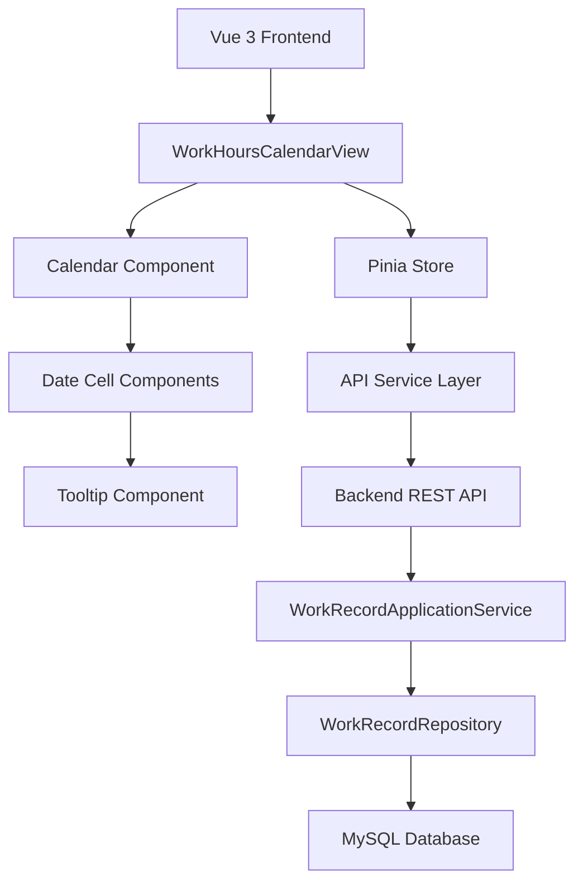
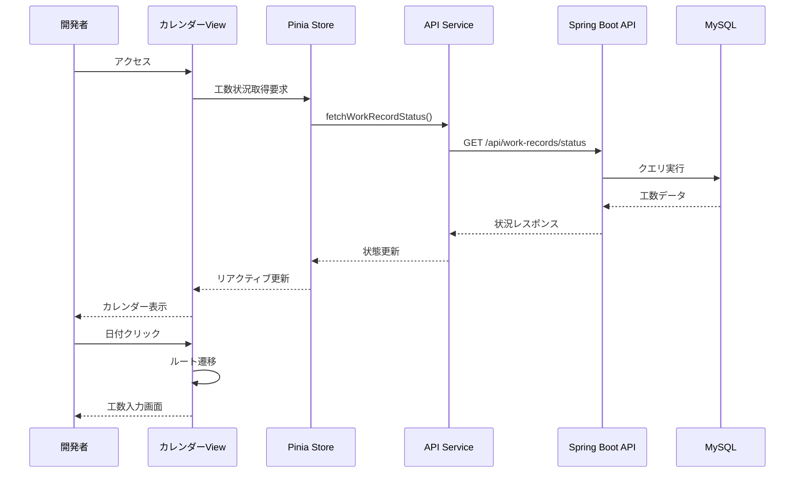

# 技術設計書

## 概要
開発者が工数入力状況を視覚的に確認し、効率的に入力漏れを解消できるカレンダーベースのインターフェースを実装します。この機能は既存の工数管理システムと完全に統合され、リアルタイムで入力状況を反映します。

## 要件マッピング

### 設計コンポーネントのトレーサビリティ
各設計コンポーネントが対応する要件：
- **WorkHoursCalendarコンポーネント** → REQ-1: 工数入力状況カレンダー表示
- **CalendarDateCell コンポーネント** → REQ-2: 日付選択による工数入力機能
- **WorkRecordStatusService** → REQ-3: 工数入力時の状況更新
- **CalendarTooltip コンポーネント** → REQ-4: ユーザビリティ向上
- **WorkRecordIntegrationService** → REQ-5: システム統合要件

### ユーザーストーリーカバレッジ
- **ストーリー1（視覚的確認）**: カレンダーコンポーネントで色分け表示を実装
- **ストーリー2（日付クリック遷移）**: Vue Routerを使用した動的ルーティング
- **ストーリー3（リアルタイム更新）**: Piniaストアでの状態管理とAPI連携
- **ストーリー4（直感的UI）**: Vuetifyコンポーネントとツールチップ実装
- **ストーリー5（システム統合）**: 既存APIエンドポイントの活用

## アーキテクチャ



### 技術スタック

- **フロントエンド**: Vue 3.5.13 + TypeScript 5.6
- **UIライブラリ**: Vuetify 3（既存利用）
- **状態管理**: Pinia（グローバル状態管理）
- **HTTPクライアント**: Axios（既存利用）
- **ルーティング**: Vue Router 4（既存利用）
- **バックエンド**: Spring Boot 3.5.4（既存）
- **データベース**: MySQL 8.0（既存）

### アーキテクチャ決定の根拠

- **Vuetify 3の採用理由**: プロジェクトで既に使用中であり、v-calendarコンポーネントが要件に適合
- **Piniaの採用理由**: Vue 3との相性が良く、TypeScript サポートが優秀
- **既存API活用**: 新規エンドポイントを最小限に抑え、既存のWorkRecord関連APIを最大限活用
- **コンポーネント分割**: 再利用性とテスタビリティを考慮した細かい粒度での実装

## データフロー

### 主要ユーザーフロー



## コンポーネントとインターフェース

### フロントエンドコンポーネント

| コンポーネント名 | 責任 | Props/State概要 |
|---------------|------|----------------|
| WorkHoursCalendarView | カレンダー全体の表示制御 | currentMonth, workRecordStatuses |
| WorkHoursCalendar | カレンダーグリッドレンダリング | month, year, statusData |
| CalendarDateCell | 個別日付セルの表示 | date, status, isToday, isWeekend |
| CalendarTooltip | 日付詳細情報表示 | date, workHours, approvalStatus |
| CalendarSummary | 入力状況サマリー表示 | requiredDays, completedDays |

### バックエンドサービス拡張

```java
// WorkRecordApplicationService拡張
public class WorkRecordApplicationService {
    // 既存メソッド...
    
    // 新規追加メソッド
    public WorkRecordStatusResponse getMonthlyStatus(
        Long userId, 
        YearMonth yearMonth
    ) {
        // 月次の工数入力状況を取得
        // WorkRecordのapproval_statusフィールドから状況を判定
    }
    
    public List<WorkRecordSummary> getDailyStatuses(
        Long userId,
        LocalDate startDate,
        LocalDate endDate  
    ) {
        // 期間内の日次状況を取得
    }
}
```

### APIエンドポイント

| メソッド | ルート | 目的 | 認証 | ステータスコード |
|---------|--------|------|------|-----------------|
| GET | /api/work-records/status/monthly | 月次入力状況取得 | 必須 | 200, 401, 500 |
| GET | /api/work-records/status/daily | 日次状況詳細取得 | 必須 | 200, 401, 404, 500 |
| GET | /api/work-records/summary | 入力サマリー取得 | 必須 | 200, 401, 500 |

## データモデル

### ドメインエンティティ（既存活用）
1. **WorkRecord**: 工数記録エンティティ（既存）
2. **User**: ユーザーエンティティ（既存）

### 新規DTOクラス

```typescript
// フロントエンド型定義
interface WorkRecordStatus {
  date: string;           // YYYY-MM-DD
  status: 'NOT_ENTERED' | 'PENDING' | 'APPROVED' | 'REJECTED';
  totalHours?: number;
  projectCount?: number;
  lastModified?: string;
}

interface MonthlyStatusResponse {
  userId: number;
  yearMonth: string;      // YYYY-MM
  statuses: WorkRecordStatus[];
  summary: {
    totalDays: number;
    enteredDays: number;
    pendingDays: number;
    approvedDays: number;
  };
}
```

```java
// バックエンドDTO
@Data
public class WorkRecordStatusDto {
    private LocalDate date;
    private ApprovalStatus status;
    private BigDecimal totalHours;
    private Integer projectCount;
    private LocalDateTime lastModified;
}

@Data
public class MonthlyStatusResponse {
    private Long userId;
    private YearMonth yearMonth;
    private List<WorkRecordStatusDto> statuses;
    private StatusSummary summary;
}
```

### データベーススキーマ（既存テーブル活用）
既存のwork_recordsテーブルとそのapproval_statusカラムを直接活用。ApprovalHistoryテーブルは使用せず、WorkRecordエンティティの承認ステータスから状況を判定。新規テーブルは不要。

## エラーハンドリング

### エラー処理戦略
- APIエラー: Axiosインターセプターでグローバルハンドリング
- UI エラー: Vue 3のerrorCapturedフックでコンポーネントレベル処理
- ネットワークエラー: 自動リトライとオフライン表示
- 検証エラー: リアルタイムバリデーションフィードバック

## セキュリティ考慮事項

### 認証・認可
- JWT トークンベース認証（既存実装活用）
- ユーザーは自分の工数記録のみアクセス可能
- APIレベルでのアクセス制御実装

### データ保護
- HTTPS通信の強制
- XSS対策: Vue 3の自動エスケープ機能活用
- CSRF対策: Spring Securityの既存実装

## パフォーマンスとスケーラビリティ

### パフォーマンス目標
| メトリクス | 目標値 | 測定対象 |
|-----------|--------|----------|
| カレンダー初期表示 | < 500ms | フロントエンド |
| 状況データ取得 | < 200ms | API レスポンス |
| 日付クリック反応 | < 100ms | UI インタラクション |
| 月間データ取得 | < 300ms | データベースクエリ |

### キャッシング戦略
- **ブラウザキャッシュ**: 承認済みデータは1日キャッシュ
- **Piniaストア**: セッション中は状態を保持
- **APIレスポンスキャッシュ**: 条件付きGETの実装
- **データベースクエリ**: インデックス最適化

### スケーラビリティアプローチ
- ページネーションによる大量データ対応
- 遅延ローディングで必要時のみデータ取得
- WebSocket検討（将来的なリアルタイム更新）

## テスト戦略

### テストカバレッジ要件
- **単体テスト**: 80%以上（JaCoCo/Vitest）
- **統合テスト**: 全APIエンドポイント
- **E2Eテスト**: 主要ユーザーフロー
- **パフォーマンステスト**: 想定ピーク時の2倍負荷

### テストアプローチ

#### フロントエンドテスト
```typescript
// コンポーネントテスト例
describe('WorkHoursCalendar', () => {
  it('未入力日付を赤色で表示する', async () => {
    const wrapper = mount(WorkHoursCalendar, {
      props: { 
        statuses: [{ date: '2025-01-14', status: 'NOT_ENTERED' }]
      }
    });
    expect(wrapper.find('.date-not-entered').exists()).toBe(true);
  });
});
```

#### バックエンドテスト
```java
@Test
void 月次状況取得_正常系() {
    // Given
    Long userId = 1L;
    YearMonth yearMonth = YearMonth.of(2025, 1);
    
    // When
    MonthlyStatusResponse response = service.getMonthlyStatus(userId, yearMonth);
    
    // Then
    assertThat(response.getStatuses()).hasSize(14); // 1月14日まで
    assertThat(response.getSummary().getTotalDays()).isEqualTo(14);
}
```

### CI/CDパイプライン


## 実装優先順位

### フェーズ1: 基本機能（MVP）
1. カレンダーコンポーネント実装
2. 状況取得APIエンドポイント
3. 色分け表示機能
4. 日付クリックナビゲーション

### フェーズ2: ユーザビリティ向上
1. ツールチップ実装
2. サマリー表示
3. 週末・祝日表示分け
4. レスポンシブ対応

### フェーズ3: パフォーマンス最適化
1. キャッシング実装
2. 遅延ローディング
3. パフォーマンステスト
4. 最適化調整